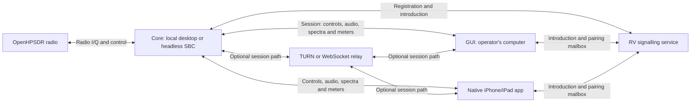

# NereusSDR

**A cross-platform SDR console for OpenHPSDR radios**

[User manual working draft](docs/manual/README.md): desktop and iPhone/iPad
operation with explicit source-build and live-verification limits.

> [!IMPORTANT]
> **Release candidate: 2026.10.0, the first calendar-versioned release.**
> This brings together the work since 0.5.2: independent receivers, remote
> Core operation with desktop and native iPhone/iPad consoles, IPv6-aware
> remote access, WDSP 2.10 with NNR and PureSignal 3, 3D display history,
> TX EQ/CFC graph editors, and movable applets with configurable meters.
>
> **Alpha testers, start here:**
> [2026.10.0 tester guide](docs/debugging/v2026.10.0-alpha-tester-smoketest.md).
> Read its upgrade notes before connecting an existing station. Core and
> desktop should be updated together. Settings migrate automatically, but
> watchdog and TCI interval defaults change once, and PS3 requires compatible
> version-2 correction files.
>
> The latest published release remains **v0.5.2** until the new release
> artifacts are available. Hardware and on-air acceptance retain their
> recorded status in the feature verification documents.
>
> J.J. Boyd ~ KG4VCF

[](https://github.com/boydsoftprez/NereusSDR/actions/workflows/ci.yml)
[](https://www.gnu.org/licenses/gpl-3.0)
[](https://en.cppreference.com/w/cpp/20)
[](https://www.qt.io/)

NereusSDR is a C++20/Qt6 port of [Thetis](https://github.com/ramdor/Thetis) — the canonical OpenHPSDR / Apache Labs SDR console, itself descended from FlexRadio PowerSDR — carrying its radio logic, DSP integration, and feature set forward to a native cross-platform codebase (macOS, Linux, Windows) with a Qt-based GUI. The Thetis contributor lineage (FlexRadio Systems, Doug Wigley W5WC, Richard Samphire MW0LGE, and the wider OpenHPSDR community) is preserved per-file in source headers and summarized in [docs/attribution/THETIS-PROVENANCE.md](docs/attribution/THETIS-PROVENANCE.md). Distributed under GPLv3 (root [LICENSE](LICENSE)), elected under the "or later" grant in upstream Thetis source-file headers (Thetis is GPLv2-or-later). A verbatim copy of GPLv2 ships at [docs/attribution/LICENSE-GPLv2](docs/attribution/LICENSE-GPLv2) for reference, since several WDSP and ChannelMaster source files explicitly reference v2.


---

## Supported Radios

Works with any radio implementing OpenHPSDR Protocol 1 or Protocol 2:

- **Apache Labs ANAN line** — ANAN-G2 (Saturn), ANAN-7000DLE, ANAN-8000DLE, ANAN-200D, ANAN-100D, ANAN-100, ANAN-10E
- **Hermes Lite 2**
- **All OpenHPSDR Protocol 1 radios** — Metis, Hermes, Angelia, Orion, Orion MkII
- **All OpenHPSDR Protocol 2 radios**

---

## Releases & Installation

Pre-built binaries for Linux (AppImage, x86_64 + aarch64), macOS (DMG +
PKG, Apple Silicon + Intel), and Windows (NSIS installer + portable ZIP,
x64) are published as GitHub Releases. The calendar release targets macOS 14
or later on Apple Silicon and macOS 12 or later on Intel:

**<https://github.com/boydsoftprez/NereusSDR/releases>**

All artifacts are GPG-signed (`KG4VCF`) via `SHA256SUMS.txt.asc`. To verify:

```bash
gpg --keyserver keyserver.ubuntu.com --recv-keys 4A95F4D22AEE9271D8A3C01B20C284473F97D2B3
gpg --verify SHA256SUMS.txt.asc SHA256SUMS.txt
sha256sum -c SHA256SUMS.txt
```

> **Platform signing:** macOS release packaging includes Apple Developer ID
> signing and notarization. Windows installers currently have no Authenticode
> signature and may prompt through SmartScreen. Check the selected release's
> artifact list and signing results; a source or CI build does not establish
> that a release package was signed successfully.

---

## Current Status

**Preparing 2026.10.0.** The latest published release is v0.5.2 (2026-05-24).
This is a substantial alpha release spanning the station Core, receiver/DSP
architecture and operator console. See [CHANGELOG.md](CHANGELOG.md) for
release history and the [tester guide](docs/debugging/v2026.10.0-alpha-tester-smoketest.md)
for upgrade checks and current limits.

## Core, GUI and remote access

The **Core** owns the radio connection and station state. It runs receiver
and transmit DSP, noise reduction and PureSignal, computes spectra, manages
station audio and accessories, and decides receiver and transmit authority.
The **GUI** is the operator's console: it renders VFOs, pans, waterfalls,
meters and editors, sends control requests, plays received audio and sends
microphone audio to the Core. Radio processing stays with the Core as the
operator moves between consoles.

There are two ways to run it. A local desktop runs the Core and GUI together.
For a remote station, headless **`nereusd`** runs beside the radio while the
GUI runs on a Mac, Windows or Linux computer, iPhone or iPad elsewhere.
Several authenticated
devices can use one Core, within station capacity, with receiver ownership
and a single transmit holder enforced by that Core.

The headless Core can run on a suitable Linux **single-board computer (SBC)**,
including a Raspberry Pi inside an **ANAN-G2**, or a separate SBC beside the
radio. Development testing included a **Raspberry Pi 4** and a **Radxa Rock 5C
with 2 GB RAM**. Other compatible SBCs can host the same Core; sustainable
receiver count, DSP features and display load depend on the board and its
configuration. A display and a locally running GUI are not required at the
radio. The radio and Core can remain at the station while the operator uses
a separate console.

For a fresh board, follow the [short Raspberry Pi OS Lite/Armbian install
guide](docs/guides/install-core-sbc.md). It uses the release's Debian Trixie
ARM64 package, enables `nereusd` at boot and walks through pairing a desktop
or phone. A matching package and normal `apt` dependencies keep this separate
from the Ubuntu package and the optional station-card image build.

**Fresh SBC setup in five steps:**

1. Flash 64-bit Raspberry Pi OS Lite or compatible Armbian Debian Trixie;
   set your own login/hostname, enable SSH and connect Ethernet to the radio's LAN.
2. Download `nereusd_<version>_arm64_trixie.deb` and verify the release's
   signed checksums.
3. Install with `sudo apt install ./nereusd_<version>_arm64_trixie.deb`, copy
   `/usr/share/nereusd/nereusd.conf.sample` to `/etc/nereusd.conf` and review it.
4. Run `sudo systemctl enable --now nereusd`, then `sudo nereusd status`.
5. Choose that Core in the desktop or native phone/tablet console and pair;
   `sudo nereusd pairing show` displays a code on the SBC.

The [full command sequence](docs/guides/install-core-sbc.md) includes OS checks,
download/signature verification and startup diagnostics.

### A native iPhone and iPad console

The **native iPhone and iPad app** is another full operator console for the
same Core. Its Swift/SwiftUI interface has live spectrum/waterfall and VFO
flags, touch tuning and receiver controls, received audio, microphone uplink
and PTT, transmit readings, station Setup, spots and accessory pages. It uses
the same station identity, pairing, receiver ownership and transmit-holder
rules as a desktop GUI. The phone or tablet renders station data while the
Core runs the radio and DSP, including the transmit processing chain.

This is a major part of the Core/GUI split: the operator can use a desktop,
iPhone or iPad with the radio and its processing remaining at the station.
The mobile app is native to those devices, with its own release counter,
validation and TestFlight/App Store delivery process. Its delivery status is
tracked separately from the desktop/Core release artifacts.

### How the RV server connects a remote console

The **rendezvous (RV) server** is a separate network service that helps a
GUI reach a Core across different networks. Both ends contact the configured
RV service. The Core registers its station identity with the RV signalling
service; the GUI asks for an introduction to that station. The service passes
connection offers and network candidates between them and provides a pairing
mailbox when the devices are not on the same network. The Core authenticates
the device and retains all control and transmit-authority decisions.

After introduction, the station session uses its own connection. It can run
directly between the GUI and Core, through a **TURN relay** when a direct path
is unavailable, or through the separate **WebSocket relay** for a network that
only passes web traffic. The RV service issues short-lived relay credentials;
its signalling process handles introductions rather than ongoing session
traffic. The signalling service, TURN relay and WebSocket relay are separate
parts of the RV server installation.

A directly reachable Core on the same LAN or a VPN can also be selected by
address. Core Settings shows the chosen station, connection and audio path,
so the operator can see which Core is in use and how the session is connected.
The RV server provides reachability; the Core continues to own the radio and
perform the DSP on every path.

### IPv6 and CGNAT/mobile networks

The station link, LAN discovery and connection selection support **IPv4
and IPv6**. Clients try usable IPv6 addresses alongside IPv4 alternatives,
and the RV installation offers relay hosts for both address families. This
lets a phone on an IPv6 mobile network reach a compatible station using
IPv6. This applies to Core/client and RV networking; the Core continues to
use the radio's existing OpenHPSDR connection.

This matters on **carrier-grade NAT (CGNAT)** and mobile broadband networks.
CGNAT shares an IPv4 address at the provider, so a forwarding rule on the
home router alone does not provide an incoming route through that provider.
A usable global IPv6 path can provide direct connectivity when both ends and
their firewalls permit it. When that path is unavailable, RV-assisted
connection setup and the TURN/WebSocket relays provide alternatives.

For example, [T-Mobile's Home Internet documentation](https://www.t-mobile.com/support/home-internet/connect)
states that its gateways do not offer configurable NAT/port forwarding.
IPv6-aware connection selection and outbound relay paths are therefore
important for stations and mobile consoles on networks with those limits.
The actual selected route and its audio status remain visible in Core Settings;
carrier, router and firewall conditions still determine which route succeeds.



See the [Core architecture](docs/architecture/2026-07-28-remote-daemon-architecture-design.md),
[station link](docs/architecture/2026-09-23-station-link-v1.md) and
[RV server installation guide](rendezvous/README.md) for implementation and
server setup. The development [Rock 5C receive-control bench](docs/architecture/2026-08-03-remote-daemon-r2-verification/rock-5c-2026-09-20/README.md)
records a specific hardware check; feature acceptance remains recorded separately.

## Key Features

- **Independent receivers and displays.** Per-receiver tuning, mode, DSP and
  audio; radio-capacity-aware allocation; saved multi-pan layouts, floating
  pans and coloured receiver markers. The transmit receiver owns its TX
  spectrum/waterfall. Native 3D stacked spectrum/waterfall adds display history.
- **A shared station Core.** Run with the desktop or as headless `nereusd`
  beside the radio. Authenticated remote desktop sessions share receiver
  control, displays and audio. Pairing, saved/manual station targets, device
  authority, transfer confirmations, link recovery and explicit direct/relayed
  connection status are part of the station system. Core Settings presents
  connection choices and current Core/audio status.
- **WDSP 2.10.** AGC, noise filters, squelch and advanced DSP controls;
  NNR Standard/Premium station-owned model assets; PureSignal 3 correction
  assets, status and AmpView. Capability and authority determine which actions
  a local or remote device can perform. See the
  [operator notes](docs/architecture/wdsp210-operator-notes.md) and
  [verification status](docs/architecture/wdsp210-verification/README.md).
- **Receiver tools.** CTUN, tunable notch filters, calibrated signal readings,
  per-band DSP/display persistence and Core-owned Diversity on eligible receivers.
- **TX processing and graph editors.** SSB, AM/SAM/DSB and RADE transmit;
  microphone profiles, independent Graphic/Parametric EQ, 5/10/18-band
  Parametric/CFC curves, exact entry, width/Q editing and undo/redo. Leveler,
  ALC, CFC, CPDR, CESSB, phase rotator, DEXP/VOX and anti-VOX remain integrated.
  See the [EQ/CFC guide](docs/guides/tx-eq-cfc.md).
- **Containers, meters and individual controls.** Move, resize and layer
  applets, meters and fifteen supported individual controls on an editable
  Canvas, or keep automatic stacks and saved legacy compositions. Preview
  draft settings, Apply or Cancel, float containers, return them to remembered
  homes and exchange portable layouts. Meter text scales with each object;
  composite faces retain calibrated source bindings and show missing readings
  as unavailable. External MMIO bindings and recovery data survive migration.
  See the [Canvas guide](docs/architecture/native-free-canvas.md).
- **Station audio and connections.** Receive mixes, radio speaker/headphone
  output, capability-gated hardware microphone controls, VAX audio buses,
  remote media recovery, discovery and manual/unicast connection targets.
- **Digital-app integration and spots.** TCI v2.0 WebSocket control/audio;
  DX Cluster, RBN, WSJT-X, DXLab, POTA, FreeDV Reporter and PSK Reporter sources;
  spots with click-to-tune and a live FreeDV station view. RADE supports
  end-of-over callsigns when FreeDV Reporter is enabled.
- **Native CAT control.** Four stable slice-bound Thetis CAT channels over TCP,
  optional serial and macOS/Linux PTYs; separate four-channel Hamlib rigctld,
  local Setup, status, log and tester. All listeners start disabled. The
  [compatibility report](docs/architecture/thetis-cat-verification/README.md)
  lists explicit unsupported capabilities and platform/client/bench limits.
- **Accessories and hardware controls.** PGXL, TGXL and RF-Kit RF2K-S;
  Core-authoritative accessory operation, tuner sequencing, step attenuator,
  preamp/Level Cal corrections, ADC overload indication and per-radio controls.
- **Cross-platform distribution.** Linux AppImage, macOS DMG/PKG and Windows
  installer/portable ZIP, with GPG-signed checksums. Headless Core install is
  separate from the console package; see the build/install instructions below.

## Roadmap and acceptance

CW transmit/keyer/QSK, FM pre-emphasis, legacy skin import and WAV/IQ
recording remain future work. Disabled actions retain an explanation;
being represented by an applet or Setup page does not establish implementation.
The iPhone/iPad app has an independent release process and calendar counter.

Cross-radio TNF listening, NNR quality, PureSignal RF improvement, RADE on-air
interoperability, sustained Pi/Radxa operation and accessory bench matrices
retain their documented pending checks. Software tests do not close these
hardware matrices. The reconnect fixes in this release also need the original
reporters' retests for issues #235, #299 and #300.

[docs/MASTER-PLAN.md](docs/MASTER-PLAN.md) preserves the original phase plan and
release history. Its current release summary takes precedence over older
phase scheduling notes. Feature designs and verification documents are under
[docs/architecture/](docs/architecture/).

---

## Building from Source

### Dependencies

```bash
# Ubuntu 24.04+ / Debian
sudo apt install qt6-base-dev qt6-base-private-dev \
  qt6-multimedia-dev qt6-shadertools-dev qt6-svg-dev qt6-websockets-dev \
  cmake ninja-build pkg-config \
  libfftw3-dev libgl1-mesa-dev \
  libasound2-dev libjack-jackd2-dev \
  libpipewire-0.3-dev libssl-dev

# Arch / CachyOS / Manjaro
sudo pacman -S qt6-base qt6-multimedia qt6-svg qt6-websockets \
  cmake ninja pkgconf fftw \
  alsa-lib jack2 pipewire openssl

# macOS (Homebrew)
brew install qt@6 ninja cmake pkgconf fftw
```

The bundled PortAudio is built with `PA_USE_ALSA=ON` and `PA_USE_JACK=ON` on Linux,
so the ALSA and JACK development headers are required at compile time even if you
don't use those audio backends at runtime. `libpipewire-0.3-dev` (≥ 0.3.50) is
strongly recommended on PipeWire-default distributions (Ubuntu 24.04+, Fedora 39+,
Arch) — without it the Linux audio path falls back from the native libpipewire-0.3
bridge to the older pactl route.

`openssl` / `libssl-dev` (≥ 3.0) is hard-required (`find_package(OpenSSL 3.0 REQUIRED COMPONENTS Crypto)`) since Remote Daemon R2 Task 17: `src/core/security/CertificateStore` links libcrypto directly to mint nereusd's self-signed TLS certificate, because Qt6 has no certificate-*generation* API. macOS resolves this through Homebrew's `openssl@3` formula with no extra hints; it is not keg-only (verified via `brew info --json=v2 openssl@3` fix round 3), its files are ordinary live symlinks into `${HOMEBREW_PREFIX}/lib` and `.../include`, the same path already searched for every other Homebrew library. The macOS Intel release row (no arm64 keg to link against) and both Windows rows source OpenSSL differently; see the `find_package(OpenSSL)` block in `CMakeLists.txt` and `vcpkg.json` for the full per-platform acquisition story.

### Windows (FFTW3 Setup)

No manual setup required. CMake auto-downloads [`fftw-3.3.5-dll64.zip`](https://fftw.org/pub/fftw/fftw-3.3.5-dll64.zip) on first configure and drops `fftw3.h` / `libfftw3-3.dll` / `libfftw3-3.def` into `third_party/fftw3/`. Requires network access on the first `cmake -B build` run; offline builds need to pre-populate those three files by hand.

### Build & Run

```bash
git clone https://github.com/boydsoftprez/NereusSDR.git
cd NereusSDR
cmake -B build -G Ninja -DCMAKE_BUILD_TYPE=RelWithDebInfo
cmake --build build -j$(nproc)
./build/NereusSDR
```

The build produces **two** binaries. `NereusSDR` is the GUI. `nereusd` is the
headless daemon added in remote-daemon R1: it links `NereusCore` only, no GUI
object code, and is guarded by `tst_core_has_no_gui_includes`. It is installed
separately so the GUI's release artifacts are unaffected:

```
cmake --install build --component nereusd
```

A plain `cmake --install` deliberately installs neither `nereusd` nor its
systemd unit. Release packaging installs the daemon component separately;
the Trixie job also checks installation and CLI startup in a fresh runtime
container. Package verification can run from a branch with the release
workflow's `verify_only` dispatch. Always pass `--profile <name>` when running
`nereusd` by hand, or it writes the same settings the GUI reads.
For a board installation, use the [short SBC guide](docs/guides/install-core-sbc.md).

On first run, NereusSDR generates FFTW wisdom (optimized FFT plans). This takes ~15 minutes and shows a progress dialog. The wisdom file is cached for subsequent launches.

See [docs/MASTER-PLAN.md](docs/MASTER-PLAN.md) for the full implementation plan and [docs/project-brief.md](docs/project-brief.md) for the project brief.

---

## Contributing

PRs, bug reports, and feature requests welcome! See [CONTRIBUTING.md](CONTRIBUTING.md) for guidelines.

**Development environment:** NereusSDR is developed using [Claude Code](https://claude.com/claude-code) as the primary development tool. We encourage contributors to use Claude Code for consistency. PRs must follow project conventions, pass CI, and include GPG-signed commits.

---

## Heritage

NereusSDR stands on the shoulders of these projects:

- **[Thetis](https://github.com/ramdor/Thetis)** — The canonical Apache Labs / OpenHPSDR SDR console (C# / WinForms). NereusSDR's feature source.
- **[AetherSDR](https://github.com/ten9876/AetherSDR)** — Native FlexRadio client (C++20 / Qt6). NereusSDR's architectural template.
- **[WDSP](https://github.com/TAPR/OpenHPSDR-wdsp)** — Warren Pratt NR0V's DSP library. The signal processing engine.
- **[OpenHPSDR](https://openhpsdr.org/)** — The open-source high-performance SDR project and protocol specifications.

---

## License

NereusSDR is free and open-source software licensed under the [GNU General Public License v3](LICENSE).

*NereusSDR is a derivative work of Thetis licensed under the GNU General Public License. It is not affiliated with or endorsed by Apache Labs, FlexRadio Systems, ramdor/Thetis, or the OpenHPSDR project.*
