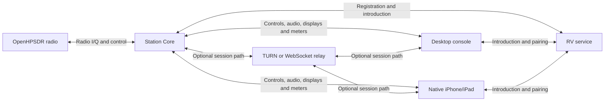

# NereusSDR

**Your station. Wherever you operate.**

NereusSDR is a free, open-source console for OpenHPSDR radios on macOS,
Windows and Linux, with a native iPhone and iPad app. Keep the radio and its
signal processing at your station, and operate from the console that suits
you: a local desktop, another computer, or your phone or tablet.

[Website](https://nereussdr.com/) · [Downloads](https://github.com/boydsoftprez/NereusSDR/releases) · [User guide](https://nereussdr.com/manual/) · [Discord](https://discord.gg/m35ERjwRe) · [Release notes](CHANGELOG.md)

[](https://github.com/boydsoftprez/NereusSDR/actions/workflows/ci.yml)
[](LICENSE)
[](https://en.cppreference.com/w/cpp/20)
[](https://www.qt.io/)

## Start here

| What you want to do | Where to go |
| --- | --- |
| Install the desktop console and connect your radio | [Downloads](https://github.com/boydsoftprez/NereusSDR/releases) and [desktop setup](https://nereussdr.com/manual/01-desktop-connect.html) |
| Upgrade from 0.5.2 | [2026.10.0 upgrade checklist](https://nereussdr.com/guides/upgrading-to-2026.10.0.html) and [release notes](CHANGELOG.md) |
| Run the Core on a Raspberry Pi or another SBC | [Fresh Raspberry Pi OS Lite / Armbian install](https://nereussdr.com/guides/install-core-sbc.html) |
| Connect an iPhone or iPad | [Mobile setup](https://nereussdr.com/manual/06-iphone-connect.html) and [mobile operation](https://nereussdr.com/manual/07-iphone-operate.html) |
| Arrange receivers, displays, applets and meters | [Receivers and panadapters](https://nereussdr.com/manual/04-slices.html) and [workspace and meters](https://nereussdr.com/manual/10-customize.html) |
| Set up transmit audio | [Transmit setup](https://nereussdr.com/manual/05-transmit.html) and [EQ/CFC editing](https://nereussdr.com/guides/tx-eq-cfc.html) |
| Get help or share your station | [Discord](https://discord.gg/m35ERjwRe), [troubleshooting](https://nereussdr.com/manual/11-troubleshooting.html) and [GitHub Issues](https://github.com/boydsoftprez/NereusSDR/issues) |

The [user guide](https://nereussdr.com/manual/) brings the operating instructions
together, from the first connection to shared stations, digital modes and
accessories. Join Discord for questions and discussion; use GitHub Issues
for bug reports and feature requests that need tracking.

## What's new in 2026.10.0

This release brings together the work since 0.5.2: independent receivers,
a shared station Core, remote desktop and native mobile operation,
IPv6-aware connections, WDSP 2.10 with NNR and PureSignal 3, 3D display
history, TX EQ/CFC graph editors, and a workspace of movable applets and
configurable meters.

It is our first **calendar-versioned release**. `2026.10.0` is the first
release in October 2026; another release that month becomes `2026.10.1`.
The first release in a new month starts at `.0`. Releases ship when ready.

**2026.10.0 is being prepared.** The downloads page continues to show the
latest published release until the new packages are available. Read the
[upgrade checklist](https://nereussdr.com/guides/upgrading-to-2026.10.0.html) before updating
an existing station, and update the Core and desktop together.

## One station, several ways to operate

The **Core** connects to your radio and does the signal processing. It runs
receive and transmit DSP, noise reduction and PureSignal, prepares spectra
and meters, manages station audio and accessories, and coordinates receiver
control and transmit access.

The **console** is what you operate. It displays receivers, waterfalls,
meters and editors, plays received audio, and sends your tuning changes,
microphone audio and transmit requests to the Core.

On a local desktop, the Core and console run together. For a remote station,
the headless **`nereusd`** Core runs beside the radio while you use a Mac,
Windows or Linux console, or the native iPhone/iPad app elsewhere. Several
paired devices can share a station within its capacity. The Core keeps
receiver ownership and a single transmit holder clear across those devices.

### Keep the Core beside the radio

A suitable Linux single-board computer can run the Core without a monitor
or a local GUI. Use a Raspberry Pi inside an **ANAN-G2**, or a separate SBC
on the radio's network. Development testing included a **Raspberry Pi 4**
and a **Radxa Rock 5C with 2 GB RAM**. Receiver count, DSP choices and display
load determine how much a particular board can sustain.

For a fresh **64-bit Raspberry Pi OS Lite or Armbian Debian 13/Trixie**
installation:

1. Flash the image, set your login and hostname, enable SSH, and connect
   wired Ethernet to the radio's LAN.
2. Download the matching `nereusd_<version>_arm64_trixie.deb` and verify
   its signed checksum.
3. Install it with `sudo apt install ./nereusd_<version>_arm64_trixie.deb`.
   Copy `/usr/share/nereusd/nereusd.conf.sample` to `/etc/nereusd.conf`
   and review the configuration.
4. Run `sudo systemctl enable --now nereusd`, then `sudo nereusd status`.
5. Select the Core in your desktop or mobile console and pair with it.
   `sudo nereusd pairing show` displays a pairing code on the SBC.

The [SBC install guide](https://nereussdr.com/guides/install-core-sbc.html) has the complete
commands, signature checks and startup troubleshooting. An ANAN-G2's built-in
Pi also needs its Saturn-specific setup. The Ubuntu Core packages and the
Trixie package are separate builds; choose the one matching your OS.

### Take the console with you

The native **iPhone and iPad app** provides live spectrum and waterfall,
touch tuning, receiver controls, receive audio, microphone uplink and PTT,
transmit readings, station Setup, spots and accessory pages. Native EQ/CFC
controls, Filter Presets and named TX profiles bring voice shaping and everyday
receiver setup to the phone. It follows the same pairing, receiver ownership
and transmit-holder rules as the desktop.
The Core continues processing the radio while you operate from the phone.

The mobile app is delivered separately through its own TestFlight/App Store
process. Desktop/Core packages do not install it. See [mobile setup](https://nereussdr.com/manual/06-iphone-connect.html)
and [mobile operation](https://nereussdr.com/manual/07-iphone-operate.html) for the console workflow.

### Reach your station from another network

The **rendezvous (RV) service** introduces your console to your Core. The Core
registers its station identity; the console asks to connect to that station.
The service exchanges connection offers and network candidates, and provides
a pairing mailbox when the devices are on different networks. Your Core
still authenticates each device and decides what it may control.

Once connected, the session can travel directly between console and Core,
through a **TURN relay**, or through a **WebSocket relay** on networks that
only pass web traffic. The RV signalling service handles introductions;
relay services carry session traffic when needed. A reachable Core on your
LAN or VPN can also be selected directly by address.

**IPv4 and IPv6** are supported for Core/client discovery and connections.
IPv6 can provide a direct route when both ends and their firewalls allow it.
When a direct route is unavailable, the outbound relay paths provide alternatives.
This is useful on CGNAT and mobile broadband networks, including services such
as [T-Mobile Home Internet](https://www.t-mobile.com/support/home-internet/connect)
whose gateways do not offer configurable port forwarding. Core Settings shows
the station, selected connection path and audio status.

The Core uses your radio's existing OpenHPSDR connection on every route.
High-rate radio I/Q stays at the station.



See [shared Core operation](https://nereussdr.com/manual/08-shared-core.html) for operating a
station from several devices, and [RV installation](https://nereussdr.com/guides/remote-access.html)
if you want to host the remote-access service yourself.

## Make the console your own

- **Independent receivers and displays.** Tune, filter and listen to each
  receiver independently. Arrange several pans, float them across displays,
  and save your layouts. Coloured receiver markers, tunable notch filters,
  CTUN and per-band settings keep each receiver easy to follow. The native
  3D spectrum/waterfall adds depth and history; the transmit receiver has
  its own spectrum and waterfall settings.
- **Receive DSP.** WDSP 2.10 brings the processing engine forward. NNR offers
  Standard and Premium station-owned models, with per-radio and per-receiver
  tuning and a Models manager. AGC, noise reduction, squelch and other DSP
  controls remain available alongside Core-owned Diversity on eligible receivers.
- **Transmit audio.** Microphone profiles carry Graphic and Parametric EQ,
  5/10/18-band curves, CFC and the rest of the transmit processing chain.
  Native graph editors provide exact entry, frequency/width handles, shared
  CFC frequency selection and undo/redo. PureSignal 3 adds correction assets,
  status and AmpView. AM/SAM/DSB transmit and the AM modulation monitor add
  carrier, envelope and positive/negative modulation readings.
- **Applets, Canvas and meters.** Stack or float containers, or arrange
  applets, meters and fifteen individual controls on an editable Canvas.
  Move, resize, layer and lock objects, preview changes, and Apply or Cancel.
  Responsive meter text, complete meter faces and the Nereus ANAN artwork
  bring readings together. Supported objects can follow the selected receiver
  or stay with a fixed receiver. Existing layouts and external MMIO bindings
  survive migration and portable layout exchange.
- **Audio and digital applications.** Choose receiver mixes, station and
  radio speaker/headphone output, microphone sources and VAX audio buses.
  TCI provides WebSocket control/audio for external applications. Spots from
  DX Cluster, RBN, WSJT-X, DXLab, POTA, FreeDV Reporter and PSK Reporter can
  be filtered and selected to tune. RADE supports end-of-over callsigns when
  FreeDV Reporter is enabled.
- **Station accessories.** Operate PGXL, TGXL and RF-Kit RF2K-S through the
  Core, with device authority and tuner sequencing. Hardware controls follow
  the connected radio's capabilities, including attenuation, preamp,
  microphone inputs and ADC overload indication.

## Radios and downloads

NereusSDR supports radios using **OpenHPSDR Protocol 1 or Protocol 2**:

- Apache Labs ANAN-G2/Saturn, ANAN-7000DLE, ANAN-8000DLE, ANAN-200D,
  ANAN-100D, ANAN-100, ANAN-10E and other compatible ANAN models.
- Hermes Lite 2.
- OpenHPSDR Metis, Hermes, Angelia, Orion and Orion MkII hardware.

Choose your package from [GitHub Releases](https://github.com/boydsoftprez/NereusSDR/releases):

| System | Package |
| --- | --- |
| macOS Apple Silicon, macOS 14 or later | DMG or PKG |
| macOS Intel, macOS 12 or later | DMG or PKG |
| Windows x64 | Installer or portable ZIP |
| Linux x86_64 or ARM64 | AppImage |
| Headless Linux Core | Ubuntu `.deb`, or Debian 13/Trixie ARM64 `.deb` for compatible SBCs |

Release downloads include detached GPG signatures and a signed checksum list.
Verify the list and the file you downloaded before installing:

```sh
gpg --keyserver keyserver.ubuntu.com --recv-keys 4A95F4D22AEE9271D8A3C01B20C284473F97D2B3
gpg --verify SHA256SUMS.txt.asc SHA256SUMS.txt
# Use the row for your downloaded file; a full check expects every listed asset.
awk -v file="YOUR_DOWNLOADED_FILENAME" '$2 == file { print }' SHA256SUMS.txt | sha256sum --check --strict
```

On macOS, use `shasum -a 256 -c` in place of `sha256sum --check --strict`.
macOS release packaging uses Developer ID signing and notarization. Windows
installers do not have an Authenticode signature and may prompt through SmartScreen.

## Known issues and what's next

PureSignal two-tone runs have an open transmit-stream continuity issue.
Receive restoration after unkeying still needs physical-radio validation.
Waterfall brightness can change when selecting a receiver and switching
between Core and Clarity level ownership. These items remain under investigation.
The original reconnect reports in [#235](https://github.com/boydsoftprez/NereusSDR/issues/235),
[#299](https://github.com/boydsoftprez/NereusSDR/issues/299) and
[#300](https://github.com/boydsoftprez/NereusSDR/issues/300) still need reporter retests.

CAT/rigctld follows in the next release. CW transmit/keyer/QSK, FM pre-emphasis,
legacy skin import and WAV/IQ recording remain future work. Radio-specific and
on-air checks are recorded in the [feature verification documents](docs/architecture/).

## Building from Source

### Dependencies

```bash
# Ubuntu 24.04+ / Debian
sudo apt install qt6-base-dev qt6-base-private-dev \
  qt6-multimedia-dev qt6-shadertools-dev qt6-svg-dev qt6-websockets-dev \
  cmake ninja-build pkg-config \
  libfftw3-dev libgl1-mesa-dev \
  libasound2-dev libjack-jackd2-dev \
  libpipewire-0.3-dev libssl-dev

# Arch / CachyOS / Manjaro
sudo pacman -S qt6-base qt6-multimedia qt6-svg qt6-websockets \
  cmake ninja pkgconf fftw \
  alsa-lib jack2 pipewire openssl

# macOS (Homebrew)
brew install qt@6 ninja cmake pkgconf fftw openssl@3
```

The bundled PortAudio is built with `PA_USE_ALSA=ON` and `PA_USE_JACK=ON` on Linux,
so the ALSA and JACK development headers are required at compile time even if you
don't use those audio backends at runtime. `libpipewire-0.3-dev` (≥ 0.3.50) is
strongly recommended on PipeWire-default distributions (Ubuntu 24.04+, Fedora 39+,
Arch) — without it the Linux audio path falls back from the native libpipewire-0.3
bridge to the older pactl route.

OpenSSL 3.0 or later is required for Core certificates. Install `libssl-dev`
on Debian/Ubuntu or `openssl@3` through Homebrew on macOS. Windows dependency
setup is described in [CONTRIBUTING.md](CONTRIBUTING.md).

### Windows (FFTW3 Setup)

No manual setup required. CMake auto-downloads [`fftw-3.3.5-dll64.zip`](https://fftw.org/pub/fftw/fftw-3.3.5-dll64.zip) on first configure and drops `fftw3.h` / `libfftw3-3.dll` / `libfftw3-3.def` into `third_party/fftw3/`. Requires network access on the first `cmake -B build` run; offline builds need to pre-populate those three files by hand.

### Build & Run

```bash
git clone https://github.com/boydsoftprez/NereusSDR.git
cd NereusSDR
cmake -B build -G Ninja -DCMAKE_BUILD_TYPE=RelWithDebInfo
cmake --build build --parallel
```

Launch `./build/NereusSDR` on Linux, open `build/NereusSDR.app` on macOS,
or run `build/NereusSDR.exe` on Windows with this Ninja build.

The build produces **two** binaries. `NereusSDR` is the GUI. `nereusd` is the
headless Core. To install the Core and its service separately:

```
cmake --install build --component nereusd
```

A plain `cmake --install` deliberately installs neither `nereusd` nor its
systemd unit. Release packaging installs the daemon component separately;
the Trixie job also checks installation and CLI startup in a fresh runtime
container. Package verification can run from a branch with the release
workflow's `verify_only` dispatch. Always pass `--profile <name>` when running
`nereusd` by hand, or it writes the same settings the GUI reads.
For a board installation, use the [short SBC guide](https://nereussdr.com/guides/install-core-sbc.html).

On first run, NereusSDR generates FFTW wisdom (optimized FFT plans). This takes ~15 minutes and shows a progress dialog. The wisdom file is cached for subsequent launches.

See [docs/MASTER-PLAN.md](docs/MASTER-PLAN.md) for the full implementation plan and [docs/project-brief.md](docs/project-brief.md) for the project brief.

---

## Contributing

Contributions, bug reports and feature requests are welcome. Follow
[CONTRIBUTING.md](CONTRIBUTING.md) for build instructions, code conventions,
attribution and review requirements. Pull requests must pass CI and include
GPG-signed commits.

---

## Heritage

NereusSDR builds on these projects, with original station Core, remote-console
and native mobile work alongside its upstream foundations. Contributor notices
are preserved in source files and the [provenance record](docs/attribution/THETIS-PROVENANCE.md).

- **[Thetis](https://github.com/ramdor/Thetis)** — The canonical Apache Labs / OpenHPSDR SDR console (C# / WinForms). NereusSDR's feature source.
- **[AetherSDR](https://github.com/ten9876/AetherSDR)** — Native FlexRadio client (C++20 / Qt6). NereusSDR's architectural template.
- **[WDSP](https://github.com/TAPR/OpenHPSDR-wdsp)** — Warren Pratt NR0V's DSP library. The signal processing engine.
- **[OpenHPSDR](https://openhpsdr.org/)** — The open-source high-performance SDR project and protocol specifications.

---

## License

NereusSDR is free and open-source software licensed under the [GNU General Public License v3](LICENSE).

*NereusSDR is a derivative work of Thetis licensed under the GNU General Public License. It is not affiliated with or endorsed by Apache Labs, FlexRadio Systems, ramdor/Thetis, or the OpenHPSDR project.*
