# NereusSDR for iPhone and iPad: Design Spec

Status: **Approved** by JJ (KG4VCF) on 2026-09-23 ("onward"); D35 to D43
were added while planning, each his call; he changed D38 later that day and set
D43's wording rule on 2026-09-24. On 2026-09-24 he also replaced one device at a
time with several devices at once (§3.9, D44 to D67; D58 to D67 answer the station
design's questions the same evening), which replaces D21 and carries D22 forward.
Every decision in §3 is JJ's.
Plan: [2026-09-23-iphone-app-plan.md](2026-09-23-iphone-app-plan.md)
Branch: `claude/nereussdr-iphone-app-5fb988`

This app is a client of the remote station, `nereusd`. That work is not on
`main` yet. Its documents live on the branch `codex/integrate-r2-main` (read at
`f9e6ef99`) and are cited here by path:

* `docs/architecture/2026-07-28-remote-daemon-architecture-design.md`, "the
  remote design"
* `docs/architecture/2026-08-02-remote-station-identity-and-pairing-design.md`,
  "the pairing design"
* `docs/architecture/2026-09-20-remote-daemon-r3-plan.md`, "the R3 plan", whose
  requirements are numbered `R-R3-nn`
* `docs/architecture/2026-09-20-remote-media-control-v1.md`, "media control"

Mockups: every screen is pictured in `2026-09-23-iphone-app-design/`, one
picture per board section (§10). `2026-09-23-iphone-app-design/board.html` is
the interactive board itself; open it in a browser, and it loads nothing from
the network. The same board is published as a private artifact:
<https://claude.ai/artifact/9Bu5TcyL63LvkGSB28tQo9>.

Signals, station names, addresses and readings in the mockups are examples.

---

## 1. Goal

Run the whole station from an iPhone or an iPad, at home on Wi-Fi or away on
cellular, as a full operating console: receive **and** transmit, both in the
first App Store release.

The phone is a thin client of the station. Radio protocol, DSP, demodulation,
the transmit chain and every safety interlock stay on the station. The phone
draws the band, plays the audio, captures the microphone, and sends what the
operator asks for. It looks and works like NereusSDR, VFO flags included, so an
operator who knows the desktop knows the phone.

## 2. Non-goals

* **Not the desktop app compiled for iOS.** Rejected because it would put WDSP
  and Thetis-derived GPL code on the App Store (§4.11).
* **Not a web page in Safari.** Rejected because the audio stops when the phone
  locks.
* **No demo mode.** A station is required (D19). App Review gets a video of the
  app running against a real station instead.
* **Not in this release, by JJ's choice:**
  * Parked by JJ ("skip for now"): a left-handed layout; larger text and
    VoiceOver.
  * Declined: WSJT-X decodes on the phone; the iPad beside a logging app; a
    listen-only guest device.
  * Rejected as unneeded: a Face ID gate for transmit. A lost phone is handled
    by revoking it from any paired device, which drops its session at once.
  * Offered and not taken up: alerts while the app is closed, an Apple Watch
    app, Siri and Shortcuts and widgets, sending CW from the phone.
  * Dropped for now while planning (D42): MIDI Mapping and Macro Buttons.

---

## 3. Decisions

Every row is a call JJ made, one question at a time, on a rendered mockup.
"Rejected" lists the alternatives he was shown and turned down.

### 3.1 Product

| # | Decision | Why | Rejected |
| --- | --- | --- | --- |
| D1 | Run the station from anywhere as a full operating console. | The purpose of the app. | |
| D2 | Anyone can install it, through the App Store, after a TestFlight beta round. | Reach, with a safety net first. | |
| D3 | A native Swift app, a thin client of `nereusd`. All DSP stays on the station. | The station already does the work; the phone stays light and the radio logic lives in one place. | The Qt app built for iOS (GPL and WDSP code on the store); a Safari web app (audio stops when locked). |
| D4 | The app's own code is GPLv3 plus an App Store permission clause. Any code shared with the phone needs the same clause. | Apple's store terms add restrictions GPLv3 forbids unless the copyright holders grant an exception. | |
| D5 | The first store release has receive **and** transmit. | JJ: "do not descope". It therefore ships after R3, R4 and R5 (§4.2). | Listen first, transmit later. |
| D6 | iPhone and iPad. | Both are operating positions. | |

### 3.2 On the band

| # | Decision | Why | Rejected |
| --- | --- | --- | --- |
| D7 | The phone keeps NereusSDR's VFO flags and look: a toolbar, a tall panadapter with the flag and the band-plan strip, the waterfall with zoom, and a tab bar (Panadapter, Modes, Tools, Radio, Setup). | It has to be NereusSDR. | A full-screen band with a bottom sheet (it dropped the flags). |
| D8 | PTT is a round button on the waterfall, bottom left, and it **toggles**: tap to key, tap again to unkey. | One thumb, no hold. Its safety net is §4.6. | Hold to talk. |
| D9 | One flag rule for both devices: every slice keeps its full flag unless it would land on another flag, and then it folds to a one-line tag (letter, frequency, TX badge). The active slice is always full; one tap swaps. On the phone this nearly always folds; on the iPad it usually stays full. | Flags stay readable on a narrow screen without burying one under another. | Stacked full flags; the desktop's placement. |
| D10 | Band markers follow the desktop: each slice's centre line, triangle and passband edges in its own colour when it is the selected slice; the others with a darker line and triangle and grey edges; the selected slice's marker on top. One slice is selected for the whole window. The shaded passband keeps the operator's colour. | JJ's desktop call of 2026-09-23 (committed on `claude/slice-marker-colours`, not yet merged); the phone draws the desktop's band. | Every slice in slice A's cyan. |
| D11 | Turned sideways, the same layout turned: toolbar on top with the station in the middle, the band edge to edge, PTT and zoom on the waterfall. | Nothing to relearn; the wider band keeps both flags full. | Band only with no tab bar; the iPad's applet column at phone size. |
| D12 | A tuning dial, three kinds, all selectable in Setup, General, Navigation (this phone): a knob on the waterfall, a knob in a sheet, a thumbwheel. **Off until chosen.** A haptic tick on each detent and a firmer bump on each whole kilohertz. | JJ asked for a dial with selectable detent steps and haptics. | |
| D13 | Spots start below the flags on the phone: at the lower of halfway down and just under the lowest flag, using only the rows that fit, with the rest in +N badges. Upright that is still halfway, as on the desktop. | Sideways, the desktop's halfway start puts spots behind the flags. | The desktop's halfway start regardless. |
| D14 | While transmitting, the band shows the mic level beside RF power and SWR, upright and sideways, as well as in the TX panel. | JJ asked for it during the confirm pass. | |

### 3.3 Tabs

| # | Decision | Why | Rejected |
| --- | --- | --- | --- |
| D15 | Controls live in both places: the Modes tab has the active slice's full set; the RX and TX panels on the band keep a quick subset. | Everything is reachable, and the common things are one tap away. | |
| D16 | Setup is the desktop's whole Setup tree (same categories, order and page names), each category marked Core, This phone or Both, with Devices added first. | One mental model on both. | |
| D17 | The front end (preamp, step attenuator, RX and TX antennas, RX-only inputs) lives in the Modes tab with the slice, as the desktop's RX applet has it, not on Radio. | It is set with the slice. | |
| D18 | The amp's OPERATE and the tuner's TUNE live in the TX panel, beside RF power, TUNE and MOX. | They are part of getting on the air. | |

### 3.4 Connecting

| # | Decision | Why | Rejected |
| --- | --- | --- | --- |
| D19 | A Core is required: no demo mode. | The app is a console for a real station. | "Try it without a Core" with a sample band. |
| D20 | The station runs from **a switch in the desktop app**, on a new Remote Access page under CAT & Network. It keeps running after the app closes and can start with the computer. | No second install for the common case. | A separate station install. |
| D21 | ~~**Ask before taking over.** Connecting to a station another device is using names that device and asks first. A device reclaiming its own dropped session is not asked.~~ **Replaced on 2026-09-24 by §3.9:** a second device connects alongside the first (D44); asking before taking a place applies to a fifth device (D55); reclaiming keeps its rule (D56). | A second person at home is not thrown off silently. Amends remote design §7.1 (§4.5). | Preempt at once. |
| D22 | **Taking over may cut a transmission off.** "Unkey and take over" unkeys the other device first. Carried into §3.9 on 2026-09-24: taking transmit (D51), or a place (D55), from a device on the air unkeys it first. | A transmission left running at home can be stopped from anywhere. | Wait until it unkeys. |
| D23 | **The app keeps the older link too.** Every app release still speaks the link one major version back; only a station two majors behind is refused. Features the Core can't do yet are greyed "Needs a newer Core". | An App Store update must never lock the operator out. Amends remote design §7.0 (§4.4). | A station self-update triggered from the phone; updating at the station only. |

### 3.5 Away from the app

| # | Decision | Why | Rejected |
| --- | --- | --- | --- |
| D24 | **Locking the phone while keyed unkeys it.** The screen stays awake while keyed, so it only locks when the operator locks it. A locked phone never transmits from its screen; the lock-screen card only reports. | iOS can't start the microphone while locked, and lock-screen buttons wait for Face ID. | Transmitting while locked with a Face ID UNKEY. |
| D25 | **Switching apps while keyed keeps transmitting.** TX and its clock stay red in the Dynamic Island over every app, with the orange microphone dot, and the opened island unkeys in one tap. | Reading a net script in another app while talking. | Leaving the app unkeys. |
| D26 | **A hardware button keys a locked phone through Apple's Push to Talk**: a headset button, a paired Bluetooth PTT button or the Action button. While connected, iOS shows its blue Push to Talk pill and its own lock-screen panel; only one Push to Talk app can be active at a time. | A button in a pocket is the one way to key a locked phone, and only Apple's system can do it. This is the one exception to D24. | Buttons only while unlocked. |
| D27 | The screen stays on while the band is showing, on battery too. "Never" and "While charging" remain as choices. | Operating is looking at the band. | "While charging" as the default. |
| D28 | Cellular starts at Balanced; Wi-Fi at Full. | Data costs money on cellular. | Full on cellular too; asking the first time. |
| D29 | **Transmit time-out on for phone and iPad**, at Thetis's default of 3 minutes, adjustable from 30 seconds to 30 minutes or off. The desktop at the station keeps Thetis's default of off. | The PTT is a toggle, so a missed second tap or a pocket press could keep the radio on the air while the link is healthy, and nothing else would stop it. | Off until switched on; on everywhere, the desktop included. |

### 3.6 iPad, spots and reporters

| # | Decision | Why | Rejected |
| --- | --- | --- | --- |
| D30 | iPad on its side: the applet column, like the desktop's main window. The band on the left; the analog S-meter, RX and TX (with the amp and tuner) in one column on the right; a corner button hides the column. | The desktop's own arrangement. | The phone's two panels docked on both sides; the phone layout scaled up. |
| D31 | iPad upright: the applets below the band in three columns, like a radio's front panel; on its side it goes back to the column. | The band keeps the full width, so both flags stay full. | The column beside the band; the column over the band. |
| D32 | Spot Hub on the phone is one Tools page with the sources listed. | The desktop's ten tabs don't fit a phone. | Ten tabs across the top. |
| D33 | FreeDV Reporter: a tap tunes to a station, as the desktop's double-click does; its details and actions are on press and hold. | Same as the Spot List. | |

### 3.7 The confirm pass

| # | Decision |
| --- | --- |
| D34 | On 2026-09-23 JJ reviewed every drawn detail he had not ruled on, in six steps, and kept all of them as drawn. They are listed per screen in §5. |

### 3.8 Decided while planning

Choices the code could not settle, put to JJ on 2026-09-23 with a
recommendation each. He kept D35 to D40 as recommended; D41 and D42 are his
answers in his own words. He later changed D38 against the recommendation, to match
his 2026-09-22 answer to the Core/GUI session. D43 is a wording rule he gave that
session on 2026-09-24.

| # | Decision | Why | Rejected |
| --- | --- | --- | --- |
| D35 | **The desktop's station switch hands over.** While NereusSDR is open it runs the station itself and serves the phone; when it closes, a background station (`nereusd`) takes over the radio and keeps serving; when it opens again it takes the radio back. While the app is open, the operator at the desktop and a phone can both operate, as when standing at the radio with the phone in hand. With §3.9 the desktop's own window takes part as one of the devices on its Core, owning its own slices and taking transmit by the same rules; the Core/GUI session's design for several devices says how it counts toward the four. | The desktop keeps working exactly as it does today, which remote design §5 requires; the loopback end state needs every control mirrored first. | The desktop as a client of a background station whenever the switch is on. |
| D36 | **The station also advertises itself over Bonjour (DNS-SD)**, alongside its existing announcement, and the phone finds stations that way. | iOS only lets an app receive custom multicast with a special permission Apple grants on request, and a refusal would block the release. Amends pairing design §6. | Asking Apple for the multicast permission. |
| D37 | **The pairing code's key exchange uses a published library on both ends:** SPAKE2+EE (BSD-2-Clause) on libsodium (ISC). | Homemade cryptography is how security bugs get in. | Writing the exchange on the cryptography already shipped (OpenSSL, Mbed TLS). |
| D38 | **The rendezvous and relay run on the website's server**, the one that serves nereussdr.com, at `rv.nereussdr.com`. The rendezvous's WebSocket rides behind the website's web server by host name; coturn takes UDP 3478 and 443; a web-only fallback that needs its own TLS listener on TCP 443 needs a splitter by TLS name or a second address, which the fallback measurement weighs. | No new machine to run, and `rv.nereussdr.com` and the R5 bench already point there. JJ's call on 2026-09-23, matching his 2026-09-22 answer to the Core/GUI session. | A second small server of its own (recommended, for keeping relay traffic and the website apart). |
| D39 | **The station also accepts the app one major version back**, just as the app accepts the station one back. | Neither update order can lock the operator out while an App Store update waits in review. Amends §4.4 and remote design §7.0. | Changing only the app's side. |
| D40 | **Filter presets live on the station**, and every device shows the same ones. | One station, one set of presets, like the radio's own memories. A desktop connected remotely starts sharing the station's presets; a desktop running the radio locally is unchanged. | Each device keeping its own. |
| D41 | **An item the desktop has not built appears on the phone once it exists.** The phone keeps the desktop's order and names for tools, Radio tab items and Setup pages, and leaves out any the station does not offer yet; each appears by itself, in its place, when it is built. VAX and antenna selection are built and working, so VAX Audio and Antenna Setup are on the phone from the start even though their desktop menu entries are not finished. | App Review rejects apps that show placeholder or "coming soon" items. JJ: "show each once it exists however vax, antenna selection are there and working". | Greyed items as on the desktop; building every missing desktop feature in this plan. |
| D42 | **MIDI Mapping and Macro Buttons are dropped for now.** | Neither exists on the desktop and nothing defined what they would do. JJ: "drop these for now". | Building a first version now; drawing them on the board first. |
| D43 | **On screen, the NereusSDR computer you connect to, update and pair with is "the Core".** "Station" appears on screen only in its ham sense: your station, the station callsign, the station's network. This document's prose, code identifiers, wire names and the link document keep "station". | One name for the same computer on the desktop and the phone, while "station" keeps the meaning hams give it. JJ's rule, given to the Core/GUI session on 2026-09-24. | "Station" for both. |

### 3.9 Several devices at once

On 2026-09-24 JJ asked for several devices on one Core at the same time, in place
of one device taking the Core over: "since we have a computer running there,
whether it be single board or core combined, it makes sense to me to be able to
have both clients connected." He settled the model one question at a time, then
kept the drawn screens (§5.8, and §5.9 for the notices and the states in between) with
the details they needed, marked below as drawn details. The station half (the session
model, who owns what, the arbitration, and the admission rules that replace link
§12.4) is [2026-09-24-several-devices-on-one-core-design.md](2026-09-24-several-devices-on-one-core-design.md),
written by the Core/GUI session and reviewed against this spec; §4.5 says what the phone
needs from it, and that design's sections 10.2 to 10.9 give the wire.

| # | Decision | Why | Rejected |
| --- | --- | --- | --- |
| D44 | **Up to four devices on one Core at the same time**, each with its own session. | JJ's call. | As many as the radio has slices (recommended); two at a time. |
| D45 | **Each device owns its slices and pans.** The Core hands receivers out from the radio's pool; only the owning device tunes, changes or closes its slices. | Two operators never fight over one VFO. | Everyone shares every slice. |
| D46 | **Other devices' slices show on the band as labelled, read-only markers:** a dashed line in that slice's colour, a label at the foot of the spectrum with the owning device's name, and no flag. A tap on the label says whose slice it is and that only that device can tune it. | You see who is where before you tune onto them. | Only your own slices. |
| D47 | **Slice letters are shared across the Core.** A slice has one letter on every device, handed out from one pool as receivers are. | Two operators can say "slice B" and mean the same one. A drawn detail. | |
| D48 | **Two devices may share one receiver when their slices fit its window.** | JJ's call: the radio's receivers go further. | Each device gets its own receiver (recommended). |
| D49 | **When no receiver is free, a device takes one after confirming.** It sees which device has each receiver and what it is doing, and picks one; that device's slice on it closes, and that device is told who took the receiver and when, with Take it back, which asks the same question the other way. | D21's rule, per receiver. | Asking the other device first; never taking, only naming who holds them. |
| D50 | **Moving a pan whose receiver another device shares asks first**, naming that device. Once confirmed, that device's slice moves to a free receiver, or closes if none is free, and that device is told. | The same rule as other shared changes (D53). | The pan stays put while shared. |
| D51 | **One device holds transmit, and its operator is the control operator.** Every device shows who has it: the PTT button names the device (a drawn detail) and TX marks its slice. Another device takes transmit after confirming; the holder is told, with Take it back. If the holder is on the air, the button reads "Unkey and take over" in red and the Core unkeys it first. | One transmitter, one control operator. | Whoever keys first; only the device that connected first. |
| D52 | **The radio's own PTT takes transmit**: a mic or a footswitch (amended by D58 the same day: a program, even one on the Core's computer, transmits only while its own device holds transmit). The press is the confirmation; the holder is told, with Take it back, and a holder on the air is unkeyed first. | The operator at the radio is never locked out by a device elsewhere. | Ignoring it while a device holds transmit; keying for the holder. |
| D53 | **Any device may change a setting every device hears** (sample rate, preamp and attenuator, antennas, PureSignal, the amp and the tuner), but a change that would disturb another device's slices asks first and names that device, which is told afterwards. | JJ's call. | Only the device holding transmit (recommended); any device, with everyone told and nobody asked. |
| D54 | **When the devices together ask for more display and audio than the Core can send, the device with transmit keeps its full band and sound**; the others share what is left, their frame rates dropping first, with a "Sharing" chip on the band while it lasts (a drawn detail). | The control operator's band and sound come first. | Equal shares; first connected first. |
| D55 | **A fifth device takes one's place after confirming.** It lists the four connected (name, how long, listening on what or transmitting, when last active), starting on the one idle longest (a drawn detail). The device whose place is taken is told who took it and when, with Take it back; a device on the air is unkeyed first. | Four is the limit, and nobody is locked out for good. | Refusing the fifth, naming who is connected. |
| D56 | **A device coming back to its own dropped session is not asked.** It gets its slices back, and transmit only if nobody took it meanwhile (a drawn detail), within the 3 minutes D62 gives it. | D21's reclaim rule kept: a phone that lost its link is never locked out of its own transmitter, and never snatches transmit back from someone who took it properly. | |
| D57 | **Setup, Devices lists the devices connected now** apart from the devices only paired, each with its slice letters and bands, and TX on the one with transmit. | Who is on the Core, at a glance. | |
| D58 | **A program transmits only while its own device holds transmit.** WSJT-X or any program keying through a device's window (TCI, VAX or CAT) is refused otherwise, and the window says why; a person takes transmit first. The same holds on the computer whose window runs the Core. On a Core with no NereusSDR window, programs can't transmit. | A program keys on its own schedule and can't see who else is on the air, so it never takes the radio from a person or makes someone the control operator without them choosing it. JJ's answers to the station design's questions, 2026-09-24; for the Core's own computer he put it as "a tci program on the same computer as core/gui client should be able to tx?", and it can, while that window has transmit. | Taking transmit like the radio's PTT; taking it only when nobody holds it; on the Core's own computer, taking transmit like the radio's PTT. |
| D59 | **An older NereusSDR window is let in.** It works with its own slices; anything that would affect another device is refused with a plain "update NereusSDR"; if a take closes its only slice, it is disconnected with that reason. | The desktop updates separately from the Core and the phone, and the operator is never locked out (D23). | Refusing it until it is updated. |
| D60 | **While the holder is on the air, changes to the transmit path wait**: the amp, the tuner, an antenna, PureSignal, the interlock, the power limit, a change that would move or close the transmitting slice, and a Protocol 1 sample-rate change are refused with "<device> is on the air. Try again when they stop." Another device can still Unkey and take over, then make the change. | Switching relays or an amp under a carrier can damage equipment, and the holder is the control operator. Narrows D53 while on the air. | Asking, then changing it during the transmission. |
| D61 | **The receive antenna stays put on a band crossing** while another device listens through that antenna input, and the person tuning is told ("The antenna stays on ANT1 while the iPad listens on it."). The new band's transmit antenna still applies at key-down. | Tuning is never held up by a question, and nobody's reception changes under them. | Switching and telling the others afterwards; asking first. |
| D62 | **A device that drops keeps its place, its slices and transmit for 3 minutes**, unkeyed at once. After that its slices are saved for its return, and its place and transmit are freed; coming back to a full Core then brings the fifth-device question. | The phone's reconnect attempts fall inside it, and a phone left dead in a drawer doesn't hold a place or transmit for ever. JJ chose 3 minutes when offered two or no limit. | Two minutes (recommended); until it comes back. |
| D63 | **When nobody has transmit, a tap on PTT takes it and keys**, and every device shows who has it. Programs still never take it (D58). | Nobody is on the air to disturb, and it works the way operating the radio alone does today. | Asking "Take transmit?" first. |
| D64 | **Five narrower rules, kept together:** nobody can take the receiver of a slice someone is transmitting on; while the radio's own mic or footswitch is keyed, the slice it transmits on can't be retuned until the press ends; a fifth device can't take the place of the computer running the Core; sound is never cut when the Core runs short (the other devices' bands slow down, then pause with sound kept, until there is room); the desktop running the Core asks before taking transmit, like any device, while a mic plugged into the radio still takes it at once. | Each follows from JJ's calls or from transmit safety; the station's design for several devices lists them as confirmed. | |
| D65 | **The phone's name, as the Core lists it, is an editable field at pairing**, filled in with the phone's own name once Apple grants the user-assigned device name entitlement (JJ applies for it from his developer account), and with "iPhone" or "iPad" until then. The short name the Core shows on PTT and markers is the model ("iPhone", "iPad"), numbered by the Core when two collide. | Since iOS 16 an app reads the phone's own name only with that entitlement; nothing waits on Apple's answer. | An editable field with no request to Apple. |
| D66 | **An older NereusSDR window finding no room is turned away, saying why**: with four devices on, or no receiver free for its slice, it is refused, retryable, with "The Core is full. Update NereusSDR to take a device's place, or try again later." Nobody already connected is disturbed. | An older window can't show the fifth-device question (D55), and letting it past the limit would break D44. Narrows D55 and D59 for older windows. | Letting it in over the limit. |
| D67 | **Deleting and reinstalling the app keeps its pairings.** The phone keeps its device key and its list of paired Cores (their identity keys, labels and addresses) in the iPhone's secure storage (the Keychain), which survives deleting the app; after reinstalling it connects as before. | Otherwise the key would survive and the list would not, and a reinstalled phone would be stuck: the Core says it's already paired while the phone has forgotten the Core. It also keeps a Core from gaining a second entry for the same phone. | Starting fresh: a new key, pairing again as a new device, the old entry left on each Core until someone removes it. |

### 3.10 Decided while building

| # | Decision | Why | Rejected |
| --- | --- | --- | --- |
| D68 | **When headphones or AirPods disconnect, the band's sound pauses** with "Sound paused: your headphones disconnected. Tap to play on the speaker.", and plays on the speaker only after that tap. The band keeps showing. | Apple's convention for audio apps: the radio never suddenly plays out loud wherever the operator is. JJ, 2026-09-24. | Keeping on playing through the speaker. |

---

## 4. Architecture

### 4.1 What runs where

| Job | Where |
| --- | --- |
| Radio protocol (P1 and P2), DSP, demodulation, the TX chain, PureSignal, meters | Station |
| FFT and display reduction for every panadapter the phone shows | Station, sent as display frames per endpoint |
| The audio mix (one 48 kHz stereo master) and its Opus encoding | Station (R-R3-06) |
| Audio playback and routing (speaker, earpiece, AirPods) | Phone |
| Microphone capture and its Opus uplink | Phone (R4); the station's PROC, EQ and leveler shape it |
| Amp and tuner connections (Power Genius XL, Tuner Genius XL, RF2K-S) | Station (R-R3-22); the phone sends intent |
| DX cluster, RBN, POTA, PSK Reporter, FreeDV Reporter | Station (remote design §6.4); how they look is set on each phone |
| WSJT-X | Wherever WSJT-X runs |
| TX interlock, PA protection, SWR gating, the watchdog, the time-out | Station, always authoritative |
| Drawing the band and flags, gestures, haptics, the lock-screen card, Apple's Push to Talk | Phone |
| Settings | Station, This phone or Both, per remote design §6.3 and the Setup tags (D16) |

### 4.2 The link, and the station phases the release needs

The phone uses the station's link as the desktop does in remote mode:

* **R2:** the TLS WebSocket control session, the state mirror, the settings
  proxy, and the connect sequence of remote design §7.0 (hello with versions,
  authentication, capabilities, snapshot, snapshot-complete, then the TX gate).
* **R3:** display endpoints the client sizes itself (media control: 1 to 4096
  pixels, 1 to 60 frames a second, per endpoint) and Opus audio (the R3 plan:
  48 kHz stereo, 40 ms frames, 24 kbit/s constrained VBR, explicit wideband, so
  audio up to 8 kHz).
* **R4:** transmit and its safety harness: the microphone uplink, the
  unkey-confirmed handoff gate, the TX watchdog (§12.1), uplink starvation
  (§12.3), the PTT time-out, and TX disabled until the snapshot is complete
  (§12.2).
* **R5:** the transport ladder: rendezvous, direct first and relay last, and
  manual address entry (pairing design §5 and §8).
* **R6:** operations: reachability diagnostics, connection UX and packaging.
  The R3 plan (§4d) leaves full pairing administration to R6.

Per D5, the first store release needs R3, R4 and R5, plus the station-side work
in §6.1.

### 4.3 A written, versioned link

The phone is the first client not built from the NereusSDR C++ tree, so it
cannot share the wire code. The link needs a written specification (framing,
handshake, snapshot, every message, capabilities, version rules) and a
conformance suite that the station and the app both run (R-IOS-01). The R2 wire
is JSON over wss today and R3 adds compact media codecs; both are covered.

### 4.4 Versions (D23)

Remote design §7.0: both ends advertise `major.minor`; a differing major is
refused with a message naming both versions; a differing minor negotiates down.
This spec amends it for the phone:

* **Every app release implements the station's current major and the one before
  it.** A station one major behind is served through the older link, and new
  features stay greyed "Needs a newer Core".
* **Only a station two or more majors behind is refused**, and the refusal
  names both versions ("The Core needs updating").
* Within a major, the capability descriptor gates each feature; the phone greys
  what the station does not advertise.

The station follows the same rule the other way (D39): it serves a client one
major behind as well as its own, and refuses only a client two or more majors
apart, naming both versions. Both ends advertise the majors they support and
agree on the highest they share. The conformance suite runs at every major
either end supports (R-IOS-01, R-IOS-16).

### 4.5 Several devices at once (§3.9)

Remote design §7.1 has one operator and one session, and a second authenticated
connection preempts the first. §3.9 replaces that: up to four paired devices hold
sessions on one Core at the same time. The station half (the session model, who
owns which slice, pan and receiver, the arbitration of transmit, receivers and
shared settings, and the admission rules that replace link §12.4) is
[2026-09-24-several-devices-on-one-core-design.md](2026-09-24-several-devices-on-one-core-design.md).
What the phone needs from it:

1. **Who is on the Core:** every connected device's name, how long it has been
   connected, when it was last active, and what it is doing (listening on which
   slices, or transmitting, with the TX clock). The phone shows it on Setup,
   Devices (D57) and in a fifth device's list (D55). Only paired devices ever see
   it, because it comes after authentication.
2. **Whose each slice is:** every slice carries its owning device and its letter
   from the Core's one pool (D47). The phone draws its own slices with flags and
   the others as read-only markers (D46), and never sends a change to a slice it
   doesn't own; the Core refuses one anyway.
3. **Who has transmit:** the holder's device name and whether it is on the air,
   sent to every session (D51). Taking transmit is a confirmed request; when the
   holder is on the air the Core unkeys it through R4's unkey-confirmed gate
   before transmit moves. The radio's own PTT takes transmit with no request
   (D52).
4. **Receivers:** which device's slices each receiver carries, so the phone can
   offer a receiver to take (D49) and name whose slice a pan move reaches (D50).
   Before the operator confirms either, the Core says what happens to the other
   device's slice: it moves to a free receiver, or it closes.
5. **Shared settings:** before a change that would disturb another device's
   slices, the Core says which devices and slices it reaches, so the phone can ask
   (D53).
6. **Notices:** a device is told who took its receiver, transmit or place, and
   when, and who changed a shared setting that reaches its slices, with Take it
   back where D49, D51, D52 and D55 give one.
7. **Capacity:** when the Core's display allowance or an allocation result says the
   phone's display doesn't fit (D54), the phone lowers its own frame rate, then its
   pixels, to the budget design's floor (the agreed quality policy), and shows the
   "Sharing" chip with the rate it settled on. The Core says why: its connection is
   shared, or its processing is short. Sound is never cut (D64).
8. **A fifth device and reclaiming:** with four connected, a fifth device takes
   one's place only when its operator confirms (D55), and a device on the air is
   unkeyed first. A device coming back to its own dropped session (the same device
   key) within 3 minutes takes it back without asking and gets transmit back only if
   nobody took it meanwhile (D56, D62).

### 4.6 Transmit safety

The PTT is a latch (D8), so the phone leans on every layer below. None of them
is new except the time-out's default.

1. **Link lost:** the station drops MOX on the watchdog deadline (remote design
   §12.1).
2. **Microphone starving on a live link:** the station's starvation deadline and
   per-mode action (remote design §12.3).
3. **Keyed too long:** the station's time-out, on for remote devices at 3
   minutes (D29, R-IOS-04).
4. **Half-connected:** transmit stays disabled until the snapshot is complete
   (remote design §12.2).
5. **Interlocks:** the TX interlock, PA protection and SWR gating stay at the
   station and cannot be overridden remotely (remote design §12.2). The phone
   shows a refusal with its reason and, where there is one, its fix ("Operate
   amp").
6. **On the phone:** locking unkeys (D24); the screen stays awake while keyed; a
   phone call or Siri interrupting the audio session unkeys; switching apps keeps
   transmitting, with the island (D25).
7. **After a reconnect, transmit stays off** until the operator taps PTT. It
   never resumes by itself.
8. **One device holds transmit** (D51). Taking transmit, or a place, from a
   device on the air unkeys it first (D22, D51, D55), and the radio's own PTT
   takes transmit the same way (D52).

### 4.7 Background, battery and data

* **Audio in the background.** The app declares the audio background mode for
  playback and capture. iOS will not start the microphone in the background
  (AVAudioSession refuses to begin recording there since iOS 12.4); a capture
  begun in the foreground may continue, and Apple's Push to Talk may start it
  for a hardware button (D26).
* **The lock-screen card and the Dynamic Island** are a Live Activity. Apple's
  limits shape them: updates are throttled, so readings step every few seconds;
  a Live Activity is active for up to 8 hours, then leaves the Dynamic Island
  and stays on the lock screen for up to 4 more; starting one needs the app in
  the foreground (or a Live Activity intent); its data is limited to 4 KB; on a
  locked device its buttons run only after the operator authenticates; the lock
  screen card is at most 160 points tall; StandBy shows it at twice the size.
* **Sound only.** While the phone is locked or another app is in front, the
  phone asks the station to stop sending the band. Audio and the card's readings
  continue. This uses the R3 endpoint controls (R-R3-08) and telemetry
  (R-R3-13).
* **Data use.** Display frames are most of the data, so each mode sets the
  frame rate and detail it asks for (§5.4). The published figures are
  estimates from the reference clients measured in remote design §2.5 (94.4 and
  144.2 kbit/s at 30 frames a second, best case, one panadapter, receive only)
  until the bench measures ours (R-IOS-23).
* **Power.** Low Power Mode drops the band to Saver; a hot phone slows the band
  until it cools.

### 4.8 Amps and tuner

The station owns the accessory connections, discovery, configuration and
telemetry (R-R3-22), and receive-only operation cannot trigger transmit-coupled
accessory commands (R-R3-25). The R3 plan leaves the authorised transmit and
tuner workflows to R4, so the commands the phone needs (the amp's OPERATE and
STANDBY; the tuner's TUNE, OPERATE, BYPASS and antenna; the RF2K-S's OPERATE,
STANDBY and antenna) are station work for R4 (R-IOS-05). Discovery runs on the
station's network, which the phone is often not on.

### 4.9 Spots and FreeDV Reporter

The spot clients and the FreeDV Reporter connection run at the station (remote
design §6.4), so the station keeps collecting, and stays listed, while the phone
is away. Their lists reach the phone as record streams (remote design §6.1a).
How spots look on the band is set on each phone. The FreeDV Reporter lists the
operator's **callsign**, never the station's private label (pairing design
§3.3).

### 4.10 Values the station owns

Everything the phone shows about the radio comes from the station: the mode
list, the filter presets for each mode, the tune-step list, AGC ranges, meter
ranges and the board's capabilities (R-IOS-06). The phone draws its controls
from them. This keeps each radio correct (a Hermes Lite 2 and an ANAN-G2 differ)
and keeps Thetis-derived data out of the app (§4.11). The step list is Thetis's
26-entry `tune_step_list` (1 Hz to 10 MHz, `console.cs:1953-1982` [v2.10.3.15])
once the desktop ports it; today the desktop's STEP cycles a six-entry stand-in.

### 4.11 Licence (D4)

* The app is new Swift code, NereusSDR-original, licensed GPLv3 plus the App
  Store permission clause.
* **Nothing in it is copied or translated from Thetis, WDSP or AetherSDR.**
  Their authors have not granted the clause. The look is drawn fresh in Swift.
* Code shared with the station (for example a display-frame decoder compiled
  into the app rather than rewritten) must be NereusSDR-original, and every one
  of its copyright holders must agree to the clause.
* A provenance check covers the app's sources in CI (R-IOS-29).

### 4.12 The app's structure

**Proposed here, not yet discussed with JJ.**

* **Screens in SwiftUI;** the band (spectrum, waterfall, flags and markers) in a
  Metal view, since the desktop draws the band on the GPU and Metal is iOS's GPU
  interface. SwiftUI is also what a Live Activity is written in.
* **Modules:** Link (TLS session, handshake, versions, reconnect); Mirror (the
  snapshot and live updates); Media (Opus in and out, the jitter buffer, the
  display-frame decoder); Band (renderer, gestures, haptics); Screens (tabs,
  Setup, sheets); Platform (the audio session, Live Activity, Push to Talk, the
  Action button, a Bluetooth PTT button, Bluetooth MIDI, Local Network).
* **Minimum iOS 17.4,** because Apple's Push to Talk transmit intent, which the
  Action button runs, needs it.

### 4.13 Building and shipping

* Building needs Xcode; this Mac has only the command line tools today.
* JJ's Apple developer account, which already signs the macOS DMG, covers
  TestFlight and the App Store.
* The first build goes to a TestFlight beta round (D2).
* App Review gets a video of the app on a real station, since there is no demo
  mode (D19).
* The export-compliance answers (the app uses TLS, SRTP and the pairing key
  exchange) and the privacy label are prepared with the first TestFlight build.
  The app ID carries the Push to Talk capability.

---

## 5. The screens, as confirmed

Each group lists what JJ decided in §3 and every drawn detail he confirmed in
the pass (D34). Pictures are in `2026-09-23-iphone-app-design/`.

### 5.1 On the band

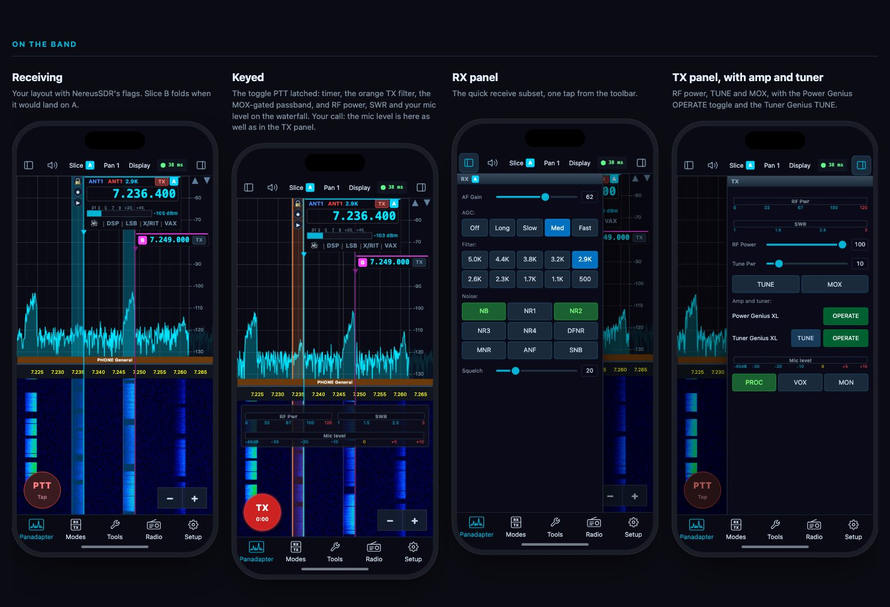
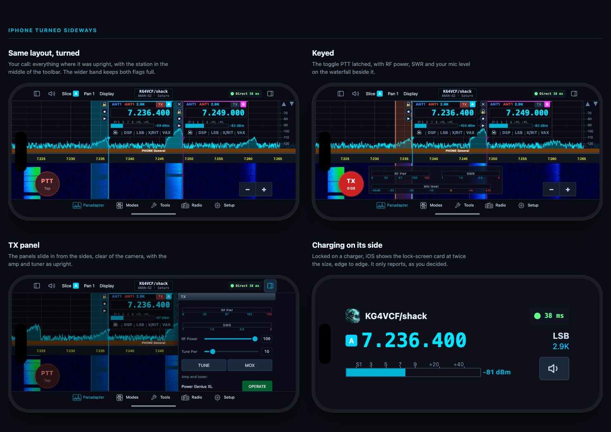
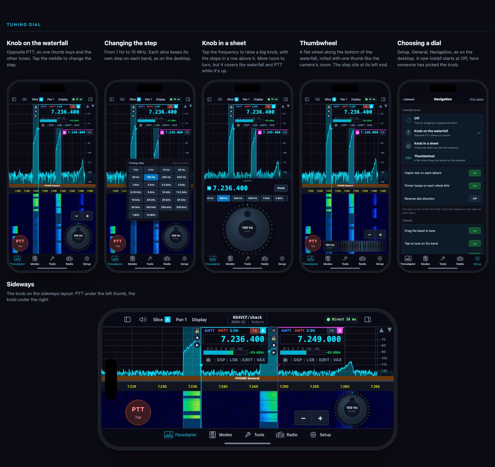
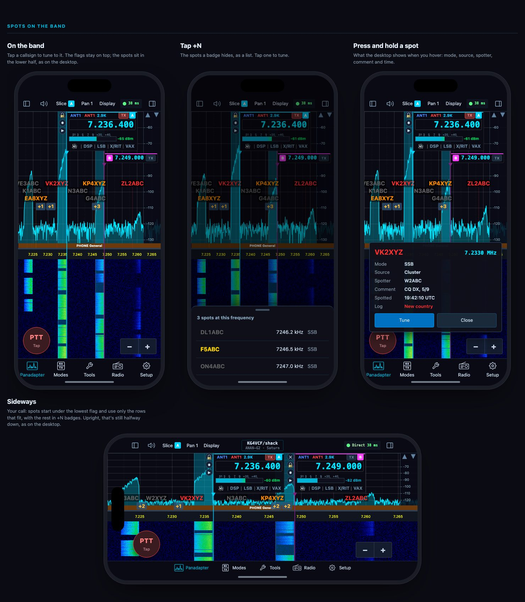

1. The toolbar, left to right: RX panel, speaker mute, Slice A, Pan 1,
   Display, the link dot with its round-trip time, and TX panel.
2. The tab bar: Panadapter, Modes, Tools, Radio, Setup.
3. Tap or drag the band to tune the active slice. Zoom minus and plus sit at
   the bottom right of the waterfall; PTT at the bottom left.
4. The flag uses the desktop's text size, narrowed to fit. The dBm scale is a
   little larger for fingers, and the band plan strip is on, ARRL by default.
5. The RX panel holds AF gain, AGC, filter presets, the noise buttons and
   squelch. The TX panel holds RF and tune power, TUNE, MOX, the amp's OPERATE,
   the tuner's TUNE, the mic level, PROC, VOX and MON.
6. Keyed: a timer on the PTT, the orange TX filter, the passband shading hidden
   (as on the desktop), and RF power, SWR and the mic level on the waterfall.
7. Sideways, the panels slide in from the sides. On a charger on its side, iOS
   shows the lock-screen card at double size.
8. The dial ticks on every detent and bumps harder on every whole kilohertz,
   with 36 detents in a full turn. Tap the knob's middle for the step list.
   Reversing the direction is a setting.
9. Setup's Navigation page on the phone swaps the desktop's Mouse section for
   Touch: drag to tune, tap to tune (optionally snapped to the step), pinch to
   zoom, and a choice of double-tap action.
10. Spots: tap a callsign to tune to it. Press and hold for its details (mode,
    source, spotter, comment, time) with a Tune button. Tap a +N badge to see
    the hidden spots as a list. Colours follow the desktop's DXCC priority.
11. How spots look is set on each phone. Which spots there are comes from the
    Core.
12. The mic meter is titled "Mic level", not the desktop's "Level", because on
    the band it sits next to RF power and SWR, where "Level" could be mistaken
    for the leveler. It is the desktop's Phone/CW applet gauge: -40 to +10 dB,
    yellow from -10, red from 0.
13. As on the desktop, each meter's title sits inside its bar, so a healthy mic
    level covers the words.

### 5.2 Tabs

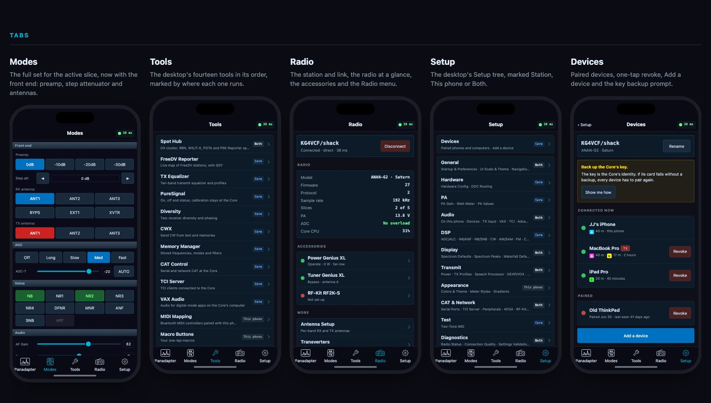

1. **Modes** is one scrolling page for the active slice, top to bottom: slice
   switch, mode (the 14 modes), filter (the mode's presets plus the low and high
   edges), front end, AGC with AGC-T and AUTO, noise, audio, RIT and XIT, then
   transmit (TX filter, mic gain, PROC, LEV, EQ, CFC, VOX, MON).
2. While transmitting, every tab's title bar shows a red TX pill with the clock
   and Stop; one tap unkeys.
3. **Tools** lists the desktop's tools in its order, each marked Core, This
   phone or Both, showing each once the Core offers it (D41). On the phone,
   PureSignal is on, off and status only; calibration stays at the Core.
4. MIDI Mapping and Macro Buttons are dropped for now (D42). Network Diagnostics
   and Support Bundle cover both ends.
5. **Radio** opens with the Core and link (name, direct or relay, round-trip
   time) and Disconnect; then the radio at a glance (model, firmware, protocol,
   sample rate, slices in use, PA volts, ADC overload, the station computer's
   CPU); then the accessories, each with a one-line status that opens its page;
   then the rest of the desktop's Radio menu: Antenna Setup, Transverters,
   Manage Radios, Protocol Info, each shown once the station offers it (D41).
6. **Setup** puts Devices first, then the desktop's categories:

   | Category | Pages | Marked |
   | --- | --- | --- |
   | Devices | Paired phones and computers, Add a device | Core |
   | General | Startup & Preferences, UI Scale & Theme, Navigation, Battery and sessions, Options | Both |
   | Hardware | Hardware Config, DDC Routing | Core |
   | PA | PA Gain, Watt Meter, PA Values | Core |
   | Audio | On this phone, Devices, TX Input, VAX, TCI, Advanced, TX Profile | Both |
   | DSP | AGC/ALC, NR/ANF, NB/SNB, CW, AM/SAM, FM, CFC, TNF, Filter Presets, Options | Core |
   | Display | Spectrum Defaults, Spectrum Peaks, Waterfall Defaults, Grid & Scales, Multimeter, TX Display | Both |
   | Transmit | Power, TX Profiles, Speech Processor, DEXP/VOX, PTT buttons | Both |
   | Appearance | Colors & Theme, Meter Styles, Gradients | This phone |
   | CAT & Network | Serial Ports, TCI Server, Peripherals, 4O3A, RF-Kit, TCP/IP CAT, MIDI Control, Data use | Both |
   | Test | Two-Tone IMD | Core |
   | Diagnostics | Radio Status, Connection Quality, Settings Validation, Logs, Export / Import | Both |

   Core settings are shared by every device paired with the Core;
   settings marked This phone stay on the phone. A page the desktop has not
   built yet appears once it exists (D41).
7. Left off the phone: the Keyboard page on the iPhone (an iPad with a keyboard
   gets it once the desktop builds it, D41); Appearance's Skins and Collapsible
   Display, which are about the desktop's window; the desktop's Remote Access
   page, whose job Devices does on the phone.
8. **Devices**: Rename for the Core; a reminder to back up the Core's key;
   the devices connected now (their slices and bands, and TX on the one with
   transmit) apart from the devices only paired, each paired device with when it
   was paired and last seen; one-tap Revoke, which drops that device at once,
   even mid-session; Add a device, which shows a one-time code; a note that up to
   four devices can be connected at once (D57, §5.8 item 13).

### 5.3 Getting connected

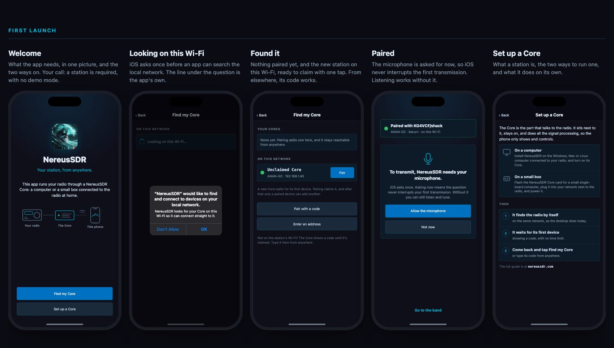
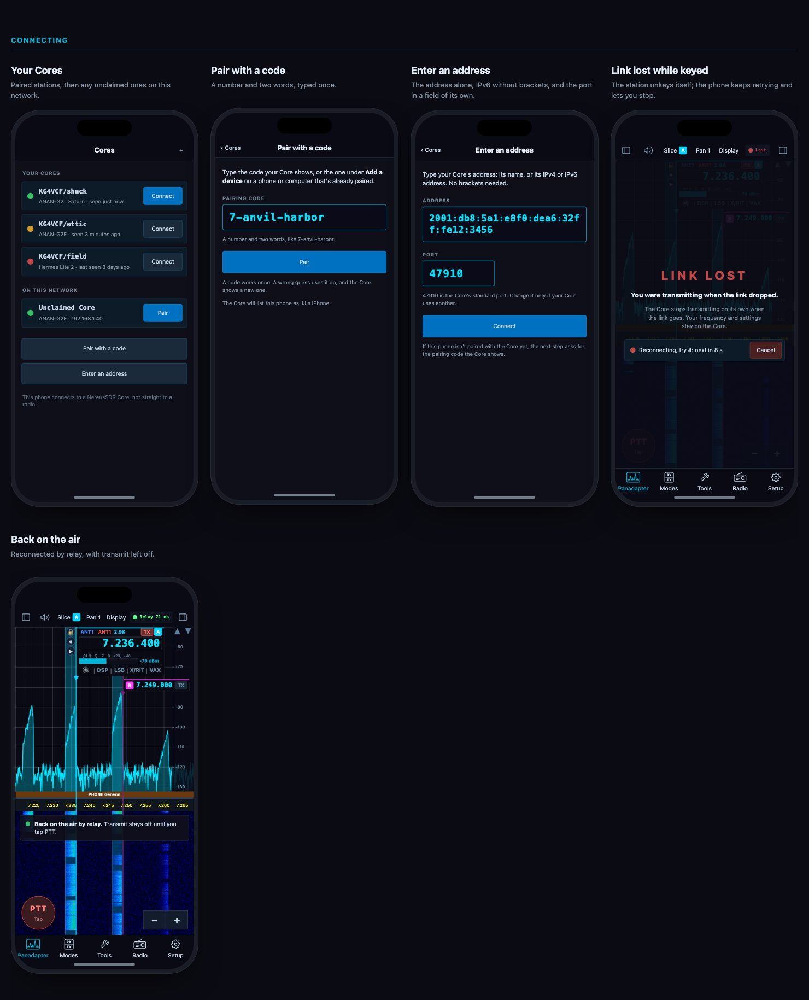
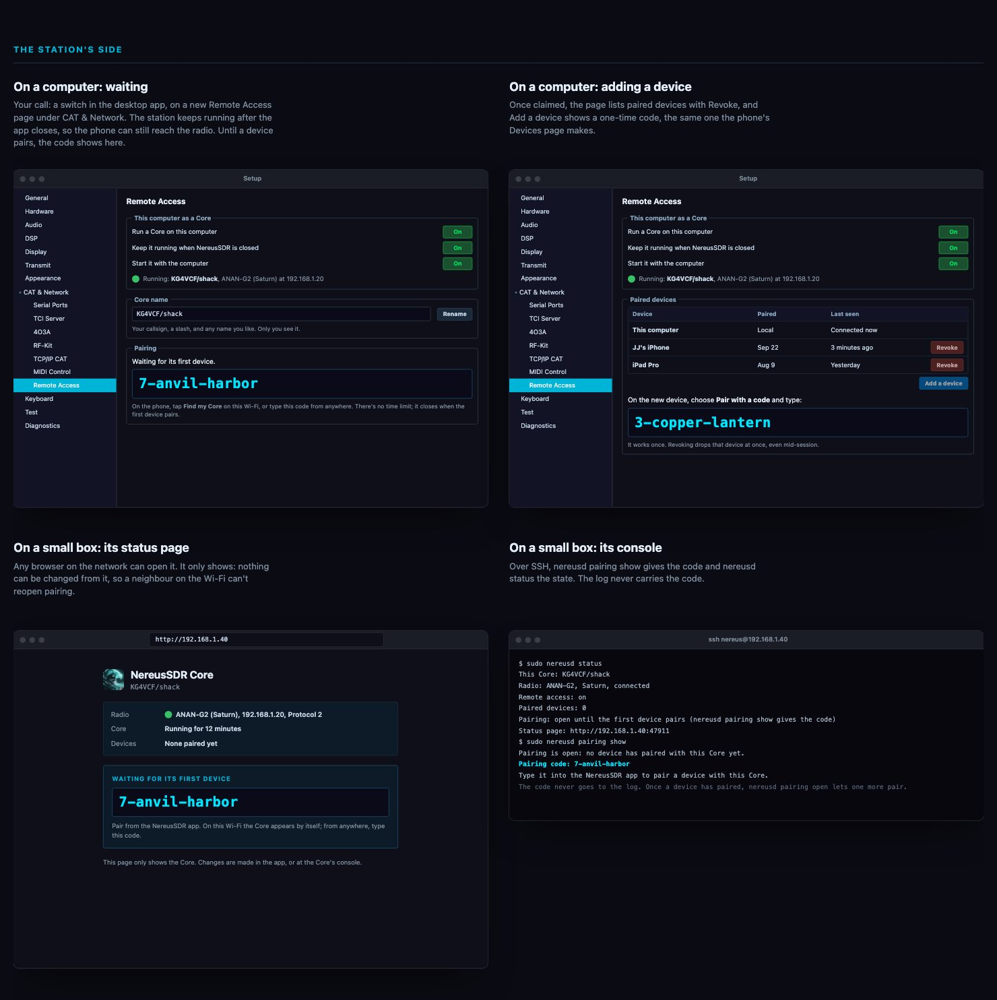
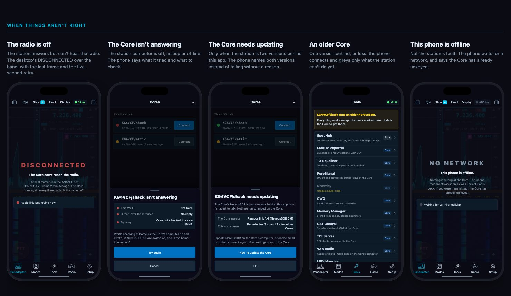

1. **Welcome:** one picture of radio, Core and phone ("Your station, from
   anywhere."), with two ways on: Find my Core and Set up a Core.
2. iOS asks once to search the local network, with the app's own reason under
   its question.
3. **Found it:** an unclaimed Core on the same Wi-Fi is claimed with one
   tap. From anywhere else its code works, and an address can be typed.
4. The microphone is asked for right after pairing, so iOS never interrupts the
   first transmission. Listening works without it.
5. **Set up a Core** explains the two ways to run one (on a computer, or on
   a small box from a flashed card). It finds the radio and waits for its first
   device, showing a code with no time limit until five wrong codes in a row
   close pairing, which only the Core's own computer then reopens.
6. **Your Cores** lists paired Cores first, then unclaimed ones on this
   network. The phone lists Cores only, never radios directly.
7. A pairing code is a number and two words (for example `7-anvil-harbor`),
   typed once.
8. **Link lost while keyed:** the phone says the Core stops transmitting on
   its own when the link goes. That is the Core's promise, since the phone
   can't see it happen. The phone keeps retrying, with Cancel.
9. **Back on the air:** transmit stays off until the operator taps PTT.
10. **The desktop's Remote Access page:** Run a Core on this computer; Keep
    it running when NereusSDR is closed; Start it with the computer; the
    Core's name with Rename; the pairing code, shown until a device claims
    it; then the paired devices with Revoke, and Add a device.
11. **A small box** shows its code, while it is unclaimed, on a status page
    any browser on its own network can open, which changes nothing, and to
    `nereusd pairing show` on its computer for claiming over SSH (`sudo nereusd
    pairing show` on a packaged Core, with no other options); the code never
    goes to its log. Only the console or an already-paired device can reopen
    pairing.
12. **Another device on the Core** no longer brings a question: up to four
    connect side by side (§5.8). The question comes for a fifth device, which
    names the four, how long each has been connected, when each was last used,
    and whether each is listening or transmitting.
13. A phone taking back its own dropped session is not asked; it gets its
    slices back, and transmit only if nobody took it meanwhile. The device whose
    place is taken is told who took it and when; its band stops; Take it back
    asks the same question the other way.
14. **Five trouble screens,** each naming its cause, so the operator knows
    whether to walk to the radio, the Core or the phone:
    * The radio is off: the Core answers but can't hear the radio; the
      desktop's DISCONNECTED over the band, the last frame and the five-second
      retry.
    * The Core isn't answering: what the phone tried (this Wi-Fi, direct,
      relay) and what to check.
    * The Core needs updating: only when it is two versions behind; names
      both versions.
    * An older Core: one version behind or less; the phone connects and
      greys what the Core can't do yet.
    * This phone is offline: not the Core's fault; the phone waits for a
      network and says the Core has already unkeyed.

### 5.4 Amps, tuner, audio and data

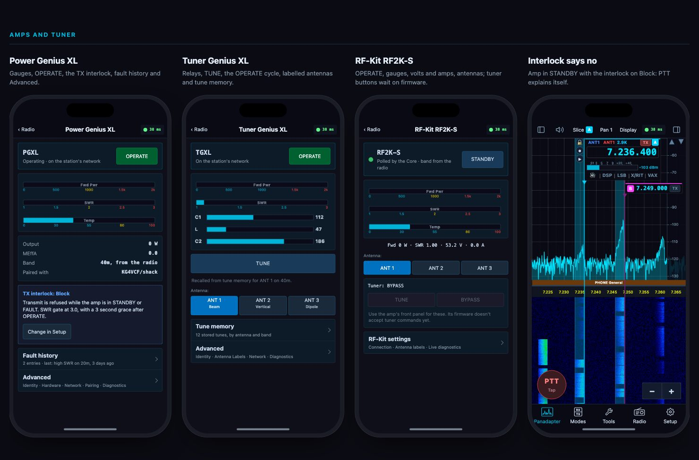
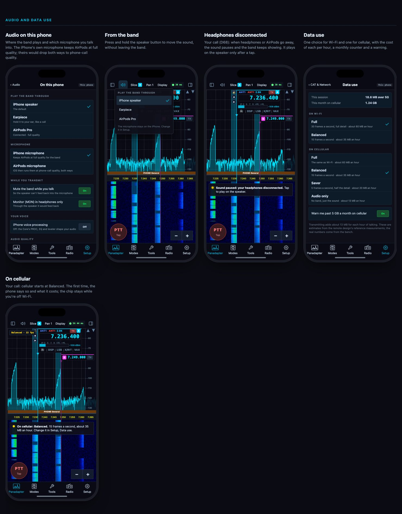

1. Each accessory has its own page, reached from the Radio tab, saying it is on
   the station's network (the RF2K-S says "polled by the Core").
2. **Power Genius XL:** OPERATE, output and efficiency; the band it got from the
   radio and what it is paired with; the TX interlock summary (Block, the SWR
   gate and its grace time) with "Change in Setup"; its fault history; Advanced.
3. **Tuner Genius XL:** OPERATE, TUNE, a line when a tune is recalled from
   memory, three antennas with the operator's labels, the tune memory, Advanced.
4. **RF2K-S:** OPERATE or STANDBY, power, SWR, volts and amps, the antennas. Its
   tuner buttons are greyed with a note to use the amp's front panel until its
   firmware accepts commands.
5. **Interlock says no:** with the amp in STANDBY and the interlock on Block,
   PTT is refused with a red explanation and an "Operate amp" button.
6. **Audio on this phone:** the band plays through the iPhone speaker by
   default, or the earpiece, or AirPods. The microphone stays on the iPhone by
   default, because the AirPods' microphone would drop them to phone-call
   quality both ways (A2DP is output-only; with the hands-free profile allowed,
   iOS prefers it).
7. While transmitting, the band is muted, so the speaker can't feed the
   microphone, and MON plays in headphones only. Both are on by default.
8. iPhone voice processing is off, so the station's PROC, EQ and leveler shape
   the voice.
9. Audio quality is Standard (Opus at 24 kbit/s, audio up to 8 kHz) or High
   (48 kbit/s). High appears only when the station advertises a measured profile
   (R-R3-23, R-IOS-09).
10. Pressing and holding the speaker button on the band moves the sound without
    leaving the band.
11. **Data use:** one choice for Wi-Fi (Full or Balanced) and one for cellular
    (Full, Balanced, Saver or Audio only), each with its cost per hour;
    counters for this session and this month; a warning past 5 GB a month on
    cellular, on by default.

    | Mode | What it asks for | Estimated |
    | --- | --- | --- |
    | Full | 30 frames a second, full detail | about 60 MB an hour |
    | Balanced | 15 frames a second | about 35 MB an hour |
    | Saver | 5 frames a second, half the detail | about 20 MB an hour |
    | Audio only | No band, just the sound | about 13 MB an hour |

    Transmitting adds about 13 MB for each hour of talking.
12. The first time on cellular, the phone says it is at Balanced and what that
    costs; a "Balanced · 15 fps" chip stays up while off Wi-Fi.
13. The data figures are estimates until the bench measures them (R-IOS-23).

### 5.5 Away from the app

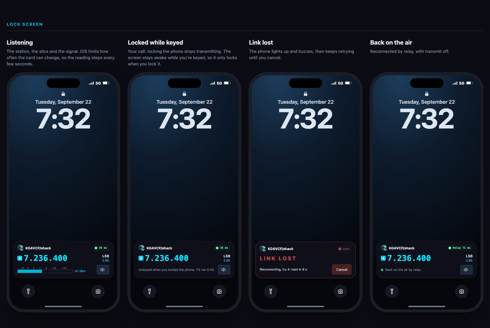
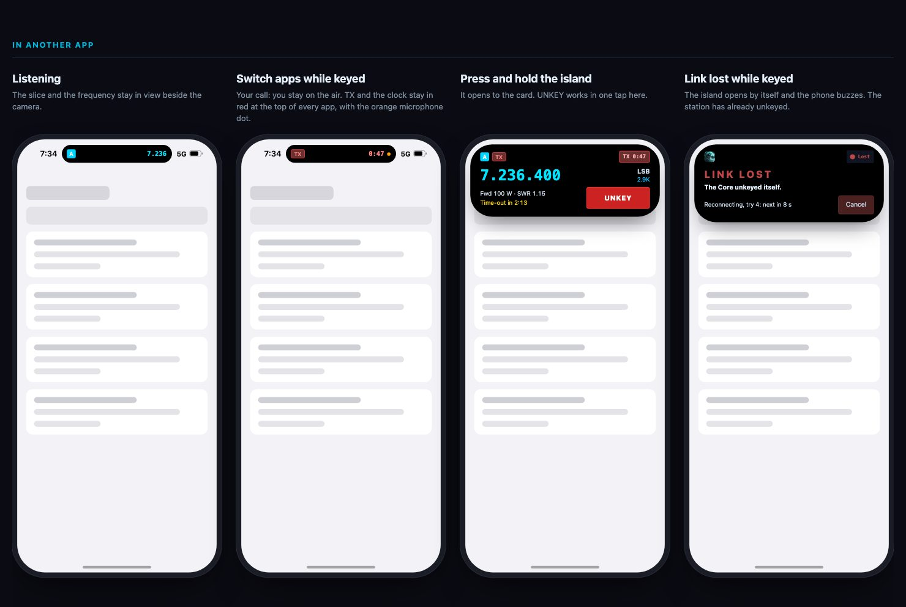
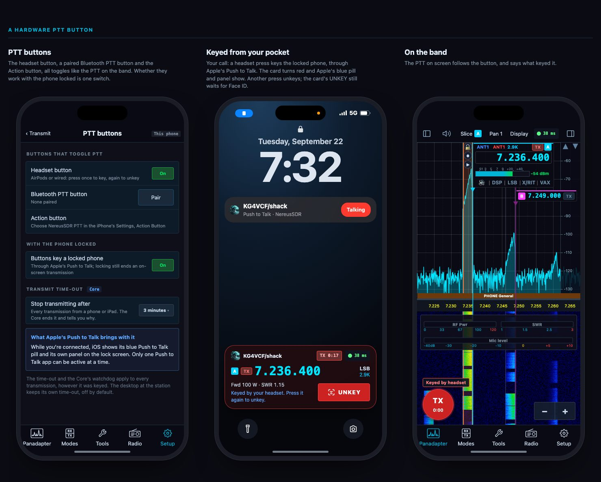
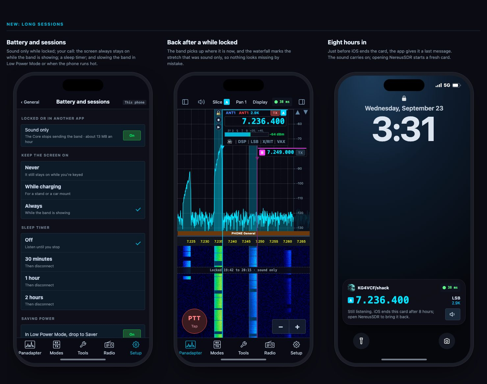
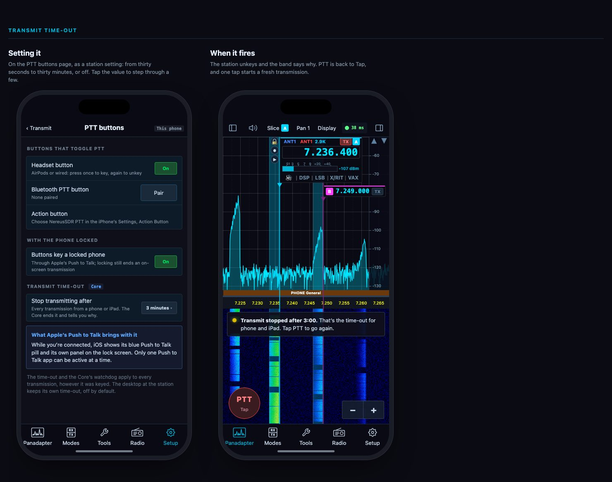

1. **The lock-screen card** shows the Core, the link, slice A with its
   frequency and signal level, and mute. iOS limits how often the card can
   change, so the reading steps every few seconds.
2. When the link drops, the lock screen lights up and buzzes, then keeps
   retrying until cancelled. Back on the air, transmit stays off.
3. **In another app,** the Dynamic Island keeps the slice and frequency beside
   the camera. Pressing and holding opens the card, where UNKEY works in one
   tap. On iPhones without the island, the card shows only on the lock screen
   and a lost link arrives as a banner.
4. If the link drops while keyed in another app, the island opens by itself,
   the phone buzzes, and it says the Core has already unkeyed.
5. The opened island shows forward power, SWR and the time left before the
   time-out ("Time-out in 2:13").
6. **PTT buttons** (Setup, Transmit, this phone): the headset button, a paired
   Bluetooth PTT button, and the Action button (chosen in the iPhone's
   Settings). All toggle, like the PTT on the band. One switch, on by default,
   decides whether they key a locked phone.
7. While connected, iOS shows its blue Push to Talk pill and its own lock-screen
   panel, and only one Push to Talk app can be active at a time. Apple's rule;
   it comes with D26.
8. **Keyed from a pocket:** the card turns red and says to press the button
   again to unkey; the card's own UNKEY still waits for Face ID. On the band,
   the PTT follows the button and says what keyed it ("Keyed by headset").
9. **Battery and sessions** (Setup, General, this phone): sound only while
   locked or in another app, on by default.
10. Keep the screen on: Never, While charging, or Always, with Always the
    default (D27). It always stays on while keyed.
11. A sleep timer (off, 30 minutes, 1 hour or 2 hours, then disconnect). Low
    Power Mode drops the band to Saver, and a hot phone slows the band until it
    cools; both are on by default.
12. After a while locked, the waterfall marks the stretch that was sound only
    ("Locked 19:42 to 20:15 · sound only"), so nothing looks lost.
13. Just before iOS ends the card at eight hours, the app leaves a last message
    on it. The sound carries on, and opening NereusSDR starts a fresh card.
14. **Transmit time-out** (D29): on the PTT buttons page, a Transmit time-out
    group marked Core with "Stop transmitting after: 3 minutes" (30 seconds
    to 30 minutes, or off). When it fires, the band shows an amber notice,
    "Transmit stopped after 3:00. That's the time-out for phone and iPad. Tap
    PTT to go again.", and PTT is back to Tap.

### 5.6 iPad

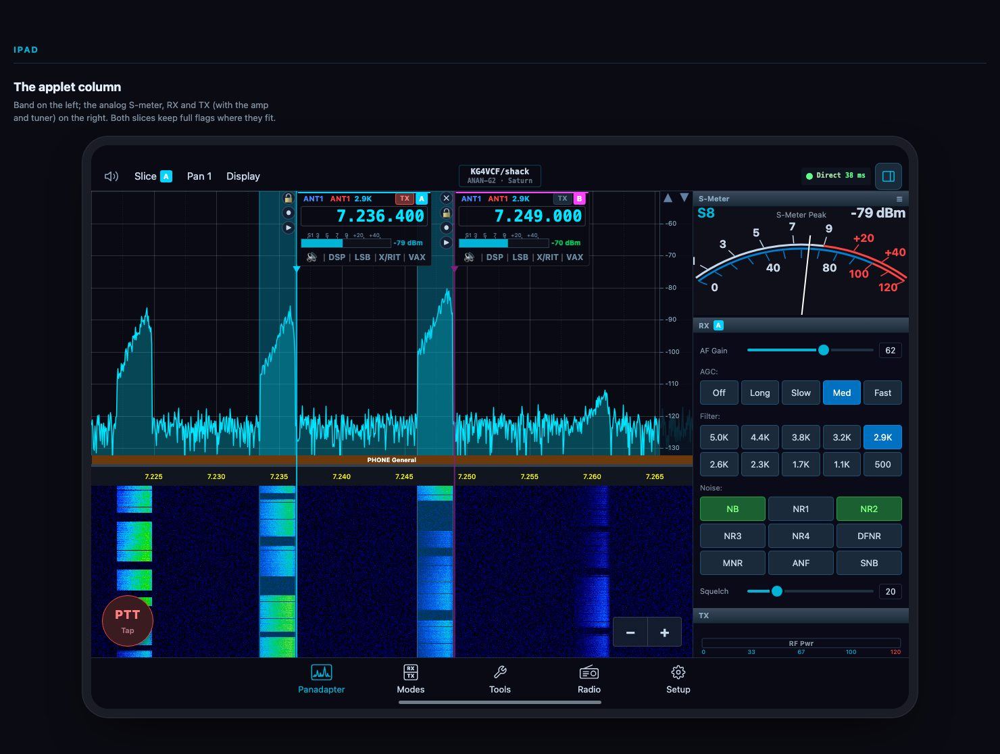
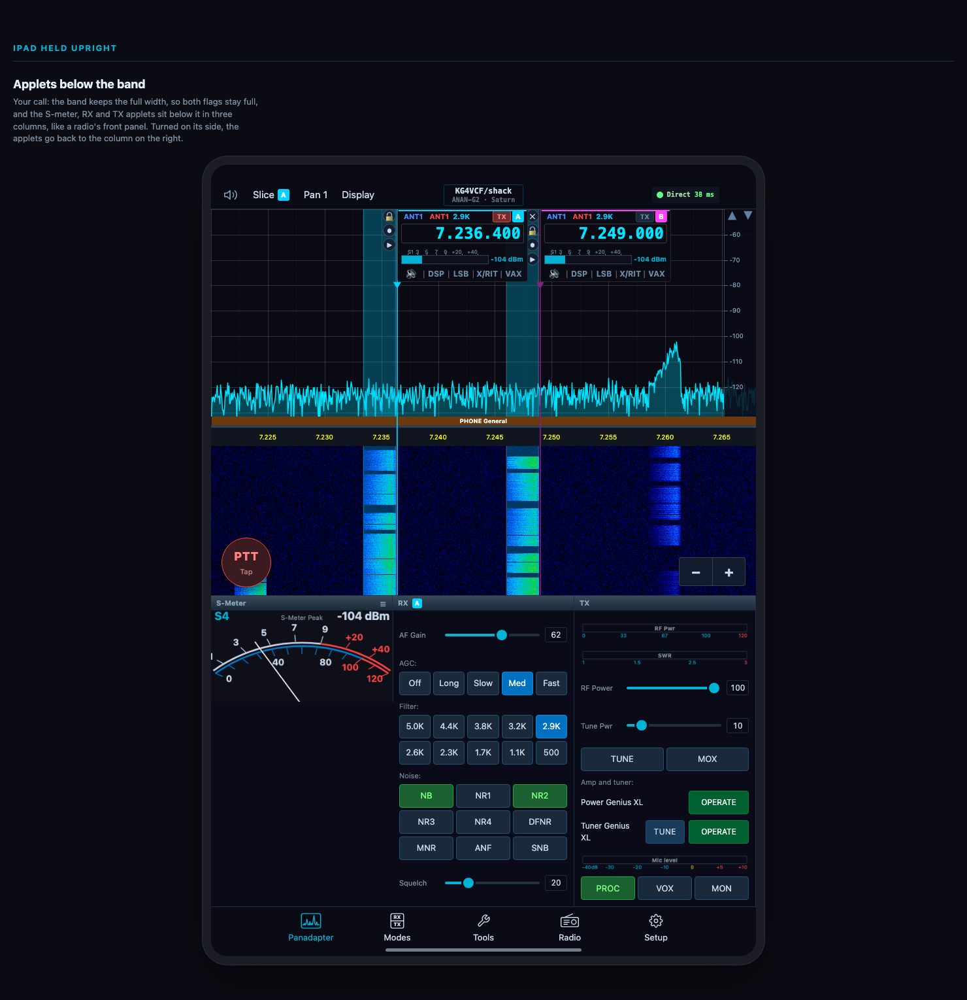

1. On its side, the analog S-meter heads the column, then RX, then TX with the
   amp and tuner. A corner button hides the column, and the Core's name shows
   in the toolbar. Otherwise the iPad has the phone's toolbar, flags, band plan,
   toggle PTT and tabs.
2. Upright (834 by 1210 points on the 11-inch), the S-meter, RX and TX sit in
   three columns below the band, and the column button is hidden.

### 5.7 Spot Hub and FreeDV Reporter

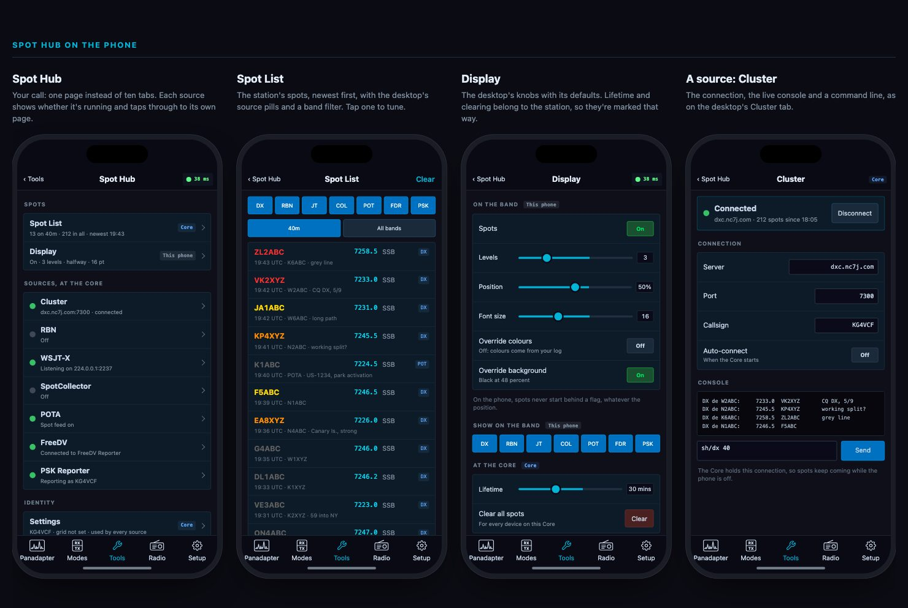
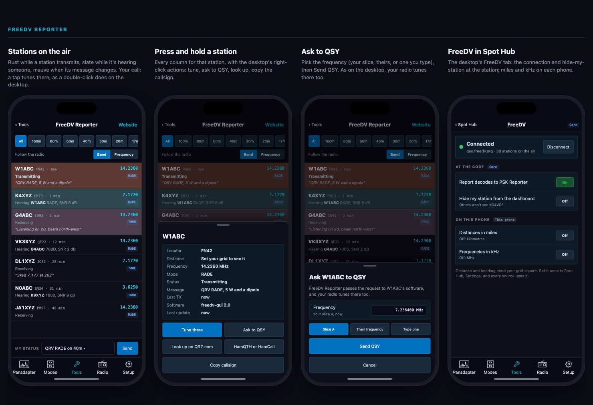

1. **Spot Hub** is one Tools page: the Spot List and Display first; then each
   source with a status dot (cluster, RBN, WSJT-X, SpotCollector, POTA, FreeDV,
   PSK Reporter); then Identity. The sources and the list live at the Core;
   how spots look lives on the phone.
2. **Spot List:** newest first, with the desktop's columns (time, kHz, call,
   mode, source, spotter, comment), source pills and a band filter. A tap tunes.
3. **Display:** the desktop's knobs and defaults (spots on; 3 levels of 1 to 10;
   halfway, 0 to 100; font 16 of 8 to 32; override colours off; override
   background on at 48). Each source can be shown or hidden on this phone's
   band. Spot lifetime (default 30 minutes) and "Clear all spots" belong to the
   Core.
4. **A source page** (the cluster, for example): server, port, callsign,
   auto-connect (off), the live console and a command line.
5. **FreeDV Reporter** folds the desktop's 14 columns into two lines per
   station. Rows tint rust while a station transmits, slate while it hears
   someone and mauve when its message changes, fading after six seconds.
6. A band filter (All by default) and "follow the radio" by band or frequency
   (the desktop's track frequency).
7. The operator's status message, with saved messages and Send.
8. Pressing and holding a station shows every column plus the desktop's
   right-click actions: tune, ask to QSY, look up on QRZ.com or HamQTH, copy the
   callsign.
9. **Ask to QSY:** pick the slice's frequency, theirs, or type one, then Send
   QSY. As on the desktop, the operator's radio tunes there too.
10. The reporter connection and "hide my station" run at the Core, so your
    station stays listed while the phone is away. Miles and kHz are set per
    phone. Distance and heading stay blank until a grid square is set.

### 5.8 Several devices at once

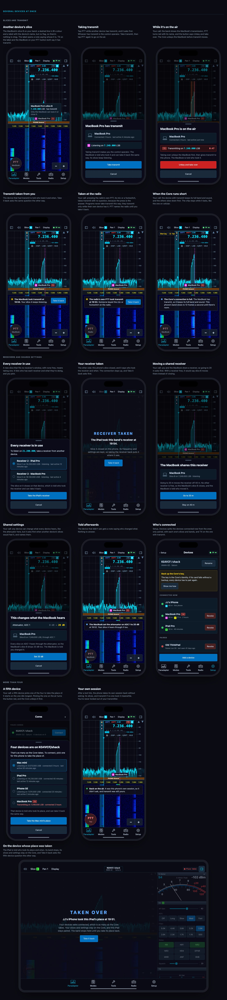

On every screen here this phone has slice A on 40 m; the MacBook at the shack has
slices B (sharing this phone's receiver) and D, and has transmit; the iPad has
slice C on 20 m.

1. **Another device's slice** on the band: a dashed line in its colour, a label
   at the foot of the spectrum with the device's name, and TX on the label while
   it has transmit; no flag. A tap on the label opens a note: whose slice, where,
   and that only that device can tune it or close it.
2. **PTT names the holder** while another device has transmit ("PTT" over
   "MacBook", in muted red), and this phone's own TX badges are off.
3. **Taking transmit:** a tap on PTT asks first, naming the device and what it is
   doing; after Take transmit, PTT keys as usual.
4. **While it's on the air:** the band shows the other device's transmission, PTT
   turns red with its name, and the button reads "Unkey and take over" in red
   beside the TX clock.
5. **Transmit taken from you:** a notice with who and when, and Take it back.
6. **Taken at the radio:** the radio's own PTT took transmit; PTT names the
   radio; Take it back.
7. **When the Core runs short:** a "Sharing · 12 fps" chip and a one-time notice
   that the device with transmit keeps its full band and sound.
8. **Every receiver in use:** to listen where no receiver reaches, pick a
   receiver to take from a list of who has each one and what they are doing.
9. **Your receiver taken:** RECEIVER TAKEN over the band, with who and when;
   slice A closed with its frequency and settings kept; Take it back. The
   connection stays up.
10. **Moving a shared receiver:** going to another band names the device that
    shares the receiver and says what happens to its slice ("Go to 20 m" or
    "Stay on 40 m").
11. **Shared settings:** a change that reaches another device's slices names that
    device, shows the change (the attenuator on ADC 1 from 0 dB to 20 dB), and
    asks.
12. **Told afterwards:** the other device gets a note of who changed what, and
    when; there is nothing to answer.
13. **Setup, Devices:** Connected now, with each device's slice letters and
    bands, TX on the one with transmit, and Revoke; then Paired. "Up to four
    devices can be connected at once."
14. **A fifth device:** "Four devices are on KG4VCF/shack", the four with what
    each is doing, starting on the one idle longest that can be replaced (a device
    that's away counts as idle longest; the computer running the Core can't be
    replaced, D64); picking the one on the air turns the button red ("Unkey and take
    the MacBook's place").
15. **Your own session:** after a lost link the phone comes back without asking.
16. **The device whose place was taken** (an iPad): TAKEN OVER, with who and
    when; its slices and settings kept on the Core; Take it back.

### 5.9 Several devices: states and notices

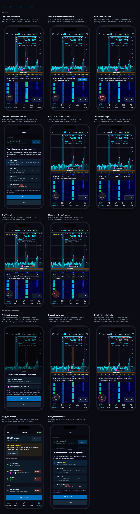

Drawn the same evening as §5.8 and kept by JJ (board v50 and v51), with the same cast.

**The states in between:**

1. **A device that's away:** the MacBook's link dropped while it had transmit; its
   label greys with "away", and taking transmit asks "Take transmit from the
   MacBook?" without the red button, since nobody is on the air.
2. **Transmit on its way:** right after Unkey and take over, PTT waits with a
   turning ring and "Wait" while the Core unkeys the other device, then reads Tap.
3. **Held by the radio's mic:** on a Core with no desktop, the radio's own mic
   transmits on this phone's slice A; the flag says ON AIR, the frequency greys, and
   tuning slice A waits until the press ends.
4. **Away, on Devices:** an amber dot and "away for 1 minute"; it keeps its place and
   slices for 3 minutes.
5. **Away, for a fifth device:** a device that's away comes first in the list.

**Notices:**

6. **Back within 3 minutes, without transmit:** "Back on the air. It was this
   phone's own session, so it didn't ask."
7. **Back, transmit taken meanwhile:** "The MacBook took transmit while you were
   away, at 19:55." with Take it back.
8. **Back after 3 minutes:** "Back after more than 3 minutes. Your slices are back,
   and transmit was freed while you were away."
9. **Back after 3 minutes to a full Core:** the fifth-device question, headed "Your
   place went to another device", saying the phone was away more than 3 minutes.
10. **A slice that couldn't come back:** "Slice E couldn't come back: every receiver
    is in use. Its frequency and settings are saved."
11. **The antenna stays:** "The antenna stays on ANT1 while the MacBook listens on
    it." (D61)
12. **The Core is busy:** the Sharing chip with "The Core is busy." when processing
    runs short, in place of "The Core's connection is full."
13. **Short, nobody has transmit:** "The Core's connection is full. The devices share
    it, so this phone's band slows to 12 frames a second until there's room." (also
    when the radio's mic has transmit)

---

## 6. Requirements

IDs `R-IOS-nn` are new with this spec, stable, and never renumbered; a withdrawn
one is marked, not deleted. It relies on R-R3-06, R-R3-08, R-R3-13, R-R3-22,
R-R3-23 and R-R3-25 as the R3 plan defines them, and amends remote design §7.0
(D23) and §7.1 (§3.9, which replaced D21 on 2026-09-24).

Evidence layers:

* **Software:** unit and conformance tests, in the app's test target and the
  station's ctest (run offscreen).
* **Integration:** the app against a real `nereusd` over the link, on a LAN and
  through the relay.
* **Device:** on a real iPhone or iPad: lock screen, background audio, Push to
  Talk, haptics, permissions.
* **Bench:** with a radio on the air: an ANAN-G2, a Hermes Lite 2, and the
  Power Genius XL and Tuner Genius XL where the requirement names them.
* **Measurement:** data, battery and heat over hours.

Hardware evidence stays **pending** until a device or the bench shows it.

### 6.1 Station-side work the app needs

| ID | Requirement | Owner | Evidence |
| --- | --- | --- | --- |
| R-IOS-01 | A written, versioned specification of the link (framing, handshake, snapshot, messages, capabilities, version rules) and a conformance suite the station and the app both run. | Station, before R4 | Software: the suite passes on the station and in the app, at both majors the app speaks. |
| R-IOS-02 | Several sessions at once (§3.9, §4.5 items 1 to 3 and 8; amended 2026-09-24 from the one-holder report): up to four paired devices, each owning its slices and pans; one pool of slice letters; receivers from the radio's pool, shared when slices fit a window; who is on the Core, whose each slice is and who has transmit, sent to every session; a fifth device takes a place only on its operator's confirmation; a device reclaiming its own session is admitted without asking and gets transmit back only if nobody took it. | Station, R4, per the Core/GUI session's design for several devices | Software: session tests for four devices, ownership refusals, the letter pool, shared receivers, the fifth device and silent reclaim. Integration: four devices on one Core. |
| R-IOS-03 | "Unkey and take over" (amended 2026-09-24): taking transmit (D51) or a place (D55) from a device on the air unkeys it through the unkey-confirmed gate before transmit or the place moves; the radio's own PTT takes transmit, unkeying a holder on the air first (D52). | Station, R4 | Software. Bench: the holder keyed on air, the taker confirms, the carrier stops before transmit moves; the radio's PTT pressed while a phone holds transmit. |
| R-IOS-04 | A remote transmit time-out: a station setting, on by default at 180 seconds for sessions from paired remote devices (30 seconds to 30 minutes, or off), off by default for the desktop at the station as in Thetis. When it fires the station drops MOX and TUNE and tells the client why; the time remaining is part of the transmit state the client sees. From Thetis `TimeOutTimerManager.cs` and `setup.designer.cs` `udMoxToTSeconds` (180, range 30 to 1800) and `chkToTMox` (off) [v2.10.3.15]. | Station, R4 (remote design §12.2) | Software: the timer, the reason and the remaining time. Bench: it fires on air at the setting. |
| R-IOS-05 | Transmit-coupled accessory commands through the station: the amp's OPERATE and STANDBY; the tuner's TUNE, OPERATE, BYPASS and antenna; the RF2K-S's OPERATE, STANDBY and antenna. The TX interlock is enforced at the station and every refusal carries its reason. | Station, R4 (R-R3-25) | Software. Bench: Power Genius XL and Tuner Genius XL; RF2K-S when one is available. |
| R-IOS-06 | The station advertises the values it owns and the phone shows (§4.10): the mode list, filter presets per mode, the tune-step list, AGC ranges, meter ranges and the board's capabilities. | Station, R3 follow-on | Software: the snapshot carries them; the phone builds its controls from them for an ANAN-G2 and a Hermes Lite 2. |
| R-IOS-07 | The desktop's Remote Access page of §5.3 (items 10 and 11 describe it and the small box). | Desktop, R6 | Software, and screenshots of the running page per the ui-verification skill. |
| R-IOS-08 | Pairing, devices and revocation per the pairing design: one tap on the LAN, the code from anywhere, the window open while unclaimed with no timer, reopening from the console or a paired device, revoke dropping a live session, the station-key backup prompt, and the code on a small box's status page and console. | Station, R5 and R6 | Software. Integration: pair on the LAN, pair by code through the relay, revoke mid-session. |
| R-IOS-09 | The higher audio quality is offered only when the station advertises a measured profile for it (R-R3-23); otherwise the phone greys it. | Station, R3 | Integration. |
| R-IOS-10 | Sound only: with every display endpoint disabled, audio and the card's readings keep flowing (R-R3-08, R-R3-13). | Station, R3 | Integration: traffic drops to audio and telemetry, and the card's reading keeps moving. |
| R-IOS-30 | Asked changes and notices (§4.5 items 4 to 6, D49, D50, D53): taking a receiver, moving a shared receiver, and a shared setting that would disturb another device's slices are confirmed requests; the Core says beforehand which devices and slices they reach and what happens to them; every affected device is told who, what and when, with Take it back where §3.9 gives one. | Station, R4, per the Core/GUI session's design for several devices | Software: each request confirmed and cancelled, and each notice. Integration: two devices. |
| R-IOS-31 | Capacity (D54): when the sessions together ask for more display and audio than the Core can send, the transmit holder keeps its full display and audio, the others' frame rates drop first, and each slowed session is told the rate it gets. | Station, R3 follow-on | Software: the allocation with four sessions. Measurement: four devices over a constrained uplink. |

### 6.2 The app

| ID | Requirement | Evidence |
| --- | --- | --- |
| R-IOS-11 | On the band as in §5.1 items 1 to 7 and D7 to D11: toolbar, flags and the fold rule, markers per D10, toggle PTT, zoom, band plan, RX and TX panels, keyed view; the same layout sideways. | Software: layout and fold-rule tests. Device: screenshots on two iPhone sizes, both orientations, compared against the board. |
| R-IOS-12 | Tuning: tap and drag on the band; the three dials, off until chosen; steps from the station's list; haptics per detent and per whole kilohertz; the Touch settings (§5.1 items 8 and 9). | Software: step and detent arithmetic. Device: the haptics felt on a real iPhone. |
| R-IOS-13 | Transmitting from the phone: the toggle PTT; the keyed view with RF power, SWR and mic level (D14); refusals shown with the station's reason and fix; transmit never resumes after a reconnect; an audio interruption (a call, Siri) unkeys. | Software: the PTT state machine. Bench: keying on air from the phone; a call arriving mid-transmission unkeys on air. |
| R-IOS-14 | Locked and in other apps (§5.5 items 1 to 5): locking unkeys; the screen stays awake while keyed; switching apps keeps transmitting with the island; the card as drawn; sound only; the eight-hour last message. | Device: a real iPhone locked, switched and left eight hours. Bench: transmission stops on lock and continues across an app switch. |
| R-IOS-15 | Hardware PTT through Apple's Push to Talk (§5.5 items 6 to 8): headset button, Bluetooth PTT button, Action button; keying a locked phone; "Keyed by headset". | Device and Bench, with each button. |
| R-IOS-16 | Connecting (§5.3): first launch, the Local Network question, pairing three ways, the microphone asked after pairing, the station list, link lost and back on the air, the five trouble screens; the version rules of §4.4. | Integration: each failure induced against a real station, including a station one major back and one two majors back. Device: the permission prompts. |
| R-IOS-17 | The several-devices screens of §5.8 and §5.9 and §5.3 items 12 and 13 (amended 2026-09-24 from the takeover screens). | Integration: four devices on one Core, listening and transmitting, with a fifth device and the radio's own PTT. Device: screenshots compared against the board. |
| R-IOS-18 | Tabs and Setup (§5.2): Modes, Tools, Radio, the Setup tree with its tags, Devices; controls in both places (D15). | Software: each control writes to its owner (station or phone). Integration: a station setting changed on the phone shows on the desktop. |
| R-IOS-19 | Accessories on the phone (§5.4 items 1 to 5): the three pages, the TX panel controls, the interlock refusal with "Operate amp". | Bench with the devices. |
| R-IOS-20 | Audio on the phone (§5.4 items 6 to 10): routes, the iPhone microphone by default, the band muted while talking, MON in headphones only, voice processing off, the quality choice, the speaker's route menu. | Device: every route, including AirPods; no feedback on the speaker while keyed. Bench: on-air audio shaped by the station's processing. |
| R-IOS-21 | The transmit time-out on the phone (§5.5 items 5 and 14): the setting marked Core, the time left in the island, the notice when it fires. | Software. Bench, with R-IOS-04. |
| R-IOS-22 | Long sessions (§5.5 items 9 to 13): sound only when locked, the screen-on choice defaulting to Always, the sleep timer, Low Power Mode to Saver, the heat slow-down, the locked stretch marked in the waterfall. | Device and Measurement: a multi-hour run with battery and heat logged. |
| R-IOS-23 | Data use (§5.4 items 11 to 13): the modes and their defaults (D28), the counters, the 5 GB warning, the first-time cellular note and chip. The estimates are replaced by measured figures before release. | Measurement: each mode for an hour on Wi-Fi and on cellular. |
| R-IOS-24 | iPad on its side and upright (§5.6, D30, D31). | Device: an 11-inch iPad in both orientations. |
| R-IOS-25 | Spots on the band and Spot Hub (§5.1 items 10 and 11, §5.7 items 1 to 4). | Integration: the station's spot clients feeding the phone. Device. |
| R-IOS-26 | FreeDV Reporter (§5.7 items 5 to 10), with the callsign and never the station label. | Integration: against the live reporter. |
| R-IOS-27 | The app draws each radio's controls from the values the station advertises (R-IOS-06) and has no radio tables of its own. | Software: the same build shows an ANAN-G2's and a Hermes Lite 2's presets and ranges correctly. |
| R-IOS-28 | Store readiness (§4.13): the TestFlight round, the App Review video on a real station, the export-compliance and privacy answers, the Push to Talk capability. | The App Store Connect record, checked by JJ. |
| R-IOS-29 | Licence (§4.11): no Thetis, WDSP or AetherSDR code in the app; the App Store permission clause in its licence; shared code cleared with its copyright holders. | Software: the repository's provenance check extended to the app's sources, run in CI. |

### 6.3 How this becomes a plan

One plan builds all of it, station and app together, ordered by dependency:
[2026-09-23-iphone-app-plan.md](2026-09-23-iphone-app-plan.md). Two sessions run
it, one owner per task (JJ, 2026-09-24): the Core/GUI session builds every station
and desktop task in its lanes, and the phone session builds the app, each phone task
waiting for the station tasks it uses. What follows was the first proposal, which JJ
turned down on 2026-09-23 ("i hate us splitting plans"); it is kept for the record.

This spec is larger than one plan. The station-side requirements (§6.1) go
into the remote-station phase plans that own them: R-IOS-06, R-IOS-09 and
R-IOS-10 into an R3 follow-on; R-IOS-02 to R-IOS-05 into R4; R-IOS-08 into R5
and R6; R-IOS-07 into R6. R-IOS-01, the written link and its conformance
suite, comes first, because every other plan tests against it. The app (§6.2)
gets its own plan, built against that suite from the start and taken onto
the air as R3, R4 and R5 land.

---

## 7. Error handling

| Situation | The Core | The phone |
| --- | --- | --- |
| Link lost while listening | Keeps the radio state (remote design §13) | Retries with backoff, cancellable; LINK LOST on the band, the card and the island |
| Link lost while keyed | Drops MOX on the watchdog | Says the Core stops on its own; retries; back on the air with transmit off |
| The radio is off | Answers; reports the radio link | The desktop's DISCONNECTED, the last frame, the five-second retry |
| The Core isn't answering | | What it tried (this Wi-Fi, direct, relay) and what to check |
| Versions two majors apart | Refuses, naming both | "The Core needs updating", naming both |
| An older Core | Negotiates down | Connects; greys "Needs a newer Core" |
| The phone is offline | Unkeys if it was keyed (watchdog) | Waits for a network; says the Core has already unkeyed |
| Four devices are connected | Lists them (R-IOS-02) | The fifth device's question (§5.8) |
| This device's place is taken | Admits the fifth device, unkeying this one first if it was on the air | The band stops; who and when; Take it back |
| Transmit taken, by a device or the radio's own PTT | Moves transmit, unkeying the holder first if on the air (R-IOS-03) | PTT names the new holder; a notice with Take it back |
| This device's receiver taken | Closes the slice on it and keeps its settings (R-IOS-30) | RECEIVER TAKEN; who and when; Take it back |
| A shared setting changed by another device | Applies it and tells the devices it reaches (R-IOS-30) | A note of who changed what |
| The Core runs short of room | Keeps the transmit holder whole and slows the rest (R-IOS-31) | The "Sharing" chip |
| Transmit refused (interlock, amp in STANDBY, PA protection) | Refuses with a reason | Red explanation, with the fix where there is one |
| The time-out fires | Drops MOX, gives the reason | Amber notice; PTT back to Tap |
| A call or Siri interrupts | Unkeyed by the phone's request | Unkeys; audio resumes afterwards |
| The device is revoked | Drops the session at once (pairing design §7) | Back to the list of Cores; the Core must be paired again |
| Low Power Mode or a hot phone | Honours the smaller display request | Saver, or a slower band until it cools |

---

## 8. Verification plan

* **Before any code:** the link specification and its conformance suite
  (R-IOS-01), so the app and the station are tested against the same contract.
* **Software on every change:** the app's unit tests and the station's ctest,
  run offscreen.
* **Integration:** the app against a real `nereusd` on a LAN and through the
  relay, including a station one major behind and one two majors behind, and
  four devices on one Core with a fifth trying to connect.
* **Device matrix:** two iPhone sizes (one with the Action button), an 11-inch
  iPad, AirPods, a Bluetooth PTT button, both orientations, locked and
  unlocked, and an eight-hour session.
* **Bench, on air:** keying from the phone; lock, app switch and a call during a
  transmission; the time-out firing; taking transmit, and a place, from a device
  on the air, and the radio's own PTT taking transmit from a phone; the
  remote design's watchdog test (the link severed mid-transmission on each relay
  rung) rerun with the phone as the client; the amp and tuner commands.
* **Measurement:** data per mode per hour on Wi-Fi and cellular, battery per
  hour with the screen on and with sound only, and heat.
* **UI evidence:** screenshots of every screen in §5 from the real app on a
  device, compared against the board, per the ui-verification skill.

---

## 9. Open items

Each has an owner and the moment it is settled.

* **Data figures** (§5.4): measured on the bench before release (R-IOS-23).
* **Microphone starvation deadlines and the per-mode action:** R4, remote design
  §12.3.
* **Keepalive intervals on cellular:** the pairing design's §9.8 bench.
* **Console command names** for reopening pairing and resetting a station to
  unclaimed: R6.
* **The app's structure and minimum iOS version** (§4.12): proposed in this
  spec; JJ rules on them in his review.
* **The station's design for several devices**: written as
  [2026-09-24-several-devices-on-one-core-design.md](2026-09-24-several-devices-on-one-core-design.md)
  and reviewed twice against this spec (2026-09-24); §4.5, R-IOS-02, R-IOS-03,
  R-IOS-30 and R-IOS-31 take their wire form from its sections 10.2 to 10.9.

---

## 10. Mockups

The pictures, one per board section, in `2026-09-23-iphone-app-design/`:

| Picture | Board section | Spec |
| --- | --- | --- |
| `01-on-the-band.jpg` | On the band | §5.1 |
| `02-sideways.jpg` | iPhone turned sideways | §5.1 |
| `03-tuning-dial.jpg` | Tuning dial | §5.1 |
| `04-spots.jpg` | Spots on the band | §5.1 |
| `05-tabs.jpg` | Tabs | §5.2 |
| `06-first-launch.jpg` | First launch | §5.3 |
| `07-connecting.jpg` | Connecting | §5.3 |
| `08-station-side.jpg` | The station's side | §5.3 |
| `09-takeover.jpg` | The takeover question (replaced on 2026-09-24 by `22`; kept for the record) | §3.4 D21 |
| `10-trouble.jpg` | When things aren't right | §5.3 |
| `11-amps-and-tuner.jpg` | Amps and tuner | §5.4 |
| `12-audio-and-data.jpg` | Audio and data use | §5.4 |
| `13-lock-screen.jpg` | Lock screen | §5.5 |
| `14-other-apps.jpg` | In another app | §5.5 |
| `15-hardware-ptt.jpg` | A hardware PTT button | §5.5 |
| `16-long-sessions.jpg` | Long sessions | §5.5 |
| `17-transmit-time-out.jpg` | Transmit time-out | §5.5 |
| `18-ipad-landscape.jpg` | iPad (on its side) | §5.6 |
| `19-ipad-upright.jpg` | iPad held upright | §5.6 |
| `20-spot-hub.jpg` | Spot Hub on the phone | §5.7 |
| `21-freedv-reporter.jpg` | FreeDV Reporter | §5.7 |
| `22-several-devices.jpg` | Several devices at once | §5.8 |
| `23-several-devices-states-and-notices.jpg` | Several devices: states and notices | §5.9 |

`board.html` in the same folder is the whole interactive board: the knobs
turn, the PTT keys, the flags fold, and the lock-screen states step through.
