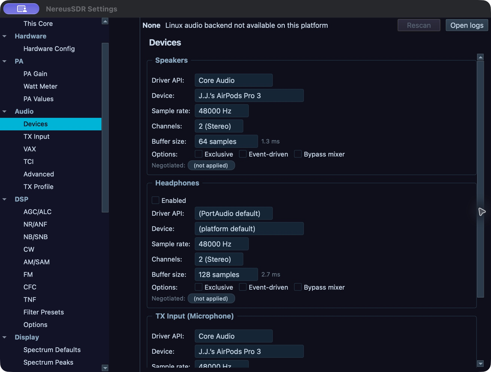

# Install, connect, and check desktop audio

This chapter gets the desktop client to the intended radio and confirms that receive audio and a microphone route exist. It covers the radio target for this window and audio devices attached to this computer. To host a Core for phones or another desktop, see [Share a Core with other devices](08-shared-core.md). For transmit setup and a controlled on-air check, continue to [Set up and transmit](05-transmit.md).

## Install and make the first start

Download the package matching your operating system and processor from the [NereusSDR releases page](https://github.com/boydsoftprez/NereusSDR/releases), and use that release's notes for package-specific requirements. On macOS, install from the DMG or PKG and launch NereusSDR from Applications. On Windows, run the x64 installer or extract the portable ZIP and keep its files together. On Linux, make the AppImage executable and launch it. If a platform's package manager or security prompt blocks launch, resolve that operating-system prompt before diagnosing radio discovery.

The first local launch may show **NereusSDR: FFTW Wisdom** while it creates optimized DSP tables. Allow this one-time work to finish; closing the application interrupts startup and the next launch may repeat it. The wisdom cache is local to this computer. It is not a radio setting and does not travel with a saved radio entry. If a later release changes the DSP build, a new wisdom pass may be needed. First-start time varies with the computer, so the progress display is the readback; there is no fixed completion time to promise.

Before connecting, power the radio and attach it to the network. A local desktop needs network reachability to the radio. A remote desktop needs reachability to the Core computer, while that Core computer needs reachability to its radio. The desktop's **Connections** picker chooses this window's target; it does not start the Core service on another computer. Open it through **Radio > Connections…** in a picker-managed window. Windows using the local radio panel call that command **Manage Radios…**; a dedicated remote window can instead open **This Core**. The connection procedures below use the picker name where applicable.

## Connect to a radio through this computer's Core

1. Open **Radio > Connections…**. This opens the **Connections** picker. In a normal local window, its **This computer's Core** row means that the local Core is selected as the operating context; it is not itself a radio. Select a radio under **Radios on this network**. If the list is stale, press **Scan** and wait for discovery to refresh.
2. Select the radio row and press **Connect**. If the model or address is not discovered, use **Add Radio…**, enter the radio address and model requested by the editor, save it, then select the saved row and connect. Check the address and model against the radio/Core information you have; a saved row is only a target record, not proof that the endpoint is reachable.
3. Read **Current connection** in the picker. It should identify the connected radio and say the window is connected using this computer's Core. Close the picker and wait for the panadapter trace to update. Open **RX** or select the active VFO's audio controls and unmute a suitable output; a moving spectrum alone confirms data, not that the selected speaker is audible.

Some desktop windows present **Connect to Radio** directly instead of the full picker. In that dialog select a row under **Discovered Radios**, use **↻ Scan** to refresh, or choose **Add Manually...** to enter a target, then press **Connect**. The dialog's own **Connected** state is the readback. Follow the labels actually displayed by the window.

The selected target is saved so the application can reconnect to it. If you need a different radio, reopen **Radio > Connections…**, select the other row, and connect. Use **Edit…** to correct a saved target and **Forget…** to remove a saved entry you no longer use. Forgetting removes the saved target from this computer's picker; it is not a factory reset of the radio. Do not use the standalone **Radio > Connect** action to choose a different target: in an ordinary local window it reconnects to the last-used saved radio. **Radio > Disconnect** ends the current radio link. In a picker-managed window, **Connect** opens the picker workflow.

## Connect to another computer's Core

Use this route when another computer owns the radio connection and DSP. In **Radio > Connections…**, select a paired Core under **Your Cores**, or choose a nearby entry under **Cores on this network**. The selected row's action may read **Connect** or **Pair**. For first-time pairing, use **Add a Core by code…** and enter the code shown by the Core, or **Type an address…** when you were given a network address. A pairing code is an enrollment credential; enter it only for the Core you intend to trust.

After pairing, select that Core and press **Connect**. Confirm its name and connection state in **Current connection** before operating; the radio is remote through that Core. Later, **Radio > Connect** in a dedicated remote window reconnects the window's Core target. Reopen **Connections…** when choosing among saved targets. **Radio > Disconnect** leaves the Core session. A connection attempt can fail even when the target is saved: verify that the Core is online, the address/path is current, and that the Core has remote access enabled. Retry from the picker after correcting reachability rather than repeatedly changing the radio's saved identity.

In a dedicated remote window that retains **Radio > Manage Radios…**, that command can open the **This Core** radio-management page. **Change radio…**, **Edit radio…**, and **Forget radio** there affect the radio configured on that Core, rather than this computer's local radio list. A change to the radio attached to a shared Core changes the station endpoint for its connected operators. The action can be held while transmitting, while a Core change is busy, or when the Core does not offer that operation; read the reason displayed by the page and resolve that condition first. Reconnect the window when the page says a Core radio change requires it.

## Inspect a saved Core and the actual connection path

Open **File > Settings… > Cores > Your Cores**, or select a saved Core in
**Connections** and click **Manage…**. This is the Core Settings area. Selecting
an entry for inspection does not connect this window or change its target.
The selected Core has **Overview**, **Addresses**, **Radio** and **Devices** tabs.

1. Select the intended saved Core and read **Overview > Connection in this
   window**. **Status** tells you whether this window is connected to that Core.
   **Reached through**, **Controls**, **Audio and display**, **Core listener IP**
   and **Radio** report the available current-session facts. Controls and media
   may use different paths. A retained address is a candidate for a connection,
   not proof of the path currently in use.
2. Open **Connection details…** or **Diagnostics…** for this window's live
   connection evidence. **Audio with the Core…** also concerns this window's
   current Core, even when the saved entry being inspected is a different Core.
   Check that context before changing audio quality.
3. Use **Radio** and **Devices** to administer the inspected Core only when this
   window is connected to it. Otherwise these tabs explain why their actions
   are unavailable. Changing its radio restarts the station connection and
   affects connected windows/devices; coordinate first and wait for reconnect.

### Retain a direct address for a paired Core

Use this when the already paired Core has a reachable listener on a LAN or VPN,
or its known listener address has changed. It is separate from adding or
pairing a different Core.

1. Select the saved Core, open **Addresses**, then choose **Add address…**.
   Enter **Hostname or IP address** and **Core connection port**, using the
   Core listener's details. IPv4, hostnames and IPv6 are accepted; IPv6 can
   be entered with or without brackets. The radio's IP and the RV service's
   address are different endpoints.
2. Click **Add** and wait for the identity check. The address is saved only
   when the answering endpoint is verified as this paired Core. A refusal
   leaves it unsaved; correct the address/port and use the offered **Retry**.
3. Confirm it appears under **Added by you**. Up to four manual addresses can
   be retained. **Previously worked** is a separate successful-connection
   history of up to four; **Supplied by the Core** is its reported inventory,
   which may contain addresses this computer cannot reach. One row can carry
   several of these labels.
4. Changes apply to future connection attempts. They do not switch the current
   connection or mark a newly retained address as previously successful.
   When ready to reconnect, use **Connections**, select this Core and verify
   **Overview** again after it connects.

Use a manual row's **Edit…** to correct it. **Remove** asks to remove its manual
retention; the same address can still remain in the automatic sources. Read
the confirmation, then verify the row's labels. Removing retention does not
terminate this window's connection or revoke its pairing.

### Rename the Core for all devices

In the selected Core's **Overview**, choose **Rename Core…**. Enter the callsign
and optional `/name` using the characters and length described beside the
field, then press **Save**. This changes the name on the shared Core. It is not
a private alias on this computer.

Wait for acceptance and check the displayed name. The desktop can use an
eligible existing authenticated session or a temporary sign-in to a reachable
paired Core. It needs this computer's existing device key; the page explains
missing pairing/key, incompatible administration, a connection retry or a
rename session still closing. Cancel or correct the reported condition before
retrying. If the Core accepted the name but saving its local presentation failed,
follow that message and verify the actual Core name rather than issuing a
second rename merely because the saved label has not caught up.

## Start a Core service on this computer

To host a local radio for phone/tablet clients or remote desktop clients, connect this desktop to the local radio first, then open **File > Settings… > CAT & Network > Remote Access**. Under **Core on this computer**, enable **Run a Core on this computer**. The **Core** section reports the Core name and reachability. **Keep it running when NereusSDR is closed** and **Start it with the computer** control the service lifecycle beyond this application session; enable them only when that persistent behavior is intended. The **Connections…** button on this page only opens the target picker. It does not enable the Core.

Use **Rename** to give the Core a recognizable station name. For phone enrollment, use **Add a device** or provide the current pairing code shown on the page. Codes rotate and should be read from the current Core page. **Paired devices** lists enrolled devices; **Connected now** reports active sessions. The key-backup section gives its own file location and **I've backed it up** acknowledgement. Follow the displayed backup instruction and store that Core key safely: ordinary desktop settings export is not a substitute for a Core key backup. If the Core controls are disabled, the page states why, for example that no local radio is connected, a Core change is in progress, or the station is transmitting. See [Core sharing and device management](08-shared-core.md) for pairing, ownership, and revocation procedures.

## Choose this computer's receive and transmit audio routes

Open **File > Settings… > Audio > Devices**. Under **Speakers**, choose the playback device for receive audio. Enable and choose **Headphones** only when you need a separate headphone destination. These are this computer's output routes; they do not choose a radio input or alter another connected device's output. Check **Negotiated** for the format the audio engine actually opened. If the route is silent, check the device's OS volume, application mute, and the selected slice's audio mute before changing radio controls.

Computer playback and microphone capture are separate from the radio's speaker/headphone path. This computer's master volume controls its own output; the radio output follows its supported slice-audio/monitor controls.

Under **TX Input (Microphone)**, select the computer capture device when using **PC Mic**. The page reports capture status and provides **Retry microphone** if the stream failed. If the device is missing, first check operating-system microphone permission, then reselect the device and retry. This confirms capture at the computer; it does not authorize the Core to transmit. The mic source itself is selected separately at **File > Settings… > Audio > TX Input**. The supported source choices are **PC Mic**, **Radio Mic**, and **VAX TX (virtual device)**. Radio-specific controls appear only when supported. See [Set up and transmit](05-transmit.md) for the mic test, gain, TX ownership, and keying sequence.

If Linux audio will not open, **Help > Diagnose audio backend** is the available Linux-specific diagnostic. It reports backend information and provides a starting point for checking PipeWire or PulseAudio selection; it is not a general connection test. For broader link diagnosis, use **Tools > Network Diagnostics** after the radio or Core target has been selected.

*Audio Devices, desktop development build 0.5.2. Read each route separately: Speakers and Headphones are playback; TX Input is capture. The Negotiated fields in this image do not establish an open stream. The Linux backend strip is unavailable in this macOS capture. These are existing operator settings, not setup defaults.*

## Choose audio quality for this window's Core connection

Open **File > Settings… > Cores > Audio with the Core**, or use the matching
button in **Your Cores > Overview**. Check the heading naming this window's
Core; inspecting another saved Core does not redirect this page.

1. Under **Audio quality**, choose **High** (48 kbps), **Save data** (24 kbps)
   or **Lossless** when available. This preference is saved on this computer
   and applies to received Core audio and this computer's microphone uplink.
   Lossless needs about 1.6 Mbit/s and can fall back to Opus when the link
   cannot carry it. The requested choice alone is not proof of the actual format.
2. Read **Receive from Core** for the current format/health and the measured
   **Received audio payload** rate. No measurement or an unavailable reason
   means there is no current evidence to interpret as a working stream.
3. Read **Microphone to Core** separately. **Radio Mic** at the station has
   no microphone stream from this computer; see [TX input](05-transmit.md).
   **Receiver audio for apps** reports requested application streams, whose
   compressed streams keep their separate 48 kbps target.
4. If receive media failed while controls still work, use **Retry audio** when
   enabled, wait for the health readback, then check local playback/mute and
   actual receive sound. Changing an OS speaker device and retrying Core media
   address different parts of the path.

## Choose whether a saved target connects at startup

After successfully saving/connecting the intended target, open **File >
Settings… > General > Startup & Preferences** and set **Auto-connect to last
radio**. Read its tooltip to confirm which target it names. In a local window
it saves the last radio's launch choice; in a dedicated remote window it saves
the selected Core target's choice on this computer. It does not start a Core
service or change another computer's startup policy.

If the toggle is disabled, connect/save the target first and reopen the page;
the reason distinguishes a missing saved radio from a missing Core target.
Check the choice remains set when revisiting the page. On a later application
start, verify the connected identity before operating. If the saved target is
unreachable, use the normal Connections workflow to correct/reconnect it; the
startup flag does not repair a route. Clear the toggle to return to deliberate
connection at launch.

## Recover a lost connection

When the link drops, inspect the title/status area and reopen **Radio > Connections…**. Read **Current connection** for the target and progress or failure detail. If a retry is already running, wait for its state to change. Use **Radio > Connect** to retry the last-used target in a normal window, or select the intended saved target in **Manage Radios…**. A stale radio IP is corrected with **Edit…**; a remote Core address or pairing issue is corrected in the Core target editor. If radio discovery is empty, verify the radio is powered, on the same reachable LAN/VLAN, then scan; for routed or VPN networks, use the saved/manual address rather than relying on broadcast discovery.

After reconnection, confirm the connected target again, then confirm a live panadapter trace and audible receive output. Shared Core settings and radio state may have changed while this client was away. Before transmitting, recheck the selected TX slice, transmit holder, microphone source, antenna, power, and the protection/readiness message as described in [the transmit chapter](05-transmit.md). If the Core itself is reachable but its radio is not, the radio operator on that Core must restore the radio link; changing local playback devices will not repair the station connection.
