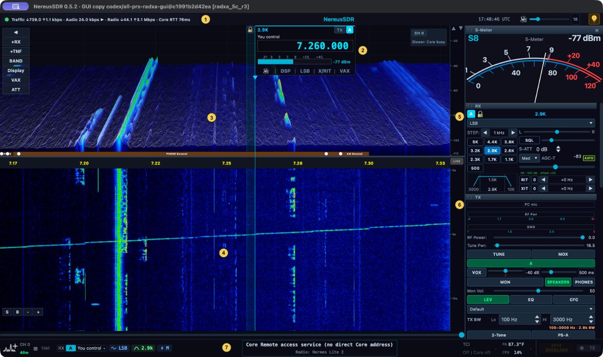
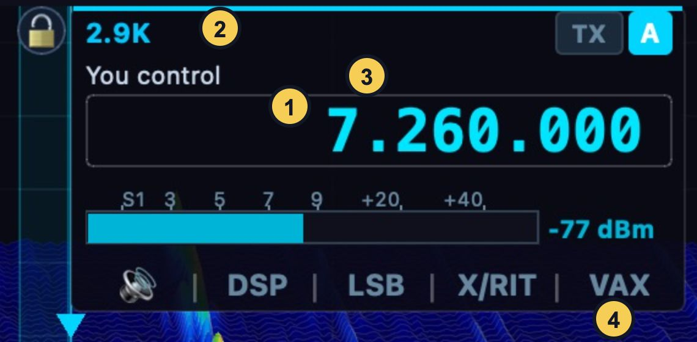

# Get to know the desktop window

The main window brings together the radio's spectrum, waterfall, slice
controls, receive audio controls, transmit controls, and status. The spectrum
shows signal level against frequency; the waterfall shows how signals
change over time. A slice is a receiving channel with its own frequency and
demodulation settings. A panadapter is the spectrum and waterfall area that
displays a frequency span.

The VFO flag identifies a slice and marks its tuned frequency on the
spectrum. Selecting a flag makes that slice active for controls that act on
the selected slice. Other slices can remain visible and continue receiving.
The operating controls are arranged in applets around the display; which
applets are visible depends on the current layout. The TX applet contains
transmit controls such as **TUNE**, **MOX**, **MON**, and the TX profile
selector. Read the state shown on the control itself before using it.

Connection status appears in the window's status area. When operating through
a shared Core, the window can also show who currently holds transmit. These
status indicators describe the Core's shared radio state, while controls
such as the selected slice and its mode belong to that receiver.

## Orient yourself before operating

1. Connect a radio or Core and wait for the spectrum to update.
2. Find the VFO flag on the spectrum and note its slice letter. Select the
   flag to make that slice active.
3. Locate its frequency, mode, and filter controls, then find the RX audio
   and DSP controls in the slice applet.
4. Locate the TX applet and read the labels and active states of its
   controls. Leave **MOX** and **TUNE** off while you are only receiving.
5. Check the connection indicator before interpreting a stopped or frozen
   display. If the radio is disconnected, reconnect from **Radio**.

The displayed frequency span is a view of the radio's received spectrum.
Changing the active slice changes which receiver's controls are being
edited; it does not automatically change the receive settings of every other
slice. Later chapters cover tuning, slices, and transmitting in detail.

## Desktop control map

Figure 1. A desktop development build receiving LSB through a remote Core.
The layout includes a 3D spectrum view. The Core-busy and overload messages
were present at capture time; the settings shown are examples.

| Callout | Area | What to check |
| --- | --- | --- |
| 1 | Connection and traffic | Connection state, audio traffic, and Core round-trip time. |
| 2 | Selected VFO flag | Slice letter, frequency, filter width, and control ownership. |
| 3 | Spectrum | Signals across the displayed frequency span. |
| 4 | Waterfall | Signal activity over time. |
| 5 | RX applet | Mode, step, filter, AGC, and receive offsets. |
| 6 | TX applet | Transmit state, power controls, monitor, profile, and bandwidth. |
| 7 | Status banner | Current slice, Core/radio identity, and operating warnings. |

Figure 2. The flag's frequency field (1), filter width (2), ownership text
(3), and control tabs (4). **You control** identifies an editable slice;
a listening slice has different ownership text and restricted controls.

## Choose the control surface you need

The app offers several views of the same receiver. You do not need to keep
every applet open to operate a slice.

| Surface | How to reach it | What it controls |
| --- | --- | --- |
| VFO flag audio page | Click the speaker tab at the foot of the flag. | AF, AGC, stereo pan, mute, binaural audio, playback destination and squelch. |
| VFO flag DSP page | Click **DSP**. | Noise blankers, noise-reduction method, automatic notch, spectral blanker and CW peak filter. |
| VFO flag mode/filter page | Click the tab showing the current mode, such as **LSB**. | Mode selection and that mode's filter presets. |
| VFO flag offset page | Click **X/RIT**. | Receive and transmit offsets, their enable/reset controls and tuning step. |
| VFO flag virtual-audio page | Click **VAX**. | The slice's virtual-audio routing controls. |
| RX applet | Show RX in the **Containers** menu's **Applets** section. | Selected-slice mode, filter, antenna selections, tuning step, balance, attenuation, AGC and offsets. |
| TX applet | Show TX in the same section. | Transmit slice, drive, tune drive, keying, monitoring, processing, profile and transmit bandwidth. |
| Phone / CW applet | Show the applet when it is available. | The implemented microphone source, input gain, level/compression displays and phone processing controls. |
| Settings window | **File > Settings...** | Detailed parameters and device/Core setup, organized in a page tree. |

Clicking an already-open flag tab closes its controls; clicking a different
tab switches the panel. The flag can therefore remain compact while you
listen, then expand for one adjustment. The mode name on the tab is a useful
readback: changing the mode also changes the applicable filter choices.

Before changing an RX applet control, check its slice letter. When there is
more than one slice, the RX applet's letter tabs provide another way to choose
the active slice. A setting entered in one surface should be reflected in
other views of that same slice. If it appears to affect the wrong receiver,
check selection and ownership before repeating the change.

## Show, hide and float applets

1. Open **Containers**. In its **Applets** section, check the applets you
   want visible. The panel's **☰** menu provides the same visibility choices.
2. If an entry is unavailable, read its reason or check the corresponding
   station feature. For example, accessory applets depend on their enabled
   accessory connection. A checked preference does not make an unavailable
   device appear.
3. Where an applet title bar has **↗**, click it to pop that applet into its
   own window. Place a frequently used TX or audio panel on a second monitor
   while retaining the band view on the main display.
4. Click **↙ Dock** in the floating window to put the applet back in the
   panel. Closing the floating applet also docks it back.

Floating an applet and floating a panadapter are different actions. An applet
window contains controls; **View > Float active pan…** detaches the selected
band display. A meter container is a third kind of window. Its items and
layout are managed with **Containers > New Container...** and
**Containers > Edit Container**. See the customization chapter for meter
layout work. Hiding a control panel does not release a slice or stop the Core.

## Make the band display useful

The spectrum, waterfall, frequency ruler and level ruler respond to different
mouse gestures. Put the pointer on the part you intend to change.

| Gesture | Result |
| --- | --- |
| Click an empty point in the spectrum/waterfall without dragging. | Tune the active slice to that frequency, rounded to its tuning step. |
| Drag an empty area horizontally. | Pan the displayed frequency window. |
| Drag within the selected passband. | Slide the VFO to a new frequency. |
| Drag a passband edge. | Adjust a receive filter edge. |
| Drag the spectrum/waterfall divider vertically. | Allocate more height to either display. |
| Drag the frequency scale horizontally. | Change the displayed bandwidth. |
| Ctrl+wheel, or Command+wheel on macOS, over the band. | Zoom the frequency span around the VFO. |
| Shift+wheel over the band. | Adjust the display's reference level. |
| Wheel over the dBm scale. | Adjust the displayed level range. |
| Left-drag the dBm scale. | Move its level window up or down. |
| Right-drag the dBm scale. | Stretch the range. |

A notch under the pointer takes precedence over ordinary tuning gestures;
its wheel action resizes the notch. If a wheel turn unexpectedly changes
an interference marker instead of frequency, move clear of the marker or
use the VFO frequency field.

Zooming and panning are display operations, but a view extending beyond the
current receive window can show survey data outside the listenable area.
Choosing a signal in that outer area can require the Core to move its
receiver window. Read any impact/refusal message when other slices share
that receiver. A visible signal and an available receiving channel are
separate things.

The display remains pannable and zoomable while keyed, but ordinary band
click-to-tune is withheld during transmit. Return to receive before making
an operating-frequency change; do not use display movement as confirmation
that the transmitter changed frequency.

## Inspect earlier waterfall activity

The waterfall has a history view as well as a live view. Drag its time-scale
strip to inspect previous rows. Use **LIVE** to return to the current band.
An old trace can help identify when a signal started or where interference
appeared. It does not mean a station is transmitting at that frequency now.

When a display seems frozen, first check whether it is showing history. Then
check connection state, Core traffic and the status message. Distinguish a
paused history view from missing data before reconnecting the station.

## Read meters and status together

The receive meter describes signal level in the selected receiver. The TX
meters describe microphone level, RF power and SWR in their applicable
operating state. A displayed meter face is not evidence of fresh samples.
For example, while receiving, a forward-power display may be zero or retain
its last indication; use it during the controlled transmit operation it is
intended to measure.

Connection/traffic indicators answer a different question: whether this
window is receiving data from its radio or Core. Core round-trip time is a
control-link measurement. Audio traffic is evidence that data is arriving,
but playback also requires a working output route, volume and unmuted slice.

## Use the connection and station context menus

Right-click the connection/segment area for its connection actions. In a
local radio window it includes **Disconnect**, **Connect to other radio…**,
**Network diagnostics…**, **Copy IP address** and **Copy MAC address**.
In a remote window it instead offers the actionable Connect/Disconnect
commands, **Core connection details...**, the Core's radio-management actions
and address-copy entries when the Core has reported them. Copied addresses
refer to the radio identified by that menu, so inspect the identity first.

Right-click the station block for radio-management actions. In a local window,
**Edit radio…** opens management for the current radio. **Forget radio**
disconnects and removes its saved radio entry; use it deliberately rather than
as a first recovery attempt. In a remote window the available actions target
the Core's radio and obey its permission/readiness gates. See
[connection management](01-desktop-connect.md) for the full saved-target flow.

Use **Radio > Protocol Info** to inspect the radio/protocol details, and
**Tools > Network Diagnostics** for the link measurements. When a status
message appears, capture its wording and the affected Core/radio/slice before
changing settings. **View > Performance** exposes performance presentation;
read whether a CPU value represents this computer, the app or the Core.
An overload indication is an input condition, whereas Core busy and link/audio
notices point to different resources. [Troubleshooting](11-troubleshooting.md)
uses those distinctions to choose the next check.

## Check that controls follow your selection

For a practical orientation check, select slice A, open its audio tab and
change AF by a small amount while listening. Confirm both the number and the
sound change. Then select another slice and verify its identity before using
the same control. This establishes which controls follow selection without
keying the transmitter or changing station hardware.

## Set this computer's master listening output

The title bar's speaker button and adjacent slider are **Master mute** and
**Master volume** for this computer. Click the speaker to mute/unmute; adjust
the slider from 0 to 100 percent and check its adjacent level readout. Master
mute can silence a correctly configured slice, so check it before changing
receiver gain or the Core's DSP. This control also affects this computer's
playback in a remote desktop window.

Right-click the speaker button for **Output device**. Choose the intended
playback device and verify the checkmark/current route, then listen at a
comfortable volume. **No output devices** means no destination is available
from the current audio backend. Use [Audio > Devices](01-desktop-connect.md#choose-this-computers-receive-and-transmit-audio-routes)
to inspect the opened format or repair a missing route. The picker changes
this computer's speakers destination; it does not change the station's
microphone input or a different operator's phone output. The selected slice's
personal volume/mute remains a separate stage, so check both when one slice
is silent.
