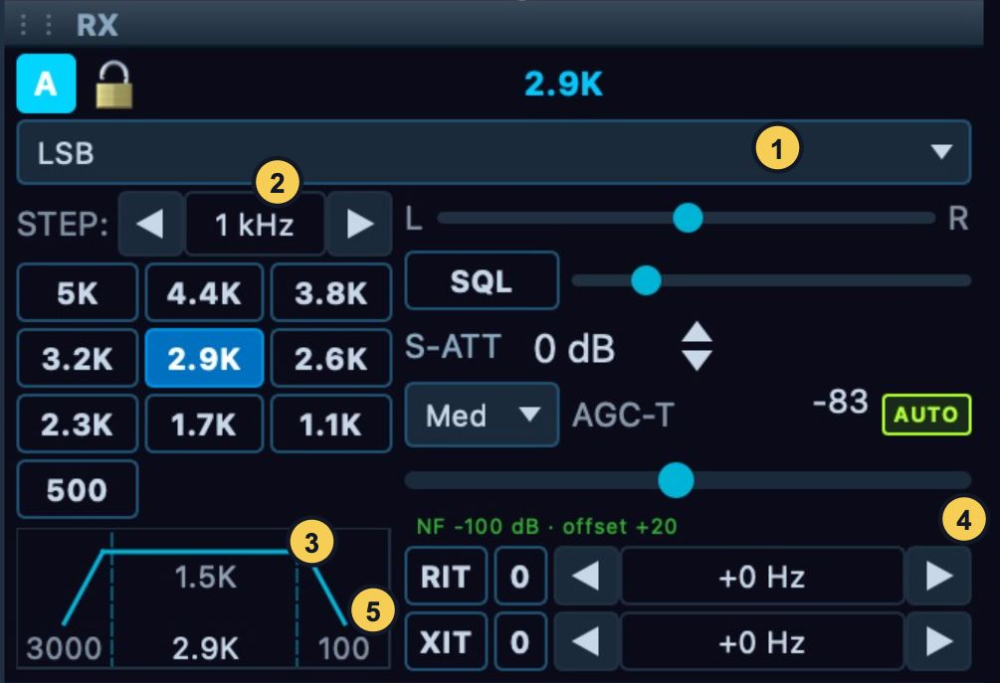

# Tune and receive

This chapter follows a receive session from selecting a slice to tuning,
filtering and managing interference. Frequency, mode, filter and receive DSP
changes apply to the slice you control. A slice you only listen to has restricted
controls; its **Your volume** and mute remain personal to this device.

Figure 3. Mode (1), tuning step (2), filter display and presets (3),
AGC/AUTO controls (4), and receive/transmit offsets (5). The illustrated
values are the captured station's settings.

## Start with the right slice and route

1. Connect and wait for fresh spectrum data. Select the desired VFO flag,
   or its letter tab in the RX applet when several slices are present.
2. Read the slice letter, frequency and ownership line. Take control if
   necessary before changing its receive settings.
3. Open the flag's speaker tab. Select **SPEAKERS** or **PHONES** for the
   intended output, unmute it and set a comfortable **AF** level. Those
   output names use the devices selected in **Setup > Audio > Devices**.
4. Check mode, filter and offsets before evaluating a signal. A leftover
   RIT offset or an inappropriate filter can make a correctly entered VFO
   frequency sound wrong.

With multiple receivers, audio from more than one slice can be mixed into
your output. Temporarily mute the others when diagnosing the selected
receiver, then restore the mix. Do not change several receivers' DSP settings
merely because the combined audio is difficult to understand.

## Tune by frequency, signal position or step

For a known frequency, double-click the flag's frequency display, enter an
explicit value such as `7.260 MHz` or `7260 kHz`, and press **Enter**. Confirm
the displayed readback. Leaving the entry without submitting it returns to
the frequency display. Use explicit units when moving between MHz and kHz to
avoid an unintended interpretation.

For an unknown signal, click its position in the spectrum or waterfall.
A short click tunes the active slice to the nearest selected tuning step.
Dragging empty space pans the view; dragging inside the selected passband
slides the VFO. The gesture table in [the window chapter](02-desktop-window.md)
shows which parts of the display change tuning, filters or presentation.

For small corrections, use the wheel over the VFO frequency field or over an
empty area of the band. The RX applet's **STEP** arrows move through the
available step choices and wrap at the ends. The step button in the flag's
**X/RIT** page cycles choices too. Choose a small step for fine alignment and
a larger step for band exploration. The step controls the increment and
click rounding; it does not change the receive filter width.

If a change is refused, check the lock icon and ownership text. Unlock a slice
you control, or request **Take control** for one you only hear. Check the
Core's message when the requested frequency requires moving a shared receive
window. Changing a local display is not proof that the Core accepted a radio
retune: use the final frequency and received audio as confirmation.

## Change bands and inspect the recalled state

Use **Band > HF** and choose the named band, or select **GEN** for general
coverage or **WWV** from the Band menu. Selecting a band restores that band's
saved frequency, mode and filter for the operating path; a first visit uses
its initial state. WWV is not a promise that every click lands on a fixed
10 MHz frequency. Read the recalled VFO, mode and filter before tuning further.

Check the antenna and hardware filter readbacks when changing bands because
the physical station can have different per-band routing. A band choice does
not extend the connected radio's frequency range or add a transverter. The
separate VHF/transverter and Band Stacking surfaces are not implemented in the
covered build.

Use **View > Band Plan** to select a shown plan and its label size, from Off
through Huge. Check the highlighted segment and frequency scale. A band-plan
label is operating context; it does not choose your receive mode or grant TX
permission. Keep it legible without obscuring the passband.

## Select the mode before the filter

Choose the mode in the RX applet, or open the flag's mode tab and select it
there. The current mode name is shown on the flag and changes the preset bank.

| Mode family | What to check in NereusSDR |
| --- | --- |
| **LSB**, **USB** | Correct sideband, voice passband, AGC and receive noise treatment. |
| **CWL**, **CWU** | Sideband, narrow receive filter and CW peak-filter settings when used. |
| **AM**, **SAM**, **DSB** | Appropriate demodulation and filter for the signal. Separate SAM setup options are not all present in this build. |
| **FM** | Receive filter and squelch. FM transmit/repeater/tone controls are not implemented in the covered desktop build. |
| **DIGU**, **DIGL** | Sideband and audio passband expected by the external decoder, plus its audio route. |
| **DRM** | A mode choice does not itself configure an external digital decoder or audio connection. |
| **SPEC** | A receive/spectrum mode choice; it cannot be used for transmit. |
| **RADE-U**, **RADE-L** | Correct sideband and RADE profile/status, using the digital-voice instructions. |

A mode label describes how the slice demodulates. It does not by itself
select the transmitter, establish a software audio route or connect a
reporting service. Check those separately when using digital modes.

## Choose and adjust the receive passband

1. Select a filter preset in the RX applet or flag's mode/filter page.
   The buttons show their widths, and their tooltip identifies the preset
   and low/high edges. Confirm the shaded passband and width readback.
2. Listen before narrowing it. Reduce the width when an adjacent signal is
   the problem; widen it again if the wanted signal loses useful content.
3. For a custom edge, drag the shaded passband edge in the spectrum, or use
   the RX applet's passband display. Check both edges after the change.
4. To reuse a shape, right-click a preset and choose **Edit this preset…**.
   Enter **Name**, **Low** and **High**, inspect **Width**, then **Save**.
   **Cancel** leaves the saved entry unchanged. **Reset this preset** restores
   that slot; the editor also provides **Reset to Default**.

Filter values are relative to the slice's tuned frequency. A lower-sideband
filter therefore uses a different placement from an upper-sideband one even
when both buttons show the same bandwidth. Check the actual edges, not only
the width. A narrower filter excludes more of the spectrum; it cannot make
an interfering signal inside the wanted passband disappear without also
removing some wanted audio.

The preset bank belongs to the Core. Editing a preset can affect other
operators who later select it. **Setup > DSP > Filter Presets** provides the
larger editor with mode selection, names/edges, ordering and reset operations.
Choose the required mode and slot before editing; the covered editor does not
provide RADE rows in its ordinary WDSP preset list.

**Shift-click** on a receive preset is a special operation: it applies the RX
preset and requests a one-time copy of that passband to the transmit audio
filter. It does not establish continuous RX/TX tracking. TX settings permission
is still required; an RX change can succeed while the TX copy is refused.
Read **TX BW** afterwards if matching was your intention. Use an ordinary
click for receive-only filter selection.

## Set receive volume and AGC deliberately

| Control | Purpose and interaction |
| --- | --- |
| **AF** | Received-audio level for the selected slice. It does not select the computer's output device or alter TX monitor volume. |
| **Mute** | Silence the slice. On a listened slice this is personal to this device. |
| **Your volume** | Personal level for a slice controlled elsewhere; changing it does not change the controlling operator's AF setting. |
| **Pan** or L/R balance | Place the receiver's audio in the stereo image. Useful for distinguishing two listening slices. |
| **BIN** | Binaural playback, with I and Q in separate ears; evaluate using a stereo headphone route. |
| **SPEAKERS**, **PHONES** | Select which configured playback destination carries this receiver. |
| AGC mode | Set how automatic gain responds and recovers. |
| **AGC-T** | Set maximum receiver gain, similar in use to traditional RF gain. |
| **AUTO** | Derive AGC-T adjustment from the measured noise floor. |
| **SQL** and threshold | Mute audio below the mode's squelch threshold. Check this when spectrum is active but audio is absent. |

AF and AGC-T solve different problems. If audio is simply too loud, adjust
AF or output volume. If background noise is being raised between signals,
review AGC mode and AGC-T while holding AF steady. Changing AF alone cannot
repair an overloaded radio input.

The AGC choices in the flag/RX applet are **Off**, **Long**, **Slow**, **Med**
and **Fast**. Off uses a fixed gain controlled with AGC-T. Longer recovery
keeps gain from rising as quickly between parts of a signal; faster recovery
follows more rapid changes. Select one, listen across several signal changes,
then compare with the previous choice. The best choice depends on the signal
and conditions; this manual does not treat a captured setting as a universal
preset. Use **AUTO** when you want noise-floor-based adjustment, and check
its indication before making a manual AGC-T change.

## Set squelch without losing weak signals

Open the flag's speaker tab or the RX applet, enable **SQL**, and adjust its
threshold while listening to a clear gap between signals. Stop when the
unwanted background closes, then tune a wanted signal and confirm it opens
the audio again. If a weak signal disappears, reduce the threshold or turn
SQL off before trying stronger noise reduction. Squelch silences the output;
it does not remove an interferer from the passband.

The threshold uses the selected mode's scale: SSB uses a normalized
threshold, AM a dB scale, and FM a linear threshold. Recheck it after a mode
change rather than copying a number between unlike scales. In a no-audio
diagnosis, turn SQL off temporarily so that a closed gate cannot be confused
with the wrong output device. Tone squelch and FM repeater controls are not
implemented in this build.

## Use input attenuation and preamp controls

The RX applet's input controls can affect the ADC feeding several slices,
which makes them different from per-slice AF and AGC. The label may read
**ATT**, **S-ATT** or **A-ATT**, depending on stepped and automatic attenuation
state. The available range and preamp choices come from the connected radio.
A slice using the other ADC can have that ADC's own settings.

If an ADC-overload indication appears, first identify the affected input and
current antenna/preamp/attenuation state. Increase available attenuation or
reduce unnecessary preamp gain while watching the overload indication and
wanted signal. If overload clears, compare reception before continuing.
Coordinate such input changes with operators sharing that ADC. Turning down
AF hides loud audio but leaves the radio input condition unchanged.

In a remote window these controls show and request the Core's input state.
Read the disabled control's reason if the Core does not offer it. Do not
assume the range or antenna/preamp arrangement of one HPSDR model applies to
another. Hardware setup and antenna routing are covered separately.

## Select noise treatment by the problem

Open the flag's **DSP** tab. The NR bank selects one noise-reduction method;
NB/NB2, SNB and the automatic notch are separate controls.

| Control | Implemented purpose and access |
| --- | --- |
| **NB** / **NB2** | Left-click cycles Off, NB, NB2, Off. NB targets sporadic time-domain impulses; NB2 adds hold/interpolation behavior for denser impulses. Right-click opens NB/SNB setup. |
| **NR1** | Adaptive LMS noise reduction. Right-click opens its parameter popup. |
| **NR2** | Enhanced multiband noise reduction. Right-click opens its parameter popup. |
| **NR3** | Recurrent neural-network noise reduction. Right-click opens its parameter popup. |
| **NR4** | Spectral baseline noise reduction. Right-click opens its parameter popup. |
| **DFNR** | DeepFilter noise reduction when offered by the Core/build. |
| **MNR** | macOS noise reduction when available. |
| **NNR** | Neural noise reduction with its settings/model choices. An amber limit indicator explains when the Core limits the saved choice. |
| **ANF** | Automatic notch filtering for suitable unwanted tones. |
| **SNB** | Spectral noise blanker, independently switchable from NB/NB2. Right-click opens NB/SNB setup. |
| **APF** | CW audio peak filter, with its frequency adjustment where applicable. |

Start with the other treatments off and the receiver correctly tuned. Turn on
one treatment, compare speech or wanted tones with it on/off, and keep it only
if intelligibility improves. Excessive treatment can remove wanted detail or
introduce artifacts. Right-click a method for its frequently adjusted parameters;
**More Settings…** leads to its detailed DSP page where offered.
[Receiver DSP setup](13-receiver-dsp.md) explains those parameters and their
dependencies.

DFNR, MNR and NNR availability is reported by the controlling Core/build.
A disabled button's tooltip gives the reason; reconnecting repeatedly is not
an installation method for a missing processor or model. If a noise algorithm
makes audio timing worse, compare with it off and capture the processor/link
status before changing unrelated network or device settings.

## Remove a persistent tone with a manual notch

1. Tune and identify the unwanted tone in the passband. Right-click its
   frequency in an empty part of the spectrum and choose **Add notch here**.
   Check the frequency shown in the popup before applying it.
2. Confirm a notch marker appears. Enable **TNF** through the DSP menu or
   the status-bar TNF control if the master notch processing is off.
3. Drag the notch centre to align it, or drag an edge to change width.
   The wheel over a selected notch adjusts its width; Shift gives finer
   adjustment. Listen to the result rather than relying only on the marker.
4. Right-click the marker to choose **Width**, **Bypass Notch** / **Activate
   Notch**, or **Remove Notch**. Widths below the filter's achievable minimum
   are disabled and explain their minimum.

A notch is a frequency/width filter entry, not a new receive slice. Making it
wider can remove wanted audio too. The **TNF** master affects all notches,
whereas bypassing one entry leaves the other entries available. **Setup >
DSP > TNF** provides the notch-management page for inspecting the bank and
its DSP settings. The notch menu does not provide a permanent/temporary
persistence choice in this build.

## Use RIT, XIT and CTUN for different jobs

**RIT** offsets received frequency without replacing the main VFO setting.
Enable it in **X/RIT** or the RX applet, adjust its signed Hz value and listen.
The **0** button clears its stored offset. Disabling RIT bypasses the offset;
check both enable state and value when returning to ordinary operation.

**XIT** offsets the transmitted frequency. It is not a receive correction.
Check it before every TX session, especially after listening to a signal that
needed RIT. The XIT offset is a slice setting; editing it does not itself grant
transmit ownership or key the radio. For a larger split, using a separate TX
slice can make the two operating frequencies clearer.

**CTUN** concerns the receiver window and band view. Right-click empty spectrum
and enable **CTUN (independent pan)** under **Tuning** to keep the receive window
fixed while tuning within it. The VFO moves while the pan stays put. Turn it off
to return to a view following the VFO. The checkbox can be unavailable when the
Core does not provide remote C-Tune support. None of these three controls is a
substitute for selecting the intended transmit slice.

## Worked example: improve a weak voice signal

Start on a slice you control, with its output audible and no unexpected RIT/XIT.
Enter the known frequency, select the correct sideband, and choose a filter that
includes the wanted voice. Hold AF steady while choosing AGC mode and setting
AGC-T. If a nearby signal is entering at one edge, narrow that edge before
trying noise reduction. For steady background noise, compare one NR method
with Off. For distinct impulses, compare NB and NB2. For a single persistent
tone, compare ANF or a narrow manual notch.

Finish by reading the frequency, mode, width, offsets and active DSP buttons.
Restore treatments that failed the listening comparison to Off. If intelligibility
is still poor, capture the signal/overload and output-route observations before
following the troubleshooting chapter. This gives the next check a specific
symptom instead of an unexplained collection of changed settings.
