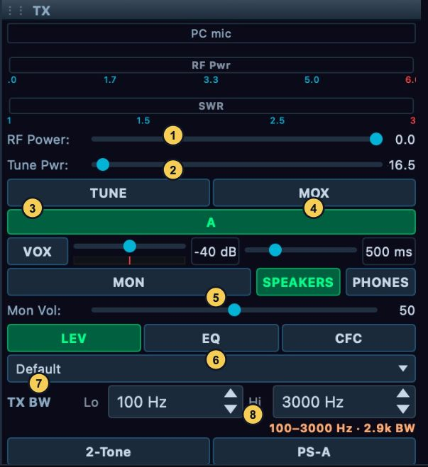

# Set up and transmit

Transmit controls change shared radio state. Before keying, confirm the transmitting slice, microphone route, antenna, intended drive, and current TX holder. A control can be visible but disabled because the radio is receive-only, the Core has no transmit permission, a TX inhibit or interlock is active, another device owns TX, the mode is not supported for TX, or the Core is applying a station change. Read the control's tooltip or status reason and resolve that condition before trying again. This build does not provide CW transmit for CWL/CWU, FM transmit, or DRM transmit; SPEC cannot transmit. For profile editing and detailed speech processing, see [Voice processing and profiles](14-voice-profiles.md); for antenna and PA calibration, see [Radio hardware and calibration](17-hardware-antennas-calibration.md).

## Route and test microphone audio

### Test the microphone and interpret the evidence

Begin with a connected, transmit-capable radio and the intended slice selected. Open **File > Settings… > Audio > TX Input**. **Mic Source** offers **PC Mic**, **Radio Mic**, and **VAX TX (virtual device)**. The local desktop chooses the radio's source; a remote desktop chooses its authenticated session's input and waits for the Core's accepted readback. Choose **PC Mic** for a microphone captured by this computer, **Radio Mic** for a radio's supported hardware input, or **VAX TX** when an external digital program supplies audio through the virtual device. Radio Mic controls vary by radio family, and unavailable rows remain gated with their displayed reason.

For PC Mic, open **File > Settings… > Audio > TX Input**. In **PC Mic**, choose the **Backend** and **Device** that contain the intended input. Use **Buffer** to adjust capture buffering only when the current route reports dropouts or unacceptable delay; its label shows samples and approximate milliseconds at 48 kHz. A smaller buffer reduces latency but may be less tolerant of a busy computer or backend. Check **Test Mic** and its VU indicator. If the stream is unavailable, open **Audio > Devices**, confirm the selected capture device under **TX Input (Microphone)** and the operating system's microphone permission, then press **Retry microphone** and test again. Adjust **Mic Gain** only when the meter shows a level mismatch; its range depends on the connected board. These controls test local capture without putting RF on the air. The microphone group and selected source have separate Core permission gates.

When **Radio Mic** is selected, use only the group shown for the connected board. **Radio Mic (Hermes / Atlas)** offers **Mic In** or **Line In**, **+20 dB Mic Boost**, and **Line In Gain**. **Radio Mic (Orion-MkII)** offers **Mic Tip-Ring (Tip is Mic)**, **Mic Bias**, **Mic PTT Disabled**, and **+20 dB Mic Boost**. **Radio Mic (Saturn G2)** offers **3.5 mm Jack** or **XLR** plus its **Mic PTT Disabled**, **Mic Bias**, and **+20 dB Mic Boost** controls. Set these to match the microphone wiring and electrical requirements; Mic Bias or boost can be inappropriate for a particular microphone. Verify the selected source and test on an authorized, low-drive transmission. A control disabled with a reason is not configurable on this Core or radio. In the candidate, Hermes Lite 2 offers **Radio Mic** with an explicit audio-add-on requirement. A stock HL2 sends no microphone audio; selecting the row does not detect or supply the add-on. Verify the actual compatible audio hardware before using that input.

In a supported remote desktop session, **Radio Mic** selects the physical
microphone at the Core's radio. Wait for the source-selection status to settle;
the page explicitly reports that no computer microphone stream is used. Its
VOX route is unavailable from this remote window, and program-audio keying
requires **PC/VAX** input instead. Older Cores can refuse the radio-mic
selection. **PC Mic** uses this computer's capture; **VAX TX** uses its digital
application input. Changing that local device does not change the radio jack.

The **Phone / CW** applet is a quick radio-side control surface. Its source buttons include supported **PC**, **MIC**, **BAL**, and **LINE** radio inputs. Select a source there only after confirming what is physically connected to that input. **ACC** is unbuilt and must not be used as a source. Phone/CW **MON** is also unbuilt; the separate **MON** control in the TX applet is the implemented transmit-audio monitor. The Phone/CW page is not a CW keyer or FM transmit panel.

Use the evidence in order, and keep the transmitter unkeyed for the local
check:

1. In **File > Settings… > Audio > TX Input**, choose the actual source. For
   **PC Mic**, choose its **Backend** and **Device**, enable **Test Mic**, and
   speak at the intended distance. Read its VU and the **Mic Gain** value. This
   observes local capture; it does not test the radio's selected input, TX
   processing, modulation, or RF path. Stop **Test Mic** when done.
2. If capture is missing or unstable, use the capture status and **Retry
   microphone**; for a PC route also check **Audio > Devices**, its
   **TX Input (Microphone)** selection, and operating-system permission. Do
   not infer a bad RF path from this local test.
3. For **Radio Mic**, check the source and board-specific wiring controls in
   **TX Input**; Test Mic is the PC capture check. Confirm the correct
   connector/input and its displayed gain/state before a keyed check.
4. For transmitted audio evidence, use a controlled authorized transmission
   and the TX applet's **MON** or an independent receiving station. Check the
   available TX mic/ALC and RF power/SWR readbacks separately. MON is the
   transmitted audio monitor in this desktop window; it does not prove how a
   remote receiver decodes or sounds. See [Listen to the transmit audio
   monitor](#listen-to-the-transmit-audio-monitor).

## Select profile, transmit slice, and TX owner

Select the intended mic/TX profile in the TX applet's profile selector. Its profile controls are described in [Voice processing and profiles](14-voice-profiles.md). Profile editing is reached from **File > Profiles > TX Profiles…**, **File > Profiles > Mic Profiles…**, or **File > Settings… > Audio > TX Profile**. Both File profile entries open the same profile editor. The File menu's **Import…** and **Export…** entries instead open Diagnostics configuration backup/restore; they do not transfer individual TX profiles. A profile is also separate from radio-authoritative power, antenna state and transmit ownership.

In the TX applet, select the letter for the slice that should transmit, or right-click its VFO flag and choose **Make this the TX slice**. The flag action is permission-gated and unavailable for a receiver you only listen to. Confirm the resulting TX selection, frequency and mode on the VFO flag. The TX slice determines the transmit frequency/mode; the active RX slice is not automatically the TX slice. If another connected device holds TX, the applet identifies the holder and displays **Take transmit**. Press it to request the handoff, wait for the owner/readback to change, then reselect the intended TX slice. Do not repeatedly press MOX or TUNE while the Core reports another holder.

The reviewed phone build has no general **Take transmit** action. When the phone already holds TX, its TX badge can select the desired slice. A first human PTT on an eligible original owned slice can acquire an unheld transmitter after all ordinary RF/microphone checks. A taken-only slice or another device's holder can refuse that request; use the supported starting states in [phone transmit preparation](07-iphone-operate.md#prepare-and-transmit-voice-from-the-phone) and keep receiver handoffs receive-only when no valid TX route is offered. The physical headset, Bluetooth, Action-button, and locked-screen PTT button choices in the phone setup are disabled shell controls. They do not make those physical buttons supported transmit routes. The phone's on-screen PTT path and its timeout are covered in the mobile chapters.

### Recheck a handoff and radio-side PTT

**Take transmit** can ask for confirmation naming the current device and the
impact, including unkeying an on-air holder. Read that question and coordinate
before confirming; wait for the accepted holder and TX slice. A changed holder
or a holder that keyed after the first question can require another confirmation.
The Core rechecks this session's transmit permission when applying the answer.
Unkeying does not release ownership, and a refused take does not grant it.

Wait for the radio to settle fully in receive before another key or TX-slice
move. The TX-to-RX tail or a frozen TX flag can produce an on-air refusal even
when MOX has just cleared. On a hosting desktop, a radio footswitch/mic PTT
keeps a flag on its own chosen slice (including a split TX slice) or an unowned
slice. If the flag belongs to another device, an admitted radio-side PTT can
move it to the hosting desktop's active slice. With a headless Core, radio-side
PTT uses the flag's slice. Check the actual flag, holder and station wiring
before relying on a physical PTT; a shared receiver view does not determine
that target.

## Set drive and read the meters

The TX applet's **RF Power** slider sets transmit drive. **Tune Pwr** stores the transmit band's tune drive. TUNE and 2-Tone each have a selectable drive source; check that source before keying. Their numerical labels are relative drive values unless a supported PA profile is configured with **MAX watts @ 100%**. Do not read either slider as watts by default. Hardware-specific scales differ; Hermes Lite 2 uses fewer drive steps and displays its own dB values. The **Power** page can expose radio/PA limits and controls according to hardware and permissions. Use the station's verified output meter, not the slider number, to establish RF power.

Before a first transmission, move RF and Tune drive to a conservative setting appropriate to the radio, amplifier, and load. Watch forward power and SWR meters during a brief authorized test. A meter with no reading can mean no transmit, a radio/PA without that telemetry, an unavailable feedback path, or an incorrect output route; it is not proof of zero RF. Keep the Tune setting conservative because TUNE produces a continuous single-tone carrier while active.

For a PA-scaled watts workflow, use **File > Settings… > PA > PA Gain** only when a supported PA profile is offered. Follow that page's bands, gain and maximum-watts controls and the displayed calibration readiness. The profile's maximum-watts setting is what permits a drive control to be interpreted on that scale; it is not a power measurement by itself. The [hardware chapter](17-hardware-antennas-calibration.md) covers **Watt Meter**, **PA Values**, and calibration controls. If no supported profile is active, keep describing RF Power and Tune Pwr as drive and use an independent station meter for actual watts.

## Choose the TUNE drive source and transmit attenuation

Open **File > Settings… > Transmit > Power** while receiving. In **Tune**,
choose the **Drive Source** intentionally:

| Choice | Value used for TUNE |
| --- | --- |
| Use Drive Slider | The current RF Power drive. |
| Use Tune Slider | The saved Tune Pwr for the transmit band. |
| Use Fixed Drive | Fixed Tune Power on this page, using the radio's displayed scale. |

Moving the TX applet's **RF Power** slider selects Use Drive Slider; moving
**Tune Pwr** selects Use Tune Slider. The last change can therefore replace a
previous source selection. Recheck the Tune group's radio button and value
before a test, especially after changing ordinary transmit drive. A remote
window uses the Core's permitted tune settings and readbacks; a refused edit
must be resolved before assuming the new drive is in effect. The separate
**TX TUN Meter** selector is not a working meter-routing control in this build.
Use the implemented meter readouts rather than relying on that selection.

The **Power** group also has **Max Power (W):**, which writes the same transmit
drive setting as RF Power. Its caption does not establish measured watts.
**ATT on TX** enables transmit-time receive/feedback attenuation, and
**ATT on TX (dB):** supplies its value. The allowed minimum is radio-specific;
the page obtains the connected radio's range. **Force ATT on Tx to 31 when
PS-A is off** applies the offered forced-attenuation policy. These are shared
radio settings, not microphone gain or a reduction in PA output drive.

Record the present attenuation and policy before editing, then set only values
established for the connected receiver/feedback path. Confirm the readback and
PureSignal feedback indication during the controlled test. With automatic
feedback attenuation active, a changing attenuation readback can be the
controller's adjustment. If feedback worsens, unkey and inspect the path and
policy; raising RF drive is not the remedy for a receiver attenuation problem.

## Configure and run a two-tone test

**2-Tone** starts a transmitted test signal. Configure it while receiving in
**File > Settings… > Test > Two-Tone IMD**. This page edits shared transmitter
settings; in a remote window a Core/version/permission refusal can prevent an
edit. These controls do not themselves start the generator.

| Control | Meaning and interaction |
| --- | --- |
| Freq #1, Freq #2 | Tone frequencies in Hz, each −20,000 to +20,000. Choose frequencies appropriate to the intended mode and measurement bandwidth. |
| Defaults | Sets only the two frequencies to 700 and 1900 Hz. Other test settings remain as shown. |
| Stealth | Sets only the frequencies to 70 and 190 Hz. It does not make a transmission silent or exempt it from normal keying gates. |
| Level | Generated audio level, −96 to 0 dB. This is separate from RF drive. |
| Drive Power Source | Drive Slider uses RF Power; Tune Slider uses the transmit band's tune value; Fixed uses Drive Power (Fixed mode). This choice is separate from the TUNE source above. |
| Drive Power (Fixed mode) | Fixed two-tone drive percentage, 0 to 100, used only with Fixed selected. |
| Pulsed two-tone | Chooses the pulsed test instead of continuous generation. It is still a keyed RF test. |
| Invert for LS Modes | Negates both tone frequencies for lower-sideband modes, reversing their signed audio-frequency direction. |
| Freq #2 delay | Delay before the second tone is enabled, 0 to 1000 ms. |

1. Confirm the correct TX slice, supported mode, TX holder and established
   antenna/load/PA measurement path. Finish any TUNE operation and check receive
   state. Set the test's audio level and selected drive source conservatively
   for that station; a quiet microphone meter does not indicate a quiet test.
2. Reopen the page if needed and confirm both tone frequencies, level, source
   and drive value. Defaults and Stealth leave drive and mode flags intact.
3. Press the TX applet's **2-Tone** button, or the PureSignal form's **Two-tone**
   toggle. The controller starts the generator and requests MOX. Observe the
   active button and actual transmit/protection indications. If keying is
   refused, read the reason and verify that the generator returned to off.
4. Read the intended spectrum/IMD, power/SWR and feedback measurements during
   a brief test. For a correction, follow [Single Cal](18-puresignal-diversity.md#calibrate-and-apply-a-correction).
5. Press the active test button again to stop. Confirm the generator and MOX are
   off and receive returns. Fixed mode restores the previous ordinary drive on
   stop; verify that value before returning to speech operation. Recheck the
   station state after a timeout or fault instead of assuming a test restarted.

## Listen to the transmit audio monitor

In the desktop **TX** applet, choose **SPEAKERS** or **PHONES**, set **Mon
Vol:** to a comfortable level, then enable **MON** for a controlled transmit
check. This selector and volume route the monitor to this computer's output;
they do not change RF drive. MON is off when NereusSDR starts. Check that the
radio is actually keyed before judging silence, and check the selected output
and its local volume if MON is silent. With **PHONES** selected, no open
headphone device means no audible monitor. Turn MON off after the check to
avoid unexpected audio or feedback.

Keep the evidence distinct: **Test Mic** is local capture before transmit;
the TX applet **MON** is a local listen to audio during transmit; TX mic/ALC
meters show only the values that the connected radio/Core supplies; and an
independent receiving station is needed to verify the received signal. None
of the first three alone establishes over-the-air audio quality.

## Make a brief voice transmission

1. Confirm the correct Core/radio and TX slice. Confirm the selected mic source and, for PC Mic, a successful **Test Mic** indication.
2. Confirm the intended antenna and radio/PA path in the hardware setup, then inspect the protection and inhibit indicators. For a shared station, confirm this device holds TX.
3. Set RF drive conservatively and enable the TX applet's monitor only if needed. Confirm the radio is in a voice mode and its TX filter is appropriate. For receive-to-transmit passband matching, use the one-time **Match RX**/shift-click action described in [Voice processing and profiles](14-voice-profiles.md); it copies the current RX filter to TX and does not maintain continuous follow.
4. Press **MOX**. The button turns red while manual transmit is requested. Speak briefly and observe the mic/ALC, forward-power, and SWR indications that your radio provides.
5. Press **MOX** again to unkey. Confirm the red state clears and receive audio returns. If the red state or transmit holder remains, do not close the window as a substitute for unkeying; inspect the active PTT state and Core indication.

For a single-tone check, press **TUNE** instead of MOX. The button changes to **TUNING…** while the carrier is active; press it again to stop. TUNE is not a voice test and should be used only into an appropriate antenna/load system with station precautions. The TX applet's **2-Tone** control is a separate keyed measurement path, configured as described below. PureSignal uses that test path in [PureSignal and diversity](18-puresignal-diversity.md).

## Configure the transmit protection readback

Open **File > Settings… > Transmit > Power**. **Enable Protection SWR >** turns on the visual SWR warning threshold; **SWR Limit** sets that threshold. **Ignore when Tune Pwr <** and **Tune Pwr (W)** specify whether SWR protection is ignored below the selected Tune power. That option disables SWR protection during low-power Tune; use it only when that is the intended station policy. **Reduce Pwr if protected** asks the radio to wind back drive when high-SWR protection engages. These controls apply immediately and affect the Core's protection behavior, including from a remote desktop when the Core offers the setting.

In the same **Power** page, **External TX Inhibit** contains **Update with TX Inhibit state** and **Reversed logic**. Enable monitoring when the connected radio's external inhibit input is wired and intended to control the TX gate. Reverse logic only when the hardware's asserted/deasserted levels require it. Confirm the resulting inhibit state in the TX readiness indication before keying. Do not mask an inhibit by changing logic as a troubleshooting guess.

Open **File > Settings… > General > Options > Time Out Timers** to review station key timeouts. **MOX** sets a maximum duration for MOX and other radio/computer keys. **Ping** stops MOX if the configured host cannot be pinged for the selected interval; choose a host that this station can reliably reach, since a blocked ICMP path can unkey a healthy RF link. The **Def** button restores the displayed default ping host. **Phone and iPad** sets the separate timeout for mobile transmissions. These timeout values are Core/station settings, apply immediately, and are evaluated from key-down. Choose limits that suit the station, then verify the enabled state and seconds readback. A timeout ending TX is a protective unkey; inspect the corresponding timer and network condition before keying again.

The **General > Options** page also includes **Prevent TX'ing on a different band to the RX band**. When enabled, it can block a TX slice whose band differs from the receive band; confirm both slice bands before changing that station-wide policy. **Receive Only** is a broader station mode that disables TX controls. Turning off a safeguard merely to clear a refusal can permit an unintended transmission, so first identify why the current selection violates the policy.

If a TX inhibit, high SWR condition, PA fault, band protection, receive-only setting, or shared transmit lock prevents keying, read the status message beside the blocked control. Check the physical antenna/load and accessory interlock first, correct the identified station condition, and then confirm the blocker clears. A red/disabled button is not a request to bypass a protection. Some protection and radio settings are unavailable while transmitting or while another Core operation is in progress; unkey and wait for the stated operation to finish.

## Set receive-only mode, region and link-loss behavior

Open **File > Settings… > General > Options** while the station is receiving.
These choices affect the Core/radio, including requests from a remote window.

- **Receive Only** disables transmit functionality. To re-enable TX, clear it
  and read **Warning: Enable Transmit?**. **No** keeps receive-only mode;
  **Yes** requests transmit capability again. A receive-only hardware kit keeps
  the box checked and locked with its reason. Recheck the box and TX readiness;
  clearing a software choice cannot add a physical transmitter.
- **Region** selects the region policy used by the transmit gate. Choose the
  station's actual location from the list, then check the selected readback
  and any transmit refusal. It does not rename a radio or change the phone's
  display-only band-plan size. On-air or unsupported Core state disables the
  choice and explains why; return to receive or update the Core as indicated.
  A region selection is not a substitute for knowing the station's permitted
  frequencies and modes.
- **Network Watchdog** controls how long NereusSDR waits for incoming radio
  data before treating the radio as lost: On is three seconds; Off keeps
  waiting. On Hermes Lite 2 and newer-network-link radios, the radio's own
  safety timer remains enabled either way. This checkbox is different from
  the Ping transmit timeout. Inspect link diagnostics before changing it;
  disabling it can conceal a stalled receive-data path. An older Core can
  refuse the change and restore the previous check state with an update reason.

**Extended**, on the same Options page, changes the Core's shared extended
transmit policy. In this build it bypasses the software frequency/passband
restrictions and the affected region-specific mode-policy branch. Supported
TX-mode and different-band checks remain in place, along with ownership and
station interlocks. It grants no operating permission and changes no displayed
band-plan presentation.

Set it only for an intentional station policy while off air. The hosting
desktop can hold the edit while another device owns TX; a remote window needs
the Core's supported transmit-setting version and transmit permission. A
disabled checkbox gives that reason. After an edit, check the Core's returned
check state and any refusal; a reverted check means the policy did not change.
Restore the previous state when ending the intended extended-policy session.
An old saved per-computer Extended value is not the active Core policy.

After any request, use the accepted check/selection and readiness state as the
result. A reverted value or displayed refusal means the requested policy has
not become operative. Reconnect and recheck before trying to key after a
link-loss event.

## TX applet control map

Figure 4. The TX applet while receiving: **RF Power** (1), **Tune Pwr** (2), **TUNE** (3), **MOX** (4), monitor output and volume (5), processing (6), profile selector (7), and **TX BW** (8). Neither MOX nor TUNE is keyed in this capture. The displayed values are not recommended starting levels.
