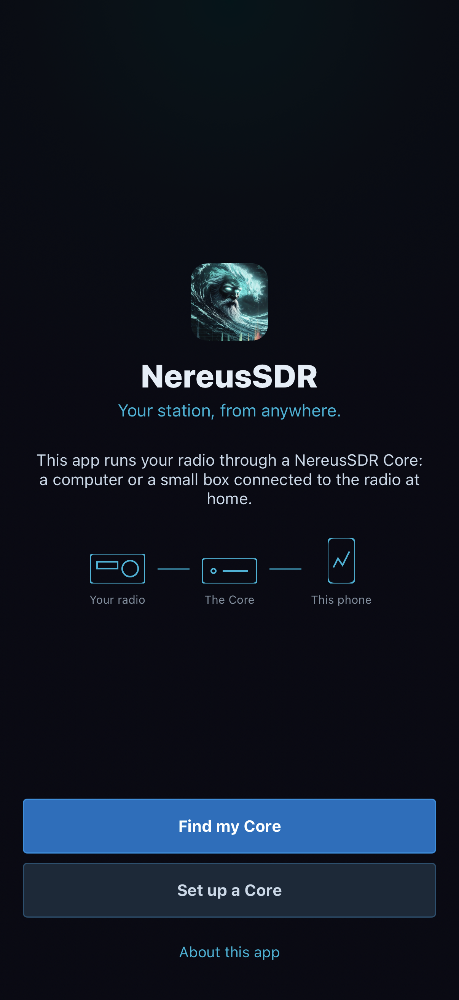

# Connect an iPhone to a Core

The phone procedures in this chapter describe the reviewed native development
app, whose availability and delivery are separate from the desktop/Core release.
Use the connected Core's capability/refusal messages; see [build and verification
scope](verification.md) before treating these instructions as release acceptance.

The iPhone is a remote control and audio client for a NereusSDR Core. The Core is the computer or small box connected to the HPSDR radio. Pairing identifies and authorizes this phone on that Core; after pairing, the phone keeps a private identity and can reconnect without another one-time code. The Core can also serve a desktop and other phones at the same time.

This chapter covers first-time setup, pairing, saved Cores, reconnecting, and the permissions the phone asks for. The Core-side steps below describe the current NereusSDR desktop and `nereusd` interfaces. They do not configure a router or guarantee a path through a particular network.

*Start here on the phone: Find my Core looks for the station service; Set up a Core explains the computer-side preparation. Native simulator screen from the acceptance build, using test services. No pairing code or live connection is shown.*

## Start the Core

Use this procedure when a desktop computer is to host the Core and radio locally.

1. Start NereusSDR on the computer connected to the HPSDR radio. Connect the desktop to the radio and leave the radio in receive. The Core on a desktop requires that this NereusSDR window manage a local radio; it is not a way to turn a desktop that is only connected to someone else's Core into another Core.
2. Open **File > Settings... > CAT & Network > Remote Access**. Turn on **Run a Core on this computer**. Read the status below it. The Core name and reachability details are the readback that confirms the service is running. If the switch is disabled, read its explanation. The desktop must manage its local radio, and a Core configuration change can be locked while transmitting or while another Core change is in progress.
3. Open pairing. From this page, use **Add a device**. The page displays the current **Pairing code** while pairing is open. Share that code with the intended phone operator using a private channel; anyone who gets a usable code can claim it.
4. Decide whether the Core should continue after the desktop app closes. **Keep it running when NereusSDR is closed** governs that case. **Start it with the computer** governs startup. Read both switches after changing them. They describe separate behaviors.
5. If using the headless Core instead, on its computer run `nereusd pairing show` to read a current code. If pairing is closed, an administrator can open it with `sudo nereusd pairing open`. A device already paired to that Core can also open pairing with **Add a device** on its Devices page.

Do not close the desktop session or assume startup is configured until the page shows the intended state. The `nereusd` service and a Core hosted by the desktop have different lifecycle controls.

## Find a Core on the local network

Use discovery when the phone and running Core are on a local network where the phone can see it.

1. On the welcome screen tap **Find my Core**. iOS may ask whether NereusSDR may find devices on the local network. Allow it for discovery on that network. If it was denied, the page explains how to change the permission in iOS Settings. Pairing by code or entering an address remain alternate paths.
2. Under **On this network**, wait for the list to update. Choose the Core you intend to use. A Core accepting a new device may offer **Pair**. If it shows **Use code**, select that action and use the current code from the Core operator. A Core that is not taking new devices appears unavailable; the administrator must reopen pairing.
3. After pairing, the Core appears under **Your Cores**. For subsequent sessions, tap its **Connect** action there. A paired Core row can also show **Pair** if that Core has forgotten this phone's identity; pair again only after coordinating with the Core operator.

If the local list stays empty, check that the Core is running and that the phone is on the intended network. Then try **Pair with a code** or **Enter an address**. Local discovery is a convenience and does not establish connectivity across every network boundary.

## Pair with a code

A code is single-use. The phone reaches the Core for code pairing through the remote access service when no Core is selected; this is how an operator can pair without local discovery. A directly reachable Core can instead be selected by address.

1. From the welcome screen choose **Find my Core**, then **Pair with a code**. **Set up a Core** opens Core-side guidance. If the Core is directly reachable and you know its host name or address, choose **Enter an address** first and pair with the code after the Core answers.
2. Get the code that is currently displayed by the Core. For a headless Core use `nereusd pairing show`. For a desktop-hosted Core use **Add a device** in **File > Settings... > CAT & Network > Remote Access**. Enter the number and both words into **Pairing code**. Do not rely on a code someone copied earlier; a rejected guess consumes the current code.
3. Set **This phone's name on the Core** to a name the station operator can identify, such as `JJ iPhone`. Tap **Pair** once and wait for the response. If accepted, the confirmation identifies the Core. Choose **Go to the band** to proceed. If asked about microphone access, choose **Allow the microphone** if this phone may send voice, or **Not now** to finish setup without it.
4. If the code is wrong, read the error and get a newly displayed code from the Core before another attempt. The fifth wrong code in a row closes pairing on that Core. Reopen pairing on the Core computer or from **Add a device** on a device already paired, then start again with the newly displayed code. Repeatedly re-entering the old code cannot succeed.
5. If the Core says it is not taking new devices, do not retry the same code. Ask its administrator to open pairing. If pairing ended before completion or timed out, check that the Core is still running and accepting devices, then use a fresh code.

Pairing failure messages matter. A rejected or expired code, a Core that closed pairing, and a Core that did not answer are different conditions; use the message shown rather than treating all three as a bad network.

## Enter a Core address

Use this when you know a reachable Core address or local discovery is unavailable.

1. On **Find my Core** choose **Enter an address**. Enter the Core's host name, IPv4 address, or IPv6 address. IPv6 brackets are optional. Use the supplied standard port unless the Core operator gives you a different port.
2. Tap **Connect** and wait for the result. If the phone already has a paired identity for that Core, it signs in. Otherwise, the flow continues to pairing and asks for the current code.
3. If the Core does not answer, check the address and port with its operator. An address is a destination, not a route; it does not itself make a Core reachable from this phone.

A successful connection opens the **Panadapter** tab. Check the Core name in the toolbar and the link indicator before tuning. A link indicator can show a round-trip time; when a relayed route is in use, the toolbar identifies the relay path.

## Connect again, rename, or remove a saved Core

The phone saves paired Cores in **Your Cores**. Use that list for a normal return session:

1. From the welcome or Cores screen choose the saved Core's **Connect** action. Wait for the band and live connection indication. The phone uses its saved identity; a code is not needed.
2. To change the Core's name, press and hold its row and choose **Rename**. Edit **Rename this Core** and choose **Save**, or **Cancel** to keep the name. This sends a change to the Core itself; every connected device sees the Core's new name. **Setup > Devices > Rename** opens the same Core rename workflow. It is not a phone-name editor. An unavailable Rename explains the session or Core-version requirement; a refused Save leaves the Core's reason under the field. Confirm the new name after success.
3. To end an active session without forgetting the pairing, open **Radio** and tap **Disconnect**. Confirm that the app returns to its disconnected state.
4. To forget the saved Core on this phone, use **Radio > Remove Core** and read the confirmation before choosing **Remove Core**. This removes this phone's saved identity and connection entry. It does not remove the Core, disconnect other devices, or erase their pairings. If the Core still lists the old identity, its operator may need to remove that device on the Core or another paired device before this phone pairs again.

Use **Remove Core** for a deliberate reset or when this phone should no longer have access. Disconnect is the ordinary end-of-session action.

### Keep alternative addresses for one Core

Open the saved Core row's **⋯ > Addresses**. The list shows addresses kept on
this phone, with **Last worked** beside the last successful destination. The
phone tries the destinations in order, starting with that one. These are
alternative routes to the same paired identity, not additional paired Cores.

1. Choose **Add an address**, enter the host/IP and port, then **Connect**.
   The phone checks that the answering Core is the saved Core before keeping
   the address. A wrong-Core or unreachable-address message means it has not
   added a working route; correct the destination before retrying.
2. Return to **Addresses** and verify the new entry. Up to four manually added
   addresses can be kept. At that limit, remove an obsolete entry before adding
   another.
3. Use an address row's **Remove** to discard that route from this phone.
   The only manually kept address cannot be removed; its disabled reason
   explains the requirement. Removing an address does not revoke pairing.
4. The **Learned from the Core** group is maintained from the Core's advertised
   and proven direct destinations. Those rows are read-only and have no Remove.
   A Core paired through remote access can have no manually kept addresses.

The saved row also offers **Remove Core**. Read the confirmation and choose it
only to discard this phone's saved Core and addresses. It does not remove the
phone from the Core's Devices list. If removal needs a safe session end, follow
the displayed refusal instead of assuming the local entry was removed. The
Core's device-revocation workflow is separate in [chapter 8](08-shared-core.md).

## Recover from a lost link

A lost Wi-Fi or cellular path does not mean the Core shut down. When the phone detects link loss, the band is covered by a reconnect notice. If transmit was active, the Core unkeys; the phone does not key again automatically when a connection returns.

1. Read the notice and the changing reconnect status. If the phone's network returns, the app tries to reconnect to the saved Core automatically. Allow it time to show the connected state and live band again.
2. If you chose **Stop reconnecting**, the notice changes to a stopped state and offers **Reconnect**. Tap that when ready to try again. Do not remove the Core merely because one automatic attempt did not finish.
3. After reconnection, check the link chip, band motion, current slice, and receive audio. Recheck which slice is marked for transmit and the PTT state. If a previous transmission was interrupted, explicitly key again only after confirming the radio and link are ready.
4. If it cannot reconnect, verify the phone has a network path and that the Core computer/service is running. Return to **Your Cores** and connect again if needed. The error or connection-attempt detail is the best evidence to give the Core operator.

A successful reconnect restores the live session; it is not a transmit command. Link loss always ends the current keying state at the Core.

## Microphone and local-network permissions

Microphone permission is optional for receiving and tuning. It is required when the iPhone microphone is the chosen source for voice transmission. The first-pairing question may offer permission immediately, and iOS can also ask the first time the microphone is opened for transmit.

- Choose **Allow the microphone** when planning to transmit from the phone. Then open **Setup > Audio > On this phone** and confirm the selected microphone and audio route. The mic meter should respond to speech when the transmit controls are available.
- Choose **Not now** to listen without mic access. If transmission is later needed, enable NereusSDR's microphone permission in iOS Settings, return to the app, and confirm the microphone is selected. If permission is denied, PTT or VOX can be refused or unavailable with an explanation.
- Local Network permission is used for finding a Core on the current network. If denied, discovery reports that it cannot look locally; use the iOS Settings permission or pair by code/address instead.

For headphones or AirPods, select **Setup > Audio > On this phone** and inspect **Play the band through** and **Microphone**. The iPhone microphone keeps AirPods at full-quality audio playback; selecting the AirPods microphone makes iOS use phone-call quality in both directions. **Mute the band while you talk** controls local playback while keyed. The monitor is played in headphones only to avoid feeding the speaker back into the microphone.

## First connected check

Before operating, confirm all of the following from the connected band:

- The toolbar names the intended Core and shows a live link indication.
- Spectrum and waterfall update, and a slice flag is present.
- The speaker control opens **Sound**; the current phone route is the one you expect.
- **Modes** shows the selected slice and current mode. A control that is unavailable may be greyed with a reason because the Core does not describe or support that setting.
- The **TX** badge is set on the slice you intend to use before you consider PTT. Pairing and connecting never select the correct transmit slice on your behalf.

For the receive, touch, audio, and transmit procedures, continue to [Operate from an iPhone](07-iphone-operate.md). For receiver ownership and handoff, see [Share a Core with other devices](08-shared-core.md).
