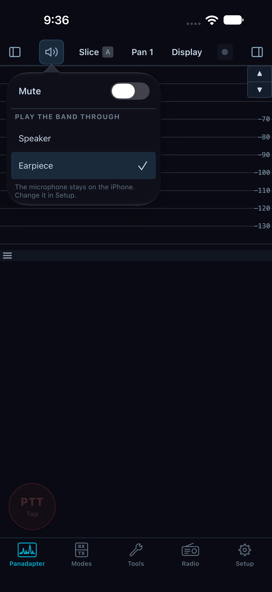
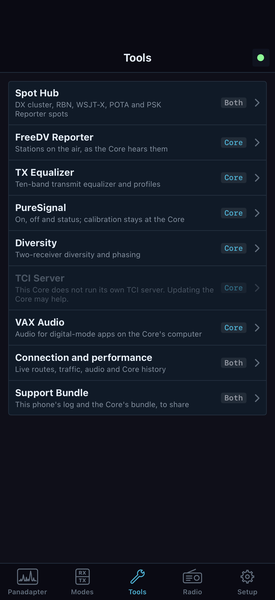
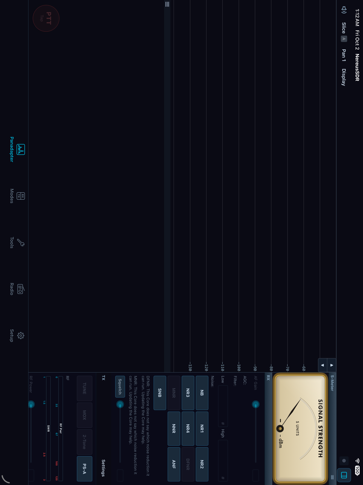

# Operate from an iPhone

The phone procedures in this chapter describe the reviewed native development
app, whose availability and delivery are separate from the desktop/Core release.
Use the connected Core's capability/refusal messages; see [build and verification
scope](verification.md) before treating these instructions as release acceptance.

This chapter assumes the iPhone is connected to the intended Core and the band is live. The phone shows the Core's panadapter and offers receive, tuning, and voice-transmit controls. The controls are arranged for touch, but each change still has an owner: many settings belong to the selected slice at the Core, while navigation, display presentation, and audio routing belong to this phone.

The tab bar is ordered **Panadapter**, **Modes**, **Tools**, **Radio**, **Setup**. Use **Panadapter** for the live band and toolbar; **Modes** for the selected slice's receive/transmit page; **Tools** for the Core's offered tool list and phone pages such as connection performance; **Radio** for Core/link status, radio telemetry, accessories, and radio menu pages; and **Setup** for ownership-marked settings. Each tab has its own navigation stack. A tool or setup page may have a back control that returns to its parent list.

## Know the band screen and its panels

In portrait, the band occupies the screen below the toolbar. The toolbar contains the **RX panel** button at left, **Sound**, active-slice selection, **Pan 1**, **Display**, the link chip, and the **TX panel** button at right. RX and TX panels slide over the band from opposite sides; opening one closes the other. Sheets such as **Pan 1** and **Display** also overlay the band and close when tapped again. In landscape the controls sit across the wide screen around the Core name and link; use the visible labels when their position shifts.

On iPad, the five tabs show icon and name. RX/TX applets have a dedicated region rather than sliding drawer buttons. In portrait, the band spans the upper area and the **S-meter**, **RX**, and **TX** applets sit in columns below. In landscape, the band occupies the left side and those applets share a column on the right; the toolbar's corner control collapses or restores that column. The Panadapter toolbar still provides **Sound**, slice selection, **Pan 1**, **Display**, and link state. Select the visible **RX** or **TX** applet for those controls; PTT stays with the transmit controls. If an iPad is in a narrow multitasking window, it uses the phone layout. Turning the iPad changes layout, not receiver ownership or tuning scope.

Tap the link chip for connection and performance details under **Tools**. It is useful when the display freezes or response feels delayed: distinguish a lost connection from a live connection with a slow path before changing radio settings.

| Control | Opens or changes | Scope and readback |
|---|---|---|
| RX panel | Quick AF Gain, AGC, filter, noise and squelch for the active slice | Slice settings from the Core; the panel title shows the active slice letter |
| Sound speaker | Local audio route/mute controls | This phone; speaker icon indicates mute and its panel stays over the band |
| Slice button | Chooses the next active slice | Changes which slice the RX panel and Modes controls edit |
| Pan 1 | Band picker, add slice/notch, extended view | Core-described band and slice operations; unavailable items explain why |
| Display | Spectrum, waterfall, display extras and CTUN | Many presentation controls are this phone's Pan 1 state; FFT and Hz/bin controls change Core display settings for all devices |
| TX panel | Quick transmit controls and status | Transmit belongs to the Core/radio; the panel reports refusals and active transmitter |
| PTT | Toggles this phone's software transmit request | Core/radio state; red **TX** plus timer while keyed, and refusal text when rejected |

## Tune and select a slice

Start on **Panadapter** with the desired band visible. Each owned slice has a colored flag with its frequency and information; folded tags identify flags crowded together. A foreign slice is a read-only label until this phone is granted control.

1. Tap the intended slice flag or folded tag. The toolbar's slice control and the RX panel title identify the active slice. If the slice is foreign, use its offered **Take control** action and follow [the shared receiver procedure](08-shared-core.md).
2. Drag the flag or its passband horizontally to tune that slice. The frequency follows the finger and lands on the slice's tune step. A drag on empty band pans the displayed spectrum and waterfall without changing slice frequency. A drag that reaches outside the receiver's current window can ask the Core to move the window; read and accept or cancel that request based on impact to other listeners.
3. Tap the frequency on a flag to open **Frequency for slice**. Enter digits, choose **MHz** or **kHz**, and tap **Tune to**. The Core's refusal appears under the entry and the pad stays open; correct the value or cancel. A configured pop-up knob changes what a frequency tap opens, so use the dial interaction instead when enabled.
4. Tap the step readout on the flag to open the tune-step menu and choose a step. Each slice keeps its own step on each band. A tuning dial's own step button opens the same kind of step choice.
5. For a coarse view change, pinch if **Pinch to zoom the band** is enabled or use the **−** and **+** controls at the lower right of the waterfall. Minus widens the view; plus closes in. The controls are deliberately placed away from the lower-left PTT area.

Tap/drag behavior is configurable under **Setup > General > Navigation > Touch**. **Drag a flag to tune** changes the flag/passband drag behavior; a drag on empty band pans the view. **Tap to tune on the band** tunes the active slice at a tapped frequency. **Double-tap action** selects **Tune**, **Center**, or **None**. **Snap tap-to-tune to step** rounds a tap to the nearest slice step when tap-to-tune or double-tap Tune is enabled. These settings apply to this phone.

## Use the dial or thumbwheel

Open **Setup > General > Navigation**. Under **Tuning dial**, choose one of the listed choices:

| Choice | Touch behavior |
|---|---|
| **Off** | Tune by dragging or tapping the band |
| **Knob on the waterfall** | An on-screen dial stays by the waterfall, opposite the PTT side |
| **Pop-up knob** | Tapping a flag frequency raises a larger knob |
| **Thumbwheel** | A flat wheel runs along the bottom of the waterfall |

The step is selected on the dial itself. Each slice retains its own step for each band. When a dial is enabled, the flag-frequency tap opens that dial rather than the frequency number pad. Turn or drag the dial according to its gesture, watch the flag frequency, and listen for the tuned signal before continuing. **Haptic tick on each detent** and **Firmer bump on each whole kHz** provide touch feedback; **Reverse dial direction** reverses rotation. These haptic/direction options are disabled while the dial is Off.

## Change receive settings in Modes

Tap **Modes** in the tab bar. It is a single vertically scrolling page, arranged as slice selector, **Mode**, **Filter**, **Front end**, **AGC**, **Noise**, **Audio**, **RIT / XIT**, **DIG / RTTY**, and **Transmit**. Confirm the slice letter and frequency near the top before editing. Changing the active slice changes the settings being shown. Each setting is read from and written to that slice at the Core; a bottom notice reports a refusal.

| Section/control | What it does | How to confirm |
|---|---|---|
| **Mode** | Selects among modes the Core lists for this slice | Selected mode button is lit; filter presets below update for that mode |
| **Filter** presets and **Low/High** | Chooses a Core-listed filter or opens a number pad for an edge | Preset is lit; read both edges after the Core accepts the change |
| **Front end** ATT / S-ATT / A-ATT | Chooses preamp/attenuator behavior; radio-provided preamp, step-attenuation range and antenna choices vary by Core/radio | Read selected button, dB value and antenna; unavailable hardware/features are omitted or explained |
| **AGC** and **AGC-T** | Chooses the Core's AGC mode and threshold; **AUTO** enables automatic threshold control when offered | Lit AGC/AUTO and threshold readout; AUTO may show its selected threshold information |
| **Noise** | Toggles listed noise controls (for example NB, NR variants, ANF, SNB), NNR state and APF where offered | Lit state, warnings/reasons, and any NNR step-back indication; a greyed control names the missing capability |
| **Audio** | AF Gain, left/right **Pan**, **MUTE**, **BIN** binaural, **SQL** and squelch level; **SPEAKERS/PHONES** select the Core output route | Confirm lit switch, slider readback and audible change; Core speakers/headphones are distinct from this phone's route |
| **RIT / XIT** | Enables receive/transmit incremental offset independently; arrows change by the slice step, value opens numeric entry, **0** clears it | Lit amber RIT/XIT and signed offset; after clearing, value returns to zero |
| **DIG / RTTY** | Provides DIG offset and RTTY mark/shift only where active mode/Core allows them | Read displayed hertz values; inactive controls show an explanation |

Do not assume every Core exposes every control. The phone renders the Core's described page and lists; unsupported or newer-Core settings remain disabled with a reason. The list and ranges may depend on the connected radio. If the Core refuses a write, the bottom notice gives its response; read the value again before continuing rather than assuming the optimistic slider position was kept.

The **RX panel** is a quick subset of the active slice settings: AF Gain, AGC buttons, filter presets and edges, noise controls, NNR status and squelch. It slides in from the left on iPhone. Use **Modes** when you need the complete page, including front-end choices, offsets and the transmit section.

## Pan the view, adjust display, or add a slice

Tap **Pan 1** in the band toolbar. The sheet names Pan 1 and the active slice, and shows a Core-provided band grid. Selecting a band opens it where the slice last was on that band, including its frequency, mode and filter. **Add a slice here** asks the Core for another slice at this pan; it can be disabled when no receiver can be assigned. **Add a notch** adds a notch associated with the selected slice when offered. **Extended view** requests the radio's full visible width around the band; it is available only when the Core describes the control. Read the note under any disabled item for the Core's reason.

Tap **Display** to open the current pan's sheet. The sheet identifies its pan and says that its waterfall/spectrum adjustments are on this phone. Available controls include palette, waterfall level, **Colour gain**, **Black level**, spectrum **Fill**, **Line**, **Spectrum height**, **Top**, and **Range**. Use them to make the trace and waterfall legible on this screen; read the scale and trace after each adjustment. When the Core offers them, **FFT size** and **Hz/bin** are station-wide Core settings, and the live bin-width readout shows the current result. A change to those settings affects every connected device and can require confirmation. If the Core cannot provide them, the controls are disabled with an explanation. Tap **More display options in Setup** at the bottom for the full grouped page; there the plan choice is Core-wide while plan size and rendering controls are local. See [chapter 20](20-phone-preferences.md) for details.

The sheet also exposes Core-dependent display extras on the band, classic **Peak hold**, **DUP** during transmit when the receiver can stay on the band, and **CTUN**. CTUN shifts the displayed/tuned relationship as indicated by the note beside it; verify the slice flag and receive pitch before using it. **LIVE** returns the display from look-back to current data. Items such as active peaks, noise floor, Clarity or 3D view appear only when the Core/app capability gates allow them. Disabled controls carry a reason; do not infer availability from another Core or from desktop-only pages.

## Route receive audio on the phone

Tap **Sound** from the band toolbar to open its popover without leaving the band. Use it for the local playback route and mute. To make a persistent phone-specific choice, open **Setup > Audio > On this phone**:

1. Under **Play the band through**, select the current route: iPhone/iPad speaker, earpiece when present, or a connected external route such as headphones. Confirm the selection marker and listen to a known signal.
2. Under **Microphone**, choose **iPhone microphone** or **AirPods microphone**. The iPhone microphone keeps AirPods audio playback at full quality; choosing the AirPods microphone makes iOS use phone-call quality in both directions.
3. Under **While you transmit**, **Mute the band while you talk** controls local band playback during transmit. The transmit monitor (MON) plays through headphones only so the speaker cannot feed back into the microphone.
4. If headphones are removed during listening, playback pauses and the band shows an audio notice. When ready to play aloud, tap that notice to resume on the phone speaker. Once playback is running, reconnect/select headphones in **Sound** and verify their route and audible output. Reconnecting a device or selecting its route alone leaves the paused playback waiting for the notice action.

The route and microphone are this phone's settings. The **Modes > Audio > SPEAKERS/PHONES** buttons instead select playback on the Core's own outputs. Check which control you are changing before troubleshooting silence.

*Sound changes this phone’s listening route. Here Earpiece is selected and Mute is off; the microphone stays on the phone. This is a capture of the running app in the simulator, without live Core audio. The grey PTT does not establish transmit readiness.*

## Prepare and transmit voice from the phone

This procedure is for voice operation when the Core and radio support it and this phone has microphone access. Check the transmit holder before changing transmitter settings. Receiving through a slice, controlling its tuning, and holding transmit are three separate states.

| Starting state | Available next action |
| --- | --- |
| This phone already holds transmit | Choose the intended owned slice's **TX** badge, wait for the Core to accept the choice, then prepare the microphone and processing. |
| Nobody holds transmit, and this phone has an original owned slice | A permitted on-screen PTT request can acquire transmit and key. Verify the Core's indicated transmit frequency/slice and complete microphone, band, power and station checks first. This is a real transmission, not a silent ownership test. |
| Another device holds transmit | PTT does not take it from that device. This source version does not expose a working phone transmit-takeover action. Continue receiving and coordinate with the station operator. |
| This phone has only a slice taken from another device, and does not hold transmit | The Core can require an explicit TX-slice choice, but that choice itself requires transmit ownership. Do not treat the highlighted badge as a complete acquisition route in this version. Keep the handoff receive-only. |

**Build limitation:** the phone's TX badge selects a transmit slice for an existing holder. It does not acquire transmit. The first permitted human PTT on an unheld transmitter can acquire it, but unkeying afterward leaves the device holding transmit. The covered phone build has no general **Take transmit** or **Release transmit** control. These restrictions matter when changing operators; see [the shared handoff procedure](08-shared-core.md#coordinate-a-second-device-handoff).

1. In **Modes > Transmit**, inspect the **TX filter** low/high edges. **Match RX** copies the current receive filter to the transmit filter. The edge values are editable when the Core says the radio is off air and the setting is allowed.
2. Choose the microphone under **Setup > Audio > On this phone**. Speak and watch the pre-key mic level indication beside **Mic Gain**. Adjust **Mic Gain** only while observing that level; when keyed, the meter shows the Core's transmit reading. If the Core reports the mic muted or this phone lacks microphone permission, resolve that state before keying.
3. Select the voice processing needed for the session: **PROC** and its level, **LEV** leveler, **EQ**, **CFC**, and **DEXP**. These controls change the Core's transmit chain, not the phone's receive DSP. Tune one at a time and use the transmit monitor/meter and on-air reports to judge the result. **MON** is a monitor status/control shown as unavailable when the Core does not send it to the phone; its grey state is not a local audio-volume fault. CFC bars also depend on telemetry offered by the Core.
4. Leave **VOX** off for manual PTT operation. VOX is a separate keying mode: it arms transmit from microphone audio, requires this phone's transmit permission and an available mic path, and has **VOX level** and **VOX delay** controls. Set and test it only when that behavior is intended. **DEXP** is downward expansion, not a keying control.
5. In **Modes > Transmit**, review the mic and processing state. Open the **TX panel** from the toolbar for the quick transmit controls and status. The phone's prominent **PTT** is a toggle: tap once to request transmit and tap again to unkey. It is not press-and-hold.
6. If this phone already holds transmit, tap the intended owned slice's **TX** badge and wait for its accepted indication. If nobody holds transmit, verify the intended original owned slice and the Core's TX indication before the first key. Do not use a refused badge choice as proof that the transmitter moved. If the Core asks for a choice you cannot make in the starting state above, stop at that limitation.
7. Tap **PTT** once. Confirm the button turns red and displays **TX** plus an elapsed timer. Watch the transmit panel and any offered power/SWR or mic indication. Keep the radio's own indication in view when operating at the station. Tap PTT again and confirm it returns to receive before leaving the screen.

TX power is not a universal phone slider. If the connected Core describes **Setup > Transmit > Power**, open that page and read its control labels, units, range, help and ownership tag. Change only a control the Core actually offers, while the radio is off air if its gate requires that, and confirm the Core's resulting readback. A shared-change sheet means other devices or slices will be affected. Do not assume that an RF-power control exists just because the radio or desktop has one.

The phone's voice source is selected under **Setup > Audio > On this phone > Microphone**. A Core may also describe source/monitor controls in Setup or its offered Tools pages; use those only when they are present and read their scope and gates. In this build the Modes **MON** indicator is not a freely switchable monitor route. The Core's transmit monitor is played on this phone when the Core sends it, through headphones only. Do not treat the source as a choice among desktop **PC**, **Radio**, or **Composite** inputs unless this Core explicitly describes that choice on the phone.

If PTT is refused, read the reason displayed over the band or in the TX panel. Another device may hold transmit, the Core may lack permission or mic access, or the Core may not be ready. Resolve the named condition, then explicitly key again. When a link is lost, the Core unkeys; the phone never automatically rekeys after reconnect. Only on-screen PTT keys from this phone in the covered app. The headset, Bluetooth, Action button and locked-phone choices in Setup are disabled. See [phone preferences](20-phone-preferences.md) for time-outs and audio interruptions.

The TX panel and Modes page can show only controls described and enabled by the Core. Do not infer that desktop TX pages, accessories or radio-specific controls are available on the phone. See [desktop transmit](05-transmit.md) for local desktop workflows and [chapter 09](09-tools.md) for mobile tools where they are listed.

## Save battery, manage data, and leave a session

Phone-only session controls are at **Setup > General > Battery and sessions**. They apply while this phone runs the app.

| Setting | Effect | Check |
|---|---|---|
| **Sound only** under **Locked or in another app** | Asks the Core to stop sending band display data while this app is away | Return to the app and confirm the live band resumes; iOS/network background behavior still applies |
| **Keep the screen on** | Choose **Never**, **While charging**, or **Always** while the band is showing | Check the selected row; this does not prevent iOS from ending a network session |
| **Sleep timer** | **Off**, **30 minutes**, **1 hour**, or **2 hours**; disconnects at the displayed time | The page shows the scheduled disconnect time when active |
| **In Low Power Mode, drop to Saver** | Reduces the band to 5 frames per second and half detail in Low Power Mode | Confirm the phone is in that state and inspect the display cadence |
| **Slow the band when the phone is hot** | Reduces display work until the phone cools | A slower waterfall with a connected link can indicate thermal/power management rather than link loss |

Phone-only network policy and counters are at **Setup > CAT & Network > Data use**. The page shows **This session** total and **This month on cellular**. Select a policy independently under **On Wi-Fi** and **On cellular**; the rows describe what data mode asks for and show an estimated cost. Cellular **Full** means the same as Wi-Fi. **Warn me past 5 GB a month on cellular** places a notice on the band when the threshold is passed. The page states that the estimates vary and transmitting adds about 13 MB per hour of talking, so use the displayed counters for this phone's actual usage rather than treating estimates as a quota.

Use **Tools > Connection and performance** when a link appears slow or a reconnect is in progress. It shows connection attempts and performance readings; choose a displayed time range or reset session statistics to focus the current session. The toolbar link chip opens this page directly. In **Radio**, the Core/link card provides **Disconnect** and **Remove Core**; **Radio at a glance** refreshes while the tab is visible and shows telemetry as unavailable when the Core does not provide a current value. The **Accessories** and **More** lists follow the Core's menu: open only listed items and follow their page's controls. **Manage Radios** is the phone surface for choosing/scanning radios only when this Core offers that capability; its choices can affect the Core's station, so read any confirmation before proceeding. **Protocol Info** reports the radio/protocol details. An item not offered by the current Core is not implied by another Core's menu.

To end normally, unkey first and verify the PTT state is receive. Open **Radio > Disconnect**. The saved Core remains available on the welcome/Cores screen. If audio or display is absent after returning, check the link chip, the Sound route, and the sleep/background notices before changing radio settings.

## Open the tool for the task

Tap **Tools**, read the page's scope tag and availability reason, then open
the named tool. Use its back navigation to return to the tool list. The Core
supplies the offered tools; compatible hardware can omit PureSignal or
Diversity entirely. A newer-Core reason differs from a tool this app does not
know, and Connection and performance remains useful for the phone's own link.

| Tool | Procedure and scope |
| --- | --- |
| **Spot Hub** | [Spot sources, filters, lists and display](16-spots-reporters.md). Core feeds and local phone presentation can share a page marked Both. |
| **FreeDV Reporter** | [Reporter station list and RADE operation](15-rade-freedv.md). Core station service. |
| **TX Equalizer** | [Voice processing and profiles](14-voice-profiles.md). Core transmitter; changing it is not personal receive tone adjustment. |
| **PureSignal** | [Feedback status and supported controls](18-puresignal-diversity.md). Calibration remains at the Core. |
| **Diversity** | [Two-receiver phasing](18-puresignal-diversity.md). Compatible Core/radio resources required. |
| **TCI Server**, **VAX Audio** | [Digital application routing](09-tools.md). Operate services/devices on the Core computer. |
| **Connection and performance** | [Read paths and audio delivery](11-troubleshooting.md). Phone and available Core measurements. |
| **Support Bundle** | [Collect and share evidence](11-troubleshooting.md). Lists phone/Core files before sharing. |

For more detailed receiver parameters after the Modes quick controls, use
[receiver DSP setup](13-receiver-dsp.md). For Core hardware or accessory pages,
use **Radio** and the offered Setup tree, then the
[hardware](17-hardware-antennas-calibration.md) or
[accessory](19-amplifiers-tuners.md) procedure. A control's presence in a desktop
chapter does not ensure that the phone or connected Core offers it.

*Tools is the starting list for the task pages above. Availability and ownership labels matter as much as the tool name. This native SwiftUI simulator screen uses simulated Core capabilities and status.*

## Worked session: receive then make a short voice call

Start with a paired phone, a live Core, headphones connected, and an original owned slice on the intended band. For the voice portion, this phone must already hold transmit or the transmitter must be unheld. This example does not transfer transmit from another device. Confirm the physical station's antenna/load, power and operating permission before any key.

1. On **Panadapter**, select the slice and tune it by the flag or the frequency pad. Use the **Pan 1** sheet to change band if necessary. Confirm the frequency and mode on the flag.
2. Open **Modes**. Choose the mode and a filter preset. Set AGC and AGC-T for the signal; use **AUTO** only if offered and desired. Adjust **AF Gain** and, if needed, toggle noise reduction. Confirm audio through the selected headphone route.
3. Set RIT only if the station requires a receive offset. Read its signed offset and lit state. Clear it with **0** before a call if you do not intend to retain it.
4. Open **Setup > Audio > On this phone**, confirm the microphone choice, then return to **Modes > Transmit**. Check TX filter, pre-key mic level and the existing processing state. If this phone holds transmit, choose its intended slice's **TX** badge and verify the accepted readback. If TX is unheld, check the original owned slice and current Core TX indication; a badge selection cannot silently acquire ownership. If the target is ambiguous, stay in receive.
5. Tap PTT, confirm red **TX** and running timer, speak briefly, then tap PTT again. Verify the receive state and that the receive signal returns. If PTT is refused, act on the refusal instead of repeatedly tapping.
6. When finished, unkey, confirm receive, then **Radio > Disconnect** if leaving the station.

If receive audio is absent at step 2, use **Sound** and check this phone's route before changing the Core's SPEAKERS/PHONES outputs. If the microphone is unavailable at step 4, resolve permission or the displayed audio-path reason. If another device holds transmit at step 5, the phone remains a receiver; repeated taps do not perform a takeover. After a successful over, verify the timer stops and receive audio returns. The phone can still hold transmit while unkeyed.

For coordinating that transmit slice or receiver with another operator, follow [Share a Core with other devices](08-shared-core.md#coordinate-a-second-device-handoff).

*iPad applet column: band at left, meter and scrolling receiver/transmitter controls at right. This full-app simulator capture illustrates the layout only. The test Core provides no usable readings, so controls are dim and the trace is empty; it is not the live two-slice state required by the following session.*

## Worked session: two slices on an iPad

Start connected in receive with two slices already available to this iPad. Use **Pan 1** for an offered add-slice action if you need another receiver, and read any resource or ownership refusal. A wider screen does not increase the radio's receiver capacity.

1. Turn the iPad to landscape in a full-width window. The band is on the left, with the S-meter, RX and TX applets in a right-hand column. Show that column with the toolbar corner control if it is hidden. In a narrow split-view window, expect the phone arrangement instead.
2. Select the first owned flag or slice tag. Check the active letter in the toolbar and RX applet before choosing its mode, filter or AF Gain. Verify its frequency and listen to it through this iPad's **Sound** route.
3. Select the second flag and repeat the check. RX controls now follow that slice. Keep its frequency and mode distinct enough to recognize which signal you are hearing. An active RX selection does not move the TX badge or grant transmit.
4. Scroll the right applet column to reach controls below the meter. Tap the S-meter's title menu, or press and hold its face, and choose an available **RX Mode**. Check the needle/readout for the active slice; a disabled reading means the Core cannot supply it.
5. Turn the iPad upright. The band spans the upper area; meter, RX and TX columns sit below it. Scroll RX independently to reach its lower controls without losing the meter or scrolling TX. Confirm both slice frequencies and the active letter survived the layout change.
6. Return to the slice you intend to monitor. Leave PTT in receive. If finished, use **Radio > Disconnect**; if another operator will take a receiver, use the [receive handoff](08-shared-core.md#coordinate-a-second-device-handoff).

The meter's **Peak Hold** and **Meter Face** options, detailed layout conditions and unavailable-reading behavior are in [the iPad reference](12-reference.md#use-ipad-screen-arrangements-and-the-meter). Changing orientation or a meter face affects presentation; changing an owned slice's mode or filter affects that receiver at the Core.
