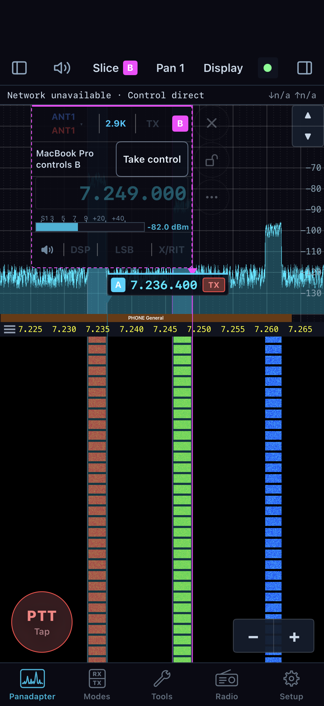
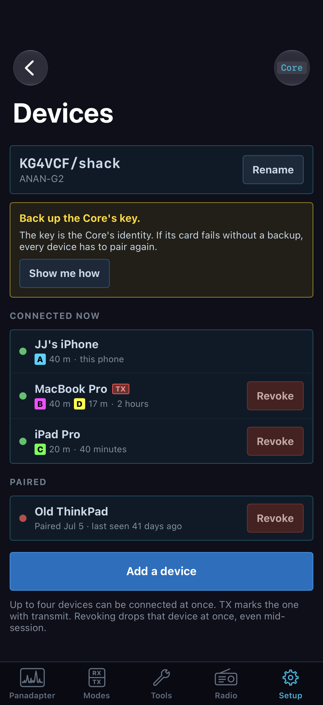

# Share a Core with other devices

The phone procedures in this chapter describe the reviewed native development
app, whose availability and delivery are separate from the desktop/Core release.
Use the connected Core's capability/refusal messages; see [build and verification
scope](verification.md) before treating these instructions as release acceptance.

A Core serves multiple paired phones and computers, but receiver capacity is finite. Each device can have its own slices and can listen where its receiver assignment permits. The Core decides ownership and access. On the iPhone, a foreign slice is a read-only label until this phone takes control. Transmit ownership is separate from the active receive slice. Check the TX slice and holder independently, using the supported starting states in [phone transmit preparation](07-iphone-operate.md#prepare-and-transmit-voice-from-the-phone).

## Inspect shared administration from a desktop

For a saved Core, open **File > Settings… > Cores > Your Cores**, select it,
and use **Overview**, **Radio** and **Devices**. Inspection does not connect
this window. Radio/device administration applies only to the Core currently
connected in this window; disconnected entries show the unavailable reason.
**Overview > Rename Core…** changes its name for all devices, with acceptance
required. **Addresses** manages future routes without changing the live link.
See [Core Settings and direct addresses](01-desktop-connect.md#inspect-a-saved-core-and-the-actual-connection-path).

Keep receiver control and TX ownership separate. A desktop **Take transmit**
can ask to unkey the named current holder, then recheck its state and this
session's permission before granting the change. See [handoff and radio-side
PTT](05-transmit.md#recheck-a-handoff-and-radio-side-ptt). The phone paths below
remain scoped to the reviewed native development app.

## Read the ownership indications

Open **Setup > Devices** to see this Core's identity, connected devices, paired devices, and pairing controls. **Connected now** lists devices presently connected; their row can show assigned slice letters/bands and a **TX** mark for the device holding transmit. **Paired** lists identities that may connect even when currently away. The current phone is identified in its row. Up to four devices can be connected at once. The **Devices** page note explains that revoking a device drops it immediately, including during a session.

On **Panadapter**, slices owned by this phone have interactive flags. Another operator's receiver is shown as a foreign, read-only label. Do not use its visible frequency as evidence that this phone can tune or transmit through it. If the Core offers **Take control**, the request and its result determine whether the flag becomes editable.

*Slice B belongs to another device and offers Take control; selecting its label does not grant that control. The folded A flag and TX badge are separate indications. This native simulator screen uses simulated Core state and a synthetic waterfall, not received RF.*

## Take a slice or receiver

Start from the band with the other device's slice visible. Tap the foreign label and choose **Take control** when it is offered. The Core may grant the existing slice with its settings intact. The band shows the result or the Core's refusal. If another operator takes one of this phone's slices, a notice names the change and can offer **Take back**; use it only after coordinating, because control will change again.

When all receivers are in use and opening another slice requires one, the Core presents **Every receiver is in use** (or **Every slice is in use** when the radio's slices run out first):

1. Read each choice. It names a receiver and the device using it, shows that device's slice frequency/mode and activity, and gives the Core's reason if the receiver cannot be taken.
2. The first takeable choice is selected initially. Select another takeable receiver only if it is the one you intend to reclaim. The action button names the affected device, for example **Take the iPad's receiver**. For a free receiver it says **Use this receiver**.
3. Read the impact note: taking a receiver closes the slice on that device and tells its operator who took it. Taking a slice has the same ownership consequence for that slice. Tap the named action to proceed or cancel the sheet to preserve the other session.
4. Wait for the Core's response. Confirm the new slice is yours and that the other device has received the notice. If refused, use the Core's explanation and coordinate a release rather than repeating the request.

A receiver takeover is not a transmit takeover. When this phone already holds transmit, its **TX** badge can select the newly controlled slice without keying. Without that ownership, the badge can be refused even though the slice is now yours. The Core can highlight the badge after refusing a first key on a taken slice. In this phone version that prompt does not provide a complete route to acquire another device's transmit ownership. Keep that handoff receive-only; see the starting states in [phone voice operation](07-iphone-operate.md#prepare-and-transmit-voice-from-the-phone).

## Understand shared-change confirmations

A Core setting can affect other connected listeners. Before applying a shared change, the phone shows the change name and **from/to** values, then the affected devices and slices. The details can say that a slice moves to another receiver, closes, or pauses while the radio transmits. A one-device confirmation names that device; a multi-device confirmation says other devices will hear the change.

1. Read the old and new value and every affected device/slice. Check whether the impact is acceptable to those operators.
2. Tap the button named for the new value (for example, **Set 20 dB**) or **Make the change**. The Core performs the change and the control updates to its readback. The sheet also says which devices are told the change.
3. Tap **Cancel** to leave the shared setting unchanged. If the Core refuses the change or the link drops, use the reported reason/readback and ask before trying a different setting.

Do not treat a setting's physical location in the phone app as its ownership. The **Setup** tree marks each category and page:

| Mark | Meaning | Example |
|---|---|---|
| **Core** | The setting lives at the Core and is shared with devices paired to that Core | **Setup > Devices**, Core-described hardware/DSP pages |
| **This phone** | The setting stays on this phone | **General > Navigation**, **General > Battery and sessions**, **Audio > On this phone** |
| **Both** | The category contains settings with both owners; inspect the page mark and individual controls | **Audio**, **Display**, **Transmit**, **General** |

The phone builds much of this tree from pages and controls described by the connected Core. A Core can provide a different page list from another Core or version. The app filters pages it does not support and shows unsupported offered pages disabled with a reason. A page missing from this Core's described list is not proof that a similarly named desktop or radio control is available on the phone. On a described page, read the help text, range, unit, choices and confirmation prompt attached to each control; these are the Core's current definitions. Values that the Core refuses stay visible with its reason. For details on phone-only choices, see [Operate from an iPhone](07-iphone-operate.md).

## Add a paired device

Pairing is initiated by a device that already has access, unless the Core is still open for its initial pairing.

1. On the connected iPhone open **Setup > Devices**. Confirm the Core name at the top is the one whose access you want to extend.
2. Tap **Add a device**. The page opens the pairing window and displays the current one-use code and the instruction to choose **Pair with a code** on the new device. Send that code privately to the intended operator.
3. Have the operator enter the code on the new phone or computer and complete pairing. The code works once; when the new device pairs, the window closes. If the code is rejected or expires, reopen **Add a device** and share the newly displayed code.
4. Return to **Devices** and check that the new identity appears under **Connected now** or **Paired**, according to its session state. The list can update as it connects. Pairing gives access to the Core; it does not reserve a receiver or choose its TX slice.

The page reports the four-device connection limit. If it is reached, coordinate which device should disconnect before adding another active session. A paired but disconnected device may still be listed under **Paired**.

## Rename or revoke a device

The top card shows the Core name and connected radio and offers **Rename**. Use that action when the Core's shared station name needs correction; wait for the Core's response and confirm the displayed name. Device rows have **Revoke** where the Core permits it. Revoke immediately removes that device's access and can terminate it mid-session. Before revoking, verify the row's name, its slices and whether it holds **TX**, then coordinate with its operator. The current phone cannot revoke itself from this page. A disabled **Revoke** has a reason; resolve that condition instead of assuming the device was removed.

To remove only this phone's local saved Core entry, use **Radio > Remove Core** from this phone's session. That is different from revoking another device in the Core's shared device list. Removing the phone's own local entry does not remove other operators or the Core itself.

*Devices separates active connections from identities permitted to connect. Device names and station identity here are synthetic test values. This native SwiftUI simulator screen does not demonstrate pairing or revocation on a real Core.*

## Back up the Core identity key

The Core's key is its identity. The Devices page can show a reminder if the Core says it has not been backed up. If the station operator administers the Core, use **Show me how**:

1. Read the file path shown by the Core. On the Core's computer, copy that file to safe storage away from that computer, such as a USB drive or another computer. Keep the copy private; someone who obtains it can stand in for the Core.
2. Only after the copy is complete, return to the sheet and tap **I've backed it up**. This tells the Core the backup was made and clears the reminder across its devices after the Core accepts the request.
3. If you have not made the copy, choose **Not now**. The reminder remains. If the page cannot provide a path, ask the Core administrator rather than guessing a filename.

The backup is not a phone pairing export; it is the Core's identity recovery file. Restoring it to the same place after the Core's storage fails allows existing devices to connect as before. Without it, the Core may have a new identity and devices may need to pair again.

## Connect when four device places are occupied

A full Core presents **Four devices are on** followed by its name. This is a
session-capacity choice, separate from pairing or receiver ownership. Read each
device's current activity, listening slices, connection duration and last
activity before choosing whom to replace. The computer running the Core cannot
be replaced.

1. Select a replaceable device. Selection alone does not evict it.
2. Read the consequence beside the confirmation button. For a transmitting
   device the button says **Unkey and take [device]'s place**; otherwise it
   says **Take [device]'s place**.
3. Confirm the intended replacement, or choose **Cancel** to leave the other
   device in place. Wait for the connection result and read any refusal.
4. After connecting, inspect your slices and TX ownership before operating.
   Taking a device place is not the same as choosing a transmit slice.

The displaced device's slices and settings remain saved. Its screen reports
**TAKEN OVER**, identifies who took its place and when, and offers **Take it
back** or **Back to Cores**. Take it back returns to the device-place choice;
it does not silently reclaim the session. If a returning device was away long
enough for its place to be freed, the app can explain that fact and present
the same choice. Do not regenerate pairing codes merely because a saved device
has lost its active place.

Coordinate replacement with the other operator when possible. Replacing a
transmitting device explicitly unkeys it; replacing an idle listener still
ends that device's current connection. Receiver takeover and transmit handoff
remain separate actions after the session is admitted.

## Coordinate a second-device handoff

A handoff separates receiver control, listening, and transmit ownership. Agree which operator is taking each role before either changes it. In the covered phone build, a receiver handoff is supported but a general desktop-to-phone transmit takeover is not exposed. The steps below therefore transfer reception. They do not promise that the phone can key afterward.

**Example: the iPhone takes control of the desktop's existing slice A.**

1. The desktop operator unkeys and confirms receive. The iPhone operator checks **Setup > Devices** to identify the desktop and its slice, then selects that slice's **Take control** action on the band.
2. The phone operator waits for the control request to succeed. The desktop operator checks its flag or **Slices on this Core** chooser for the changed controller. Taking control of an existing slice can leave the desktop listening to it. Do not confuse this with reclaiming an occupied receiver to create a new slice: that separate resource request can close the other operator's slice, and its confirmation names that consequence.
3. The iPhone operator confirms the slice appears as owned, checks frequency, mode and filter, and tests receive audio. The desktop operator can continue using any unaffected receiver/slice.
4. Both operators leave transmit in receive and identify its holder separately. The phone operator can inspect the **TX** mark in **Setup > Devices**. The desktop operator reads its TX status/holder and slice chooser. **Setup > Devices** is a phone path. Unkeying the desktop does not release its transmit ownership; tapping the phone's slice badge does not take that ownership.
5. To return receiver control, the phone operator stops tuning and tells the desktop operator it is ready. The desktop operator opens **Slices on this Core**, selects A, and chooses **Take control**, or uses the offered **Take back** notice. Both wait for the result. The desktop verifies its control mark and frequency/mode; the phone verifies that its flag is read-only/listening again. No invented phone **Release** action is required.

If this phone already holds transmit independently, it can choose the returned/taken slice's TX badge and follow the ordinary voice procedure. If another device holds transmit, this source version cannot complete that takeover from the phone. Do not key another slice merely to manufacture ownership. For a fresh unheld transmitter, a human PTT on an original owned slice is the supported first-key path, with all normal RF and microphone prerequisites; it is not an ownership-only button.

If a device goes away unexpectedly, its connection row can show it as away/stale. Do not revoke it merely to clear a stale mark; first establish whether that operator is reconnecting. Link loss unkeys transmit, but the Core may continue to list a paired identity for later reconnection.

## Release, stop listening, or disconnect

These actions have different effects. In the desktop **Slices on this Core** chooser, **Release** gives up receiver control while other listeners can continue; with nobody left, the slice closes. **Stop listening** removes this window's subscription to a receiver it does not control. These are receiver actions, not transmit release.

On the phone, coordinate return by having the intended operator take control and waiting for both devices' readbacks. **Take back** requests the offered reversal; it does not silently restore ownership. A flag's close action asks the Core to remove that slice, so do not use it as a generic release while another operator is relying on the receiver. If leaving the entire phone session, unkey first and confirm receive, then use **Radio > Disconnect**. The Core can retain an away device's ownership during its reconnect period; an ended link is not proof of immediate transmit release. Disconnecting leaves the phone paired. **Radio > Remove Core** makes this phone forget the saved Core.

A handoff is complete when both operators can identify who owns the receiver, which slice is being monitored, and which device carries the TX indication. The selected slice button alone does not prove transmit ownership.
