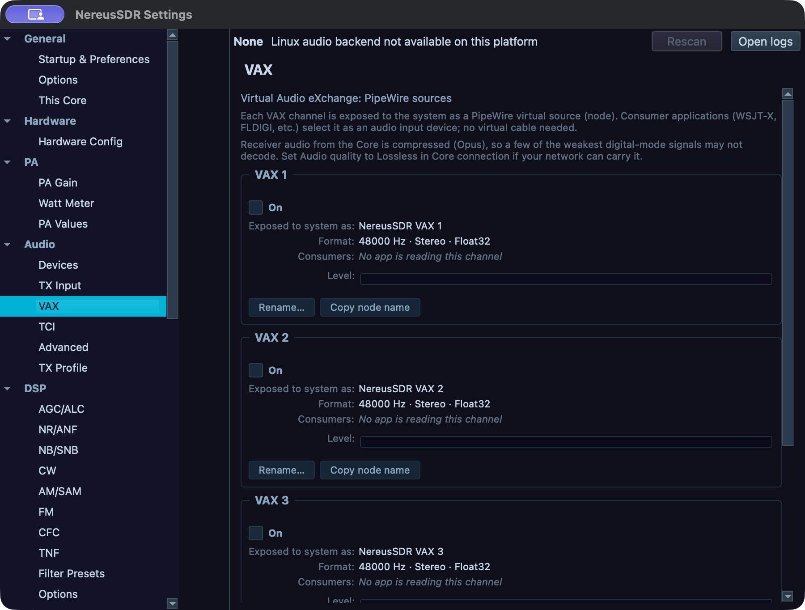
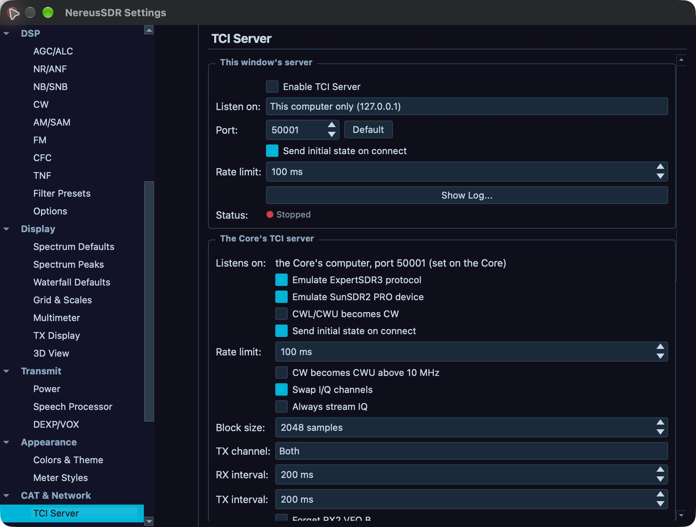

# Digital audio and external applications

This chapter covers the audio paths and network controls used by digital-mode programs. VAX exposes virtual audio channels. TCI provides a WebSocket control and audio interface for compatible clients. These controls do not decode digital modes inside NereusSDR. A VAX meter or connected TCI client confirms only the part of the path it measures.

Desktop VAX channels and TCI audio preferences belong to **This computer**, even when the desktop window is connected to a remote Core. The desktop TCI server control can coordinate the Core server, which retains its own on/off state. iPhone/iPad **Tools > VAX Audio** and **Tools > TCI Server** pages operate the Core computer directly. A missing or grey phone tool can mean the Core build or radio does not offer it.

## Route receive audio through VAX

### Desktop setup

Start with a connected radio and an active slice tuned to the signal you want to decode. Open **File > Settings > Audio > VAX**. This page has a card for each VAX channel. Its visible controls are **On**, **Name**, **Format** readback, **Consumers** readback, level meter, **Rename…**, and **Copy node name**. Device selection is not a visible page control in this build. For the channel you intend to use:

1. Turn **On** on. The channel becomes available as an audio input to consumer applications. To route a receiver, select its VFO and use the VFO's **VAX** tab/channel selector to assign the desired VAX channel. The VAX applet's slice-letter tag confirms which receiver is assigned. Use distinct channels if you need separate receiver feeds.
2. Give the channel a recognizable **Name** if your operating system or decoder lists several similar NereusSDR devices. Use **Copy node name** when you need the exact node identifier shown by the page. This name does not change the slice being routed.
3. Read **Format** and **Consumers** as status, not selection controls. The operating system exposes the VAX source when the channel is on; choose the matching NereusSDR VAX source in the external digital program.
4. Open **Tools > VAX Audio...** or show the **VAX** applet from the desktop applet/container controls. The VAX row is labelled by channel number and assigned slice letter. The page also lists channel device and contributing slices, with RX level, meter and mute; under **VAX microphone**, it shows the transmit slice and TX level/meter. RX mute suppresses only that VAX channel for apps, not the speaker. TX gain controls the VAX microphone level and may be disabled when transmit settings are not permitted. Its level control changes the level delivered to that virtual output; **Mute** suppresses only that VAX tap and does not mute the normal speaker output. Unmute and confirm activity on the row while a signal is present.

The desktop page configures VAX sources on this computer, including when the receiver stream arrives from a remote Core. It does not choose an operating-system device. If a channel is enabled but the program receives silence, verify in order: the channel is routed to the intended slice, that slice is producing audio, the row is not muted or turned down, the program selected the same VAX endpoint, and the operating system still has the virtual device. Re-select or rescan the device after changing audio backends. An exposed channel with no consumer means the application has not opened it. A live level does not certify a decode.

### Phone and iPad

Tap **Tools > VAX Audio**. This is a Core tool: the Core computer must have a supported virtual audio backend and an available VAX device. Each **VAX 1–4** card shows the device name, contributing slice or slices, **Level** slider, **Meter**, and **Mute** switch. While a signal is present, use the meter to check the channel, adjust **Level** to change that VAX feed for apps, and switch **Mute** on/off to silence/restore only that channel for apps. The main speaker remains unaffected. The **VAX microphone** card shows the transmit slice, **Level**, and meter. Its level adjusts the VAX TX microphone gain; it is disabled when this phone cannot transmit, and the reason/refusal appears below. The page shows the Core's latest refusal after a rejected change. If channel or meter status reports that the Core/build does not provide it, follow that reason; older Core versions may omit the channel or level stream. The phone does not create a virtual device on the phone itself. A remote receive-audio path may have lower quality than local audio; use a local Core-side application for decoding when network audio degrades the signal.

*VAX receive channels before routing: the cards are off and have no consumers. Check On, format and consumer status independently. This macOS desktop development capture does not demonstrate a working PipeWire endpoint, despite the page’s backend wording. The separate TX endpoint is described below.*

## Send transmit audio from a digital application

Begin with a running desktop audio engine and a supported virtual audio backend. Enabling numbered VAX channels is for receive feeds; the TX input is separate. On macOS, choose **NereusSDR TX** as the digital program's audio output. With the Linux PulseAudio/pactl backend, choose the **NereusSDR TX** sink. With native PipeWire, route the program's audio output to the **NereusSDR TX input** stream in the system's audio graph; do not choose a numbered RX source as the TX destination. NereusSDR reads that incoming stream as transmit audio. Select **VAX TX (virtual device)** in desktop **Setup > Audio > TX Input**. Confirm the selected source and TX audio indication before transmitting, and use the ordinary transmit ownership, band, interlock and power checks in [chapter 5](05-transmit.md). This path is implemented on macOS and Linux. The headless **nereusd** service publishes neither RX nor TX VAX devices; a running desktop audio engine is required for this virtual-device workflow. Windows currently opens no VAX RX or TX bus; detected third-party virtual cables and **Rescan** do not bind a cable to VAX, so this procedure is unavailable there.

Do a receive-only check first. Confirm receive audio reaches the decoder and that the decoder's own status changes. For transmit, use a permitted, coordinated test at a safe power and frequency. Confirm TX ownership and the intended VAX source before keying. If the RF transmitter does not key, investigate the displayed TX refusal; changing VAX routing cannot grant TX ownership or clear a radio protection. Do not assume the program's transmit button keys the radio unless it is explicitly configured to use a supported control path.

## Configure TCI audio

On the desktop, open **File > Settings > Audio > TCI**. This controls the TCI audio bridge on this computer. Set **Slice A rate** to a rate supported by the connected client. The offered rates are 24, 48, 96 and 192 kHz (default 48 kHz). This page does not expose Slice B, C or D rate controls; C and D are explicitly unavailable over TCI.

Under **Sample Format**, choose the sample representation and channel count the client can decode. **Samples** is also configurable on Setup > CAT & Network > TCI Server; its default is 2048 samples. The formats are Int16, Int24, Int32 and Float32; channel count is mono or stereo. A mismatched client format can produce silence or invalid audio. Use the client's documented supported format, then reconnect the client and check its stream status. **TX channel** selects Left, Right or Both for transmitted audio. **TX buffering** controls the bridge's transmit audio buffer: a smaller value reduces delay but leaves less tolerance for uneven client delivery. If TX audio breaks up, increase buffering gradually and confirm the result at the receiver.

TCI streams are independent of the main speaker mute. The TCI applet provides Slice A and TX gain controls; use those stream-level controls to diagnose a TCI-only level. TCI audio setup is local to this desktop, including when it operates a remote Core.

## Start and monitor a TCI server

On desktop, open **File > Settings > CAT & Network > TCI Server** or **Tools > TCI Server...**. If the TCI tool is unavailable, confirm the build includes WebSocket support. In Setup:

1. Turn on **Enable TCI Server**. Choose **Listen on** and **Port**. The listen address determines which network interface can accept connections. Use an interface reachable by the client and avoid exposing a server to a network you do not trust.
2. Review **Send initial state on connect** and the server options. Leave compatibility/emulation options off unless the client requires that protocol behavior.
3. Read the displayed **Status**. Open the TCI log if a client cannot connect; use the logged connection or refusal detail to correct the listen address, port, firewall or client target.
4. Configure the external client with the displayed host and port. Return to the TCI status/app applet and verify the client appears in **Clients**. A successful WebSocket connection does not mean that the client owns transmit control. Review the server options by their displayed labels: ExpertSDR3 protocol emulation, SunSDR2 PRO device emulation, CWL/CWU presented as CW, and sending initial state to new clients. On the phone, these options apply to apps connecting from that point onward and may be unavailable while on air.

Before a TCI program requests transmit, confirm that the desktop window
hosting its server holds the station’s **TXcontrol**, using the ordinary
station transmit-holder indication. The external app does not become a
station device or acquire unheld station transmit merely by connecting.
An accepted TCI key can then acquire the separate app TX-audio lock. The
client’s TX/audio indication is evidence after an accepted request, not a
pre-key station-ownership control. If keying is refused, inspect the owning
window’s station permission first, then the app/server reason. The TCI applet
has status and RX/TX audio gain controls; those gains affect TCI streams,
not the main speaker route.

On iPhone/iPad, open **Tools > TCI Server** to inspect or operate the Core computer's server, port, options and connected clients. This is a Core control. A Core may not include or enable the server even when the desktop has its own TCI server. The phone page shows the Core server switch, port, station address when available, error/status, four options, and connected app rows with name, address, subscriptions, last command and TX badge. Use **Disconnect** only after confirming the app; the page asks first. If a control is unavailable, follow its capability/readiness or on-air reason.

*TCI Server distinguishes this window’s local server from the Core server. Here the local server is disabled, bound to localhost and Stopped. A chosen port is not a connected-client readback. This is a desktop development capture; no server was started for the figure.*

## Set DIG and RTTY offsets

Select the slice you intend to configure and choose **DIGU** or **DIGL** from its mode controls. The slice's **DIG Offset** control shifts the digital audio passband offset in hertz. Adjust it in small increments while watching or listening to the decoder, then verify the displayed value and decoder response. This offset only positions the receive/transmit audio passband; it is not a decoder, CAT connection, or automatic frequency correction.

When **DIGL** is selected, the RTTY controls expose **Mark** and **Shift**. Use the adjacent decrease/increase arrows or change the displayed value. Mark is the mark tone frequency; Shift is the separation between mark and space. The controls accept Mark from 1000 to 3500 Hz and Shift from 50 to 1000 Hz. The shown initial values are 2295 Hz and 170 Hz. Confirm the external RTTY program is configured for compatible tones and that the selected audio route is the one in use. NereusSDR provides these offset controls, not an integrated RTTY decoder or CAT integration. For the mobile modes page, see [chapter 7](07-iphone-operate.md).

## Choose the computer and route

For the worked route below, use macOS or the Linux PulseAudio/pactl backend, and run the desktop NereusSDR window and the external digital program on the same computer. VAX carries the selected receiver to that computer’s audio system, and the separate **NereusSDR TX** output device/sink carries the program’s transmit audio back into NereusSDR. With native PipeWire, the TX destination is an input stream that needs a system audio-graph link; follow [the backend-specific TX directions](#send-transmit-audio-from-a-digital-application) rather than looking for a PulseAudio sink. A VAX RX channel is not the TX input. The program must support selecting an operating-system audio device; this chapter does not assume or specify its CAT, rig-control, or automatic-keying controls.

With a remote desktop session, the VAX devices belong to the computer running that desktop window. Eligible Core receiver audio can feed the remote window's VAX output, so an external program on that same computer can consume it. The external program and any audio endpoint must be on the same computer as that VAX device. The phone's **Tools > VAX Audio** and **Tools > TCI Server** pages address the Core; they do not create an audio device on the phone. A headless **nereusd** process does not publish the VAX endpoints described here.

Use VAX when the external program needs audio endpoints and NereusSDR will
key the radio manually. Choose TCI only when the program supports the TCI
protocol and needs subscribed receiver audio or TCI control. In that route,
receive audio travels from the server’s subscribed slice to the client; a
client supporting TCI transmit can return audio and request keying.

For a desktop-hosted TCI server, first verify that the owning window/device
holds station transmit control. Set the server’s sample rate and format to
values the external program supports, then use the server/client list and
**Client Chain** to check connection and receiver subscription. The separate
app TX/audio indication appears after an accepted request. Connection,
subscription and station ownership do not prove decoding or RF output. A
Core-hosted server uses the Core’s transmit authority; the phone’s TCI page
controls that service rather than granting the external program its own
station ownership. Follow the displayed refusal when authority is unavailable.
See [Configure TCI audio](#configure-tci-audio), [Start and monitor a TCI
server](#start-and-monitor-a-tci-server), and [Inspect the desktop TCI client
chain](#inspect-the-desktop-tci-client-chain) for their actual controls.

## Worked route: receive through VAX, key from NereusSDR

This procedure uses macOS or Linux PulseAudio/pactl, one desktop slice, one external audio-input consumer, and NereusSDR’s own transmit controls. Native PipeWire uses the separate graph-link alternative described [above](#send-transmit-audio-from-a-digital-application). It does not configure a digital program's undocumented controls. Do the receive check before preparing transmit:

1. Connect the radio, select a slice you control, tune the signal, and set the appropriate digital mode and passband. Set **DIG Offset** only when the signal or decoder requires an audio passband shift; it is not frequency correction. For phone-only step sizes and controls, use the mobile directions under [Set DIG and RTTY offsets](#set-dig-and-rtty-offsets).
2. On the desktop open **File > Settings > Audio > VAX**, switch **On** for one channel, and assign that channel in the selected slice's VFO **VAX** tab. The **VAX** applet should tag the channel with that slice letter. If another VAX app already uses the channel, choose a free channel or knowingly share the summed feed.
3. In the **VAX** applet, confirm the assigned row is not muted and its level meter responds to the selected signal. The applet meter measures the NereusSDR tap. It does not show whether the operating system or decoder received the samples.
4. In the external program, select that same **NereusSDR VAX N** device as its audio input. Confirm its own input meter responds, then confirm its receive/decode status changes for the signal. A moving NereusSDR meter with a quiet program meter points to the device selection or audio-system link. If the program meter moves but no decoder result appears, recheck the signal, mode, passband and offset before changing the NereusSDR route. A decoder result is the last check in this receive chain; a VAX meter alone is not evidence of a decode.
5. To prepare a controlled transmit test, stop the receiver-only activity in the program and set its audio output to **NereusSDR TX**. In NereusSDR open **Setup > Audio > TX Input** and select **VAX TX (virtual device)**. Check that the VAX applet's **TX** row identifies the intended transmit slice and that its meter responds when the program supplies audio. The VAX bus accepts a separate transmit stream; numbered RX VAX channels are not the TX destination. The device/sink selection in this example is for macOS and Linux PulseAudio/pactl; native PipeWire instead needs its TX input stream linked in the system audio graph. Windows does not yet bind the detected virtual cables to VAX, and headless **nereusd** does not publish a TX device.
6. Before keying, check the normal transmit ownership, selected slice, band, interlocks and power state in [chapter 5](05-transmit.md). Use NereusSDR's own **MOX** control for this manual-key route; do not rely on an external program's keying button or CAT command. Key only for a coordinated test at a safe frequency and power, with the expected transmit audio. A refusal or an unkeyed transmitter is a station transmit-state issue; changing the VAX endpoint cannot grant ownership or clear protection.
7. Stop the program's transmit audio, turn **MOX** off, and confirm the transmit indication clears. In **Setup > Audio > TX Input**, select the microphone source that was active before the digital test. Restore the prior microphone profile if it changed. Verify the source and profile readbacks before returning to voice operation; see [chapter 14](14-voice-profiles.md) for the profile controls. The VAX TX meter and the radio's TX state do not establish that a remote station decoded the signal.

If the selected Core or build refuses a VAX action, follow its displayed capability/readiness reason. If the route cannot produce a working TX endpoint on the host operating system, keep the session receive-only or use a separately documented, supported TCI client path. Do not translate a VAX setup into guessed external-program or CAT fields.

## What these controls do not provide

VAX and TCI route audio and client control. They do not add a built-in WSJT-X/RTTY decoder, an unlisted CAT service, IQ-over-VAX, TX monitor-to-VAX, or an automatic VAX mute during another slice's transmit. Use only the controls actually shown by the installed build. If an advertised advanced group is absent, it is not enabled by changing a parent checkbox.

## Audio Advanced: cable inventory and reset

Open **Setup > Audio > Advanced** on the desktop. **Detected Virtual Cables** lists cable device names and whether each is an input or output. Press **Rescan** after installing or enabling a virtual cable. The page updates the inventory and opens first-run guidance when it detects newly added cables. This is inventory and guidance; it does not select or connect a Windows cable to VAX. On macOS and Linux, the supported VAX endpoints are created by their native backend.

The **Reset** group contains **Reset all audio to defaults…**. The confirmation lists device choices for Speakers, Headphones, TX Input and VAX 1–4, audio processing rate and block size, and feature flags. **Cancel** leaves settings alone. **Reset all audio** clears those local audio preferences and makes first-run setup appear on the next launch. Per-slice VAX assignments are retained. In a remote desktop window, this resets the desktop computer's audio devices and leaves Core DSP settings alone. Revisit the audio pages and choose the needed local playback, microphone and VAX endpoints afterward.

The page's **DSP** sample-rate/block-size group and advanced IQ/TX-monitor/mute flags are gated as unbuilt in this baseline and hidden. They are not operator controls here.

## Inspect the desktop TCI client chain

The **Client Chain** applet is in the default meter/container panel when WebSocket support is built. Show it from **Containers > Applets** if hidden. Its top line reports the local desktop TCI server bind address and port or **Server not running**. The local client list shows each app's peer address, reported name, connection duration, subscribed IQ/audio slice numbers, sensor subscriptions, active TX audio badge, last command and age, and dropped-frame count when nonzero. **Auto-refresh** updates once per second while the applet is visible; turn it off to freeze periodic refresh, or show the applet for an immediate refresh. Client connect/disconnect events also refresh the list.

For a local desktop client, its **Disconnect** button closes that client's WebSocket immediately. For an app attached to a remote Core, inspect the separate **The Core's TCI server** rows. They report app name/address, TX badge, subscriptions and last command. Their **Disconnect** requests removal from the Core and is disabled while that Core is on air; the tooltip directs you to try again when transmission stops. An empty client list means no apps are connected to that server. A server unavailable reason means the Core lacks that TCI capability. A listed connection and subscriptions do not confirm successful audio reception or permission to transmit.

For RADE receive and FreeDV Reporter, see [chapter 15](15-rade-freedv.md). For Spot Hub sources, see [chapter 16](16-spots-reporters.md). For receiver noise reduction and filter setup, see [chapter 13](13-receiver-dsp.md).
