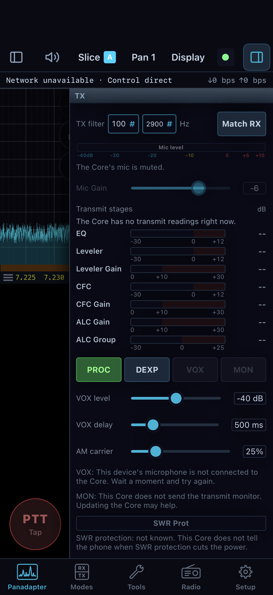

# Troubleshoot operation

Start with the indicator or message that changed. Check whether the problem is on this device, the shared Core, or the radio link before changing settings. For shared receiver and transmit access, use the ownership steps in [chapter 8](08-shared-core.md); another device's slice can be visible while remaining read-only.

## The desktop cannot connect to the radio

1. Open **Radio > Connections…** (or **Manage Radios…** in a radio-panel window) and follow the [connection flow for this window](01-desktop-connect.md). In **Connections**, scan for and select the radio, then click its **Connect** button. A dedicated remote window using **Manage Radios…** can open **This Core** instead; inspect that Core's radio and link state.
2. If the radio is absent from discovery, confirm its power and this computer's network, then scan again. Use **Add Radio…** in the Connections picker, or **Add Manually…** in the local radio panel, for a known radio address.
3. For a Core session, inspect **Settings > Cores > Your Cores > Overview** for this window's current control and audio/display paths, then **Audio with the Core** for format/health and **Retry audio** when enabled. Open **Tools > Network Diagnostics...** to inspect the network state. Check cabling, interface selection, and the route between the computer/Core and radio. Retry from the connection dialog and confirm the connection indicator changes.

**Radio > Connect** reconnects the last selected target when available. Use **Connections…** when choosing or changing a picker target. For a saved Core address, inspect **Settings > Cores > Your Cores > Addresses**; retaining a verified address does not switch the current connection.

Do not infer that a radio is connected merely because the application opened. The spectrum and radio status indicators should update after connection.

## The iPhone cannot reach its Core

Read the **Core isn't answering** sheet and its tried-path results. If it says local-network access is denied, open iOS **Settings > Privacy & Security > Local Network**, allow NereusSDR, then tap **Try again**. Otherwise check that the Core computer is awake, its NereusSDR Core switch is on, and the home internet or intended remote route is available. Reconnect on the same Wi-Fi first when at the station. If the app says the Core or app needs updating, follow the named side of the version message; the sheet says which one must be updated.

An older Core may connect while leaving individual Tools entries marked as needing a newer Core. That is a feature/version limitation, not a failed radio link.

## There is no receive audio

On desktop, confirm the selected slice is receiving, unmuted, and has **AF** above zero. Check the computer's output device in **Setup > Audio > Devices** and the operating system's output volume. If the spectrum moves but audio is silent, inspect the selected audio route before changing DSP controls. For digital software, check the VAX channel meter and mute state in the VAX applet; a silent VAX path can coexist with normal speaker audio.

On iPhone/iPad, check the phone's output route and volume, then open **Tools > Connection and performance**. The audio charts distinguish Core source frames, received packets, phone decoding, and playback underflows. Incoming traffic alone does not prove audio reached the speaker. A rising underflow count points to phone playback or link timing; capture the time and selected route before retrying.

## PTT is refused or a TCI client will not transmit

Check the selected TX slice and the transmit permission/ownership indication. When another device holds transmit, this device cannot key until a supported takeover succeeds. Desktop offers its transmit takeover workflow; the phone build covered here has no general transmit takeover action. An unheld transmitter has a separate first-human-key path, described with its RF prerequisites in [phone transmit preparation](07-iphone-operate.md#prepare-and-transmit-voice-from-the-phone). Do not repeatedly tap PTT to clear an ownership refusal. A TCI client also needs the owning window's **TXcontrol**. Confirm the server is running at **Setup > CAT & Network > TCI Server** and that the client appears in its client list. Do not troubleshoot this as an audio problem until ownership and server state are confirmed.

*Read the reason beside the control: this example says the Core microphone is muted and that transmit readings are absent. Empty stage bars are unavailable data, not measured zero levels. The native simulator screen uses scripted Core state; the indicated values are not a voice setup recipe.*

## A control is greyed or a change does not stick

Read its reason before reconnecting or repeating the request. Common cases
need different remedies:

| Reason or symptom | Check and next action |
| --- | --- |
| You only listen to this slice. | Take control if appropriate, or use the personal volume/mute controls. |
| Another device holds transmit. | Arrange a handoff and explicitly select the TX slice after obtaining control. |
| Station is transmitting or tuning. | End the over and wait for receive before a shared hardware/configuration change. |
| Requires a newer Core. | Check the Core build. Updating only the phone cannot supply a missing Core command. |
| Radio lacks the hardware. | Check radio identity and capability; a different layout cannot supply another ADC or antenna port. |
| Neural processor/model unavailable or limited. | Inspect [DSP setup](13-receiver-dsp.md), the installed assets and the Core's resource reason. Compare a supported method or Off. |
| Requested display quality reduced. | Read the Sharing/data-mode chip and power/heat settings. See [phone session care](20-phone-preferences.md). |
| A setting returns to its former value. | Read pending/refused state and final Core readback; check ownership and any shared-change confirmation. |

A visible disabled placeholder can represent an unimplemented feature. The
[availability reference](12-reference.md) distinguishes those from temporarily
held operating controls. Avoid using another application's instructions to
activate an unimplemented NereusSDR page.

## Tuning appears to act on the wrong place

Check the active slice letter, not only the applet you most recently opened.
Select the intended flag or RX letter tab and compare its frequency, mode and
filter. A foreign slice can remain visible while its controls are read-only.
After a TX handoff, selecting a receive slice does not necessarily select TX.

For an unexpected offset, inspect both enable states and stored RIT/XIT values.
Use **0** to clear an offset you no longer need. For a VFO outside the visible
band, inspect CTUN and the pan's centre/span; a panned view can move without
retuning. Check whether the waterfall is in history and use LIVE before
interpreting a stopped trace. Use explicit units for numeric frequency entry.

If adding a slice or moving a shared receiver window is refused, read the
resource/impact notice. Reduce an unnecessary slice or choose an available
window rather than retrying the same allocation indefinitely. The automatic
receiver allocation is described in [slices and panadapters](04-slices.md).

## Audio is distorted, noisy or breaks up

Separate radio overload, receive processing, microphone overload and packet
timing. They can sound similar but require different controls.

| Observation | First comparison |
| --- | --- |
| ADC overload with distorted reception. | Inspect antenna, preamp and ADC attenuation. AF changes loudness after the affected input. |
| NR introduces watery or delayed audio. | Compare the selected method with Off while holding mode/filter/AF steady; then adjust its parameters. |
| Wanted signal disappears between syllables. | Compare SQL Off, then AGC behavior and filter width. |
| Microphone level clips or processing stays heavily active. | Recheck the actual TX input and gain, then processing one stage at a time. See [voice profiles](14-voice-profiles.md). |
| Clean spectrum but intermittent playback. | Inspect underruns, packet gaps and audio-route interruptions at the time of the break. |
| Headphones removed or a call interrupted the phone. | Follow its audio notice; check Sound before a Core reconnect. |
| Speakers work but a decoder hears nothing. | Inspect the selected VAX/TCI channel, stream enable/mute and client route. See [digital audio](09-tools.md). |

Record the observation before changing several controls. A useful comparison
changes one cause, repeats the same listening conditions and restores the
setting if it did not help.

## Interpret desktop network diagnostics

Open **Tools > Network Diagnostics...** while the symptom is occurring. In a
local radio window it reports the radio connection; a remote window has the
Core-link diagnostics for that window. Check the heading/identity so a healthy
computer-to-Core connection is not mistaken for proof of a healthy Core-to-radio
connection. The desktop also provides **Setup > Diagnostics > Radio Status**
and **Connection Quality** for the available station readings.

The local radio dialog groups its readings as follows:

| Group/readings | What they establish |
| --- | --- |
| **Connection**: Status, Uptime, Radio, Protocol, IP, MAC. | Which radio/session is being observed, whether it is connected, and its identity. |
| **Latency (RTT)** and **Max RTT**. | Current and observed maximum round-trip delay. A maximum alone does not describe when a break happened. |
| **Jitter**, **Packet loss**, **Packet gap**, **UDP seen**. | Packet timing/loss observations when measured. Packet gap is the longest datagram interval in the recent sampling window. |
| TX/RX rates and Sample rate. | Traffic and the connected receive configuration. Traffic can be present even with silent or misrouted audio. |
| **Audio**: Backend and Underruns. | Playback backend and observed shortages. The Buffer row has no production reading in the covered local dialog. |
| **Radio Telemetry**: PA voltage and ADC overload. | Reported radio conditions where the hardware supplies them. Not reported is different from zero. |

**Not measured**, a dash, or a graph gap is missing evidence, not a healthy
zero. Read changes across the problem interval instead of choosing a universal
RTT or loss threshold. Use **Reset session stats** to start a comparison only
after saving the current evidence. Resetting counters does not repair a link.
The unbuilt 60-second Connection Quality history should not be assumed to exist.

## Interpret phone connection and performance charts

Open **Tools > Connection and performance**. Select the section and history
range, then compare the time of the symptom with the selected paths, latest
connection attempt/failure and available charts. **Focus**, **Compare** and
**Show all** change which chart series are shown. Gaps indicate unavailable
readings, stale samples or connection changes; older sessions are historical.

Follow an audio break through the sequence: Core source frames, packets
received by the phone, decode, and playback. If source frames stop, investigate
the station side. If delivery stops while the source continues, investigate
the connection path. If decode/playback falls behind despite received data,
record the phone state and route. This is a way to localize the symptom, not a
claim that every missing reading uniquely identifies its cause.

Where enabled, **Reset session stats** resets the phone diagnostics-session
underruns and observed maximum radio RTT only. It does not erase every chart,
every Core counter or the cellular-use counter. Save the incident readings
before starting a fresh comparison.

## Validate settings before repair or reset

On desktop open **Setup > Diagnostics > Settings Validation** and choose
**Re-validate**. Read each issue's severity, summary and detail. With no issues,
the list states that every setting is within this radio's range. A remote
Core can refuse validation/repair/forget for unavailable support, lack of
pairing or the station's current state; use the displayed reason.

**Repair Invalid Settings** asks for confirmation. It brings the supported
invalid values back into range and removes settings for hardware the radio
does not have. It is distinct from **Forget This Radio**, which removes that
radio's saved settings. Before either operation, export the relevant settings,
record the reported issues and arrange an off-air interval. After repair,
re-validate and check the affected hardware values. Do not use Forget as a
routine response to one silent slice.

On phone, use the offered settings-hygiene controls on the Core's Radio/setup
page and read their confirmation, affected scope and result. Their presence
and allowed actions depend on the Core. A refused repair does not mean the
phone should erase its saved Core pairing.

## Back up configuration and understand restore scope

Open desktop **Setup > Diagnostics > Export / Import**. The page explains
what the available operation includes.

| Operation | Scope and result |
| --- | --- |
| **Export All Settings...**, local window. | Export this window's settings as XML to the selected file. |
| **Export All Settings...**, remote window. | With a supporting, connected Core, collect this window and paired Core into a combined backup. Wait for completion and the saved path. |
| **Export Connected Radio...** | Save only the connected radio's hardware, antenna, filter and amplifier settings, from the local store or the Core as appropriate. |
| **Import All Settings...**, local window. | Select a local XML file, confirm replacing current settings, then restart after a successful import. |
| Import of combined window/Core backup. | Not available in the covered remote window. Export support does not imply a working combined restore. |

1. Export to a named location and inspect **Export Complete** or **Export
   Failed**. A selected filename alone is not a saved backup.
2. Before local import, retain the current export and check that the chosen
   file is the intended local XML configuration.
3. Read **Replace Settings** and confirm only when ready to replace that
   configuration and restart. Cancel preserves the current setup.
4. After **Import Complete**, restart NereusSDR, reconnect as needed and inspect
   the relevant values. On Import Failed, retain the file and error for support.

A remote export can stop if the Core connection or availability changes; retry
after restoring it. Container-layout files use their own editor and layout import/export commands.
They are not interchangeable with full configuration or per-radio exports.
TX and mic profiles are managed in the profile editor; this build has no
individual profile-file import/export. The File menu profile Import/Export
entries open the Diagnostics configuration workflow. The Core identity-key backup in
[device management](08-shared-core.md) is another separate operation.

## Inspect logs and reproduce an incident

Desktop **Setup > Diagnostics > Logs** provides **Refresh** and **Clear**.
A remote window distinguishes **The Core's Recent Log** from **This Computer's
Recent Log**. Clear here empties the view and keeps the log files. This is
different from **Clear Log** in the Support dialog, which clears the local log.
Preserve incident evidence before using that command.

Phone **Setup > Diagnostics > Logs** displays the Core's log, newest lines at
the bottom. **Reload** reads it again; **Clear** empties this phone's view
without deleting the Core log. Its category switches, **Turn all on** and
**Turn all off** change the Core's logging for every device. The phone's own
log is included in Support Bundle rather than shown on this page.

For a repeatable issue, note the time, enable the relevant offered diagnostic
category, repeat the shortest procedure that causes the symptom, then collect
the bundle. Category changes are station changes, so coordinate them if another
operator is diagnosing the same Core. Restore the desired logging selection
after gathering evidence.

## Collect support information

On desktop choose **Tools > Support Bundle...** and use the displayed diagnostics. On iPhone/iPad open **Tools > Support Bundle**, tap **Collect**, inspect which phone/Core files are included, then tap **Share** to choose where to send them. The app does not send the bundle automatically. Include the time, device, Core connection state, and the steps that reproduce the issue. Avoid sharing logs or addresses outside the support channel you intend.

The desktop **Support & Diagnostics** dialog offers category switches,
**Refresh**, **Clear Log**, **Open Log Folder**, and **Create Support Bundle**.
In a remote window, the Core's category/log readings are distinct from the
computer's log. Create the bundle and wait for the result and saved path;
use **Open Folder** to locate it. If the Core's collection fails or times out,
include that result and inspect what the local bundle actually contains.

On phone, **What goes in** identifies the phone log and whether the Core bundle
is available, with a reason when it is excluded. After collection, **Ready to
share** lists the files and any Core note. Inspect that list before Share;
**Collect again** makes a fresh collection. The Core logging and recent-log
controls below use the same Core log as Setup. Collection and sharing are
separate actions.

Include the app/Core build and radio identity, expected versus actual result,
frequency/mode and affected slice, ownership, audio route, network path, and
the smallest reproducible steps. State whether it began after a mode, route,
device, profile, rate or shared-ownership change. On Linux, **Help > Diagnose
audio backend** provides the platform's additional audio-backend diagnostic
path where offered. **Help > About** supplies desktop build information.
