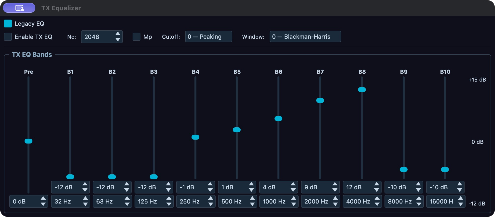
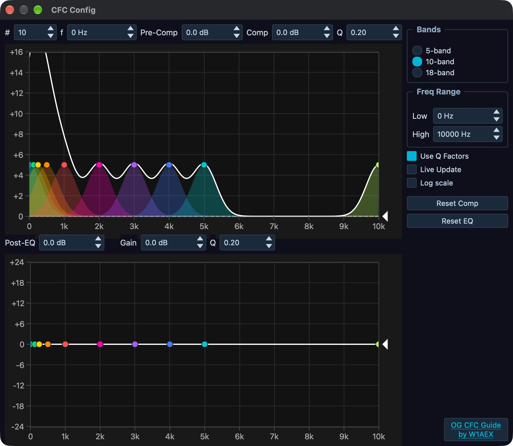
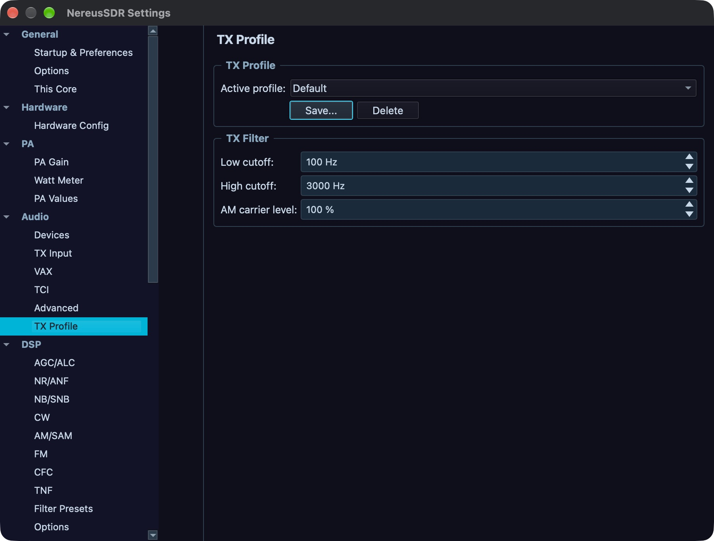

# Voice processing and profiles

Use this chapter to set a microphone route, shape voice audio, and keep separate station-side transmit profiles. Start with the radio connected, the intended TX slice selected, and the transmitter unkeyed. A control that is grey or marked unavailable is being held by the radio model, Core permissions, firmware/catalogue version, active transmit state, or the relevant hardware capability; read its displayed reason before continuing. Basic MOX, TUNE, drive, PTT ownership, TX readiness, and station timeouts are covered in [Set up and transmit](05-transmit.md). This chapter covers the detailed processing and profile editor.

## Select and verify the microphone route

Open **File > Settings… > Audio > TX Input**. The route selector offers **PC Mic**, **Radio Mic**, and **VAX TX** where the connected station supports them. Select the source that is physically connected to the microphone or digital-audio application. The local desktop chooses the radio's source. A supported remote desktop selects its authenticated session's PC/VAX input or **Radio Mic** at the Core, and must wait for the accepted source status; this is separate from choosing its local computer capture device. **VAX TX** selects the virtual audio input described in [Digital audio and external applications](09-tools.md); it does not select a local microphone.

When **PC Mic** is selected, use the **PC Mic** group. Choose the **Backend** and **Device** that correspond to the operating-system capture device, then set the **Buffer** to a value the audio backend accepts. The displayed latency is the configured buffer estimate. If the device list is empty, choose another available backend or connect/enable the capture device in the operating system, then reopen or refresh the device list. An unavailable backend or denied microphone permission prevents capture even if the device name remains selected.

Enable **Test Mic** to check the local capture path while the radio is unkeyed. Speak at normal operating distance and observe **Mic Gain** and the Phone/CW page's **Level** gauge if that applet is open. **Test Mic** is a local capture check; it does not key the radio or prove that the selected TX slice, radio input, or RF path is correct. Turn it off after the check. The app does not provide a microphone monitor route from Setup's Audio Devices page; use the distinct TX monitor controls only when the station is actually transmitting.

With **Radio Mic** selected, the page exposes the group for the detected radio family. Use only that board's labeled controls. Hermes-family hardware offers the radio input choices and **+20 dB Mic Boost**; its **Line In Gain** control changes the radio line input gain. Orion MkII exposes **Mic Tip-Ring (Tip is Mic)**, **Mic Bias**, **Mic PTT Disabled**, and **+20 dB Mic Boost**. The Saturn G2 group exposes its supported radio microphone input controls. These values alter the radio's physical input wiring/gain, not the local computer's audio device. The candidate can offer HL2 Radio Mic with a note requiring its audio add-on; a stock HL2 supplies no mic audio. Confirm the actual add-on and the radio family in [Radio hardware, antennas, and calibration](17-hardware-antennas-calibration.md), and verify the input against the actual connector wiring before changing bias or tip/ring selection. A group that does not match the connected board is hidden or disabled.

After selecting the route, use **Mic Gain** to bring speech into a useful range. The common supported-board range is −40 to +10 dB in 1 dB steps; the application uses the connected board's capability range, so follow the slider's actual endpoints. Speak at the distance and level used on air. A level consistently near the top of the **Level** gauge or in its red region indicates that input gain is too high; reduce gain or correct the upstream audio level. A very low reading calls for checking the selected device, connector, source level, and permission before adding gain. The gauge spans −40 to +10 dB, with yellow beginning at −10 dB and red at 0 dB. This readback is input level, not RF output or the TX ALC meter.

The compact **Phone/CW** applet's Phone page exposes **Level**, **Compression**, the active profile selector, microphone source, mic gain, **PROC**, **VAX**, and **AM Car**. The **Level** gauge spans −40 to +10 dB, with yellow from −10 and red from 0. The microphone source menu selects **MIC**, **BAL**, **LINE**, or **PC**; the **ACC** row is unavailable. Select **PC** for this computer's input, or the radio input matching the connected jack. The separate **VAX** toggle selects the station's VAX TX route. The profile selector is the same TX profile list as the TX applet. Use **File > Settings… > Audio > TX Input** for the complete device/backend/buffer setup and local **Test Mic** procedure. The **+ACC** and Phone/CW **MON** controls are unavailable. The CW page is a placeholder because CW transmit is not implemented. The supported TX monitor is the **MON** control in the TX applet, distinct from the unavailable Phone/CW **MON** control.

## Use PROC, leveler, and ALC

Use this task to decide whether compression helps the same phrase. Keep the
mic, distance, TX filter, and monitor volume fixed while comparing. The
**Speech Processor** dashboard at **Setup > Transmit > Speech Processor** is
the stage-state readback; parameter pages are linked from that dashboard.

1. With the radio unkeyed, record the **TX Leveler** **Enable**, **Max Gain**,
   and **Decay** values and the **TX ALC** **Max Gain** and **Decay** values in
   **File > Settings… > DSP > AGC/ALC**. ALC is always running; there is no
   ALC enable switch. Also record **PROC** state and level in **Phone/CW**.
2. Speak one quiet phrase and one loud phrase. Note which words disappear or
   flatten, and record the available mic/ALC and monitor evidence. Make a
   short, authorized keyed check only when the station path is ready; local
   **Test Mic** does not exercise the transmit chain.
3. Change only one stage or parameter. Compare the same quiet and loud
   phrases at the same mic position and monitor level. Read back its state and
   value before changing anything else. If either phrase becomes harsh,
   clipped, or loses syllables, bypass that change and verify the prior state.
4. Use **PROC** only to compare CPDR on versus off; its adjacent 0–20 dB
   control changes compressor level. Do not compensate for a weak input by
   increasing compression or RF drive. Reduce or bypass a stage when its
   addition worsens the phrase.

The compact Phone/CW page's **PROC** button and level slider operate the CPDR speech compressor. Select **PROC** to enable or bypass that stage; set the adjacent level from 0 to 20 dB and use the numeric dB readout as confirmation. This is a radio/Core transmit setting. Increase it only while listening to a monitor or making a controlled test into a suitable station load. Compare the same phrase at the same mic distance, and watch the TX audio/ALC indication. More compressor level increases compression; it does not authorize more RF power. Stop and reduce the microphone or upstream input level if the signal becomes harsh, flat-topped, or the radio reports overdrive.

For detailed controls, open **File > Settings… > DSP > AGC/ALC**. The **TX Leveler** group has **Enable**, **Max Gain**, and **Decay**. **Enable** allows the leveler to adjust gain as transmit audio rises or falls. **Max Gain** caps how much gain it can add; **Decay** is an exponential time constant in milliseconds. The value ranges are shown by each spinbox. Adjust one control at a time while monitoring the transmitted audio, then read back its displayed value. A long time constant responds more slowly to changing input; a shorter one responds more quickly. Avoid using large **Max Gain** to compensate for a disconnected or poorly routed microphone.

In **TX ALC**, **Max Gain** limits gain applied before ALC limiting and **Decay** sets its time constant in milliseconds. ALC itself is always running in this implementation, so there is no separate ALC **Enable** checkbox. Do not treat a visible ALC meter as a request to drive it continuously into limiting. Set the mic and processor for clean speech, then use ALC and forward-power readback to confirm that peaks remain controlled. If the audio is distorted, disable or reduce added processing and correct the level at the earliest stage that is too high.

The Phone/CW **DEXP** button is wired to enable or bypass the downward expander; its adjacent slider is only a decorative threshold marker and does not change the Setup threshold. To adjust DEXP, open **File > Settings… > Transmit > DEXP/VOX**. In **VOX / DEXP**, **Enable DEXP** switches the downward expander on. The shared **Threshold (dBV)** and **Hold (ms)** controls also set the VOX threshold and hang time. **Attack (ms)** is 2–100, **Hold (ms)** 1–2000, **Release (ms)** 2–1000, **Threshold (dBV)** −80 to 0, **Exp. Ratio (dB)** 0–30, **Hyst.Ratio (dB)** 0–10, and **Det.Tau (ms)** 1–100. Use the numeric readbacks rather than the decorative Phone/CW marker to record the active settings.

DEXP reduces low-level audio below its threshold; excessive expansion can clip quiet syllables or word endings. Adjust the threshold in small steps while speaking, compare with **Enable DEXP** on and off, and back it down if quiet speech disappears. Attack, hold, release, ratio, hysteresis, and detector time constant govern how the gain reduction enters and recovers; change one at a time. The **Audio LookAhead** group's **Enable** and **Look Ahead (ms)** (10–999 ms) apply audio lookahead to the VOX trigger timing. The **Side-Channel Trigger Filter** group's **Enable**, **Low Cut**, and **High Cut** (each 100–10000 Hz) restrict the frequency content used to trigger VOX. Keep **Low Cut** below **High Cut**. These controls affect VOX triggering rather than the audio spectrum sent over RF.

The same **VOX / DEXP** group has **Enable VOX**, which allows voice-activated keying. Set the threshold using the actual microphone level readback and confirm VOX keys only when intended speech crosses it. **Hold (ms)** controls the shared hang time before unkeying after speech drops below threshold. The TX applet's **VOX** indicator provides the keying state. First verify a safe station path and timeout behavior from [Set up and transmit](05-transmit.md); if VOX keys from room noise or the selected audio path, disable VOX and correct the source or trigger filter before trying again.

**Anti-VOX** is on the same Setup page. **Anti-VOX Enable** switches on its detector; **Gain (dB)** sets sensitivity, and **Tau (ms)** sets the smoothing time constant (1–500 ms). Anti-VOX references audio about to play through the configured output devices. Check the output route and listen at the usual station level before enabling it. Then confirm receiver audio alone does not key VOX and intended mic speech still does. If a remote window cannot change these settings, read the transmit-settings reason; the Core must offer the matching control version. Anti-VOX is not an RF feedback or transmit-inhibit control.

## Set TX equalization

### Compare one EQ change

Keep the established working curve intact until the active profile has been
saved under a new name. In **Tools > TX Equalizer**, record **Enable TX EQ**,
the active profile, and the current curve mode. Enable or bypass TX EQ for an
equal-level comparison first. If editing the curve, change one band's gain
and compare the same quiet/loud phrases; read back the selected band's
frequency, gain, and Q before the next change. **5-band**, **10-band**, and
**18-band** request a layout change. Explicit **Apply** resets the points, so
save-as before applying; the pending **Cancel** keeps the current layout.
**Reset** in the parametric editor flattens that curve; it is not a general
profile rollback. Restore by switching back to the saved working profile and
checking its active name and curve mode.

Open **Tools > TX Equalizer** or right-click the TX applet's **EQ** control and open the TX EQ editor. The **TX EQ** control enables or bypasses the equalizer stage; the editor's **Enable TX EQ** checkbox is the same master state. This is the transmit equalizer. **DSP > Equalizer** is explicitly unbuilt and is not an alternative receive or transmit EQ page.

The candidate header offers **Graphic · Legacy** and **Parametric**. These
modes retain separate curves; changing mode applies that mode's stored settings.
The older figure below uses a **Legacy EQ** checkbox for the same distinction.
The mode choice is stored with the TX profile and follows the model in remote
windows. Check the active mode and profile after recall.

In **Graphic · Legacy**, **Pre** sets overall pre-gain from −12 to +15 dB.
The ten band sliders have gain fields and editable center frequencies. Change
one gain/frequency, compare the same phrase at the same input level, and read
back the value. Positive boosts can require reducing Pre or another stage.
**Reset curve** resets the graphic gains/pre-gain; use Undo or the saved profile
when the prior curve is needed. Expand **Advanced** for **Nc**, **Mp**,
**Cutoff** and **Wintype**. Nc is the filter coefficient count (32–8192), Mp
chooses minimum versus linear phase, and the other fields select the existing
implementation options. These global fields are outside the profile snapshot.

In **Parametric**, select a numbered band and drag its graph point left/right
for frequency and up/down for gain. The exact **Frequency**, **Gain**
(−24 to +24 dB) and **Width (Q)** (0.2–20) fields follow the selected band.
**Preamp** is overall gain. With **Use Q Factors** enabled, use the point's
square width handles, the Wider/Narrower slider or exact Q. Lower Q is wider;
higher Q is narrower. The wheel changes Q, Shift-wheel gain, and Ctrl-wheel
frequency; endpoint frequency locks still apply.

1. Save and activate a working profile copy before a layout change.
2. Expand **Advanced** and request **5-band**, **10-band** or **18-band**.
   The checked count stays on the applied curve; a pending message names the
   requested count. This selection alone does not reset the curve.
3. Click **Apply 5/10/18 bands** only when the reset is intended. It replaces
   frequencies, gains and widths. **Cancel** beside that pending change
   keeps the current curve. **Undo** can restore an applied count change.
4. Read the applied count, points and exact fields afterward. **Reset**
   redistributes the parametric frequencies within its curve range, flattens
   gains, returns Q to 4 and resets Preamp; it is not a whole-profile rollback.

**Curve low/high** in Advanced change the actual curve frequencies, including
endpoints, with at least 1000 Hz separation. They are not merely view bounds.
**Log scale** changes axis presentation. **Live Update** sends drag changes
while moving when on, or on release when off; exact entries still apply.
**Undo / Redo** restore whole edits. Each EQ mode keeps its own history across
hiding/reopening; a profile or external-state replacement starts fresh history.
While typing in an entry, text Undo operates first. The graph shows configured
settings, not a measured filter response. Confirm processing separately with
EQ state and the controlled audio evidence described above.

*TX EQ editor: Legacy EQ is selected and Enable TX EQ is off. The existing curve is displayed, not recommended. Check the enable state separately from the visible curve; record a working profile before editing. This is the earlier desktop development editor, captured without curve changes. The release candidate uses Graphic · Legacy / Parametric mode buttons and added edit history; a selected-release screenshot is pending.*

### Set TX EQ from iPhone or iPad

Open **Tools > TX Equalizer**. The **TX EQ** switch enables or bypasses the entire equalizer stage. **Legacy EQ** selects whether the ten-band controls are the active curve; when off, the parametric curve at the Core is used instead. The profile menu selects a Core TX profile; changing it applies that profile to the shared transmit chain. Before editing, verify the displayed profile and whether **Legacy EQ** is on. Coordinate with anyone else using the transmitter.

Under **Bands**, **Preamp** and **B1** through **B10** are gain sliders from −12 to +15 dB. Each band row also has its center-frequency field. Tap the center field, enter a whole-number Hz value from 10 to 22,000 on the number pad, and tap **Set to ...**; an out-of-range value cannot be sent. Change a single band gain, then read the displayed signed dB value and compare the same signal or permitted monitor/test phrase at the same level. Continue one band at a time and avoid compensating for distortion with more positive gain. The page writes each change to the active Core transmit settings; there is no separate Apply or Save button. Wait for the displayed value to follow the Core. A Core refusal appears in the page's message; the switch/editor can be greyed while disconnected, on air, or lacking the required transmit-settings capability.

Under **Filter**, **Filter size** accepts 32 to 8192 taps, **Minimum phase** changes phase behavior, **Cutoff** selects **Peaking** or **Notch**, and **Window** selects **Blackman-Harris** or **Hann**. Make these changes only for a specific filter reason, then verify the resulting values and make a careful audio comparison. The **Parametric curve** section on the phone is a Core readout, not an editor; edit the detailed curve on a supported Core desktop.

The phone page has no **Reset** command for its ten-band EQ. To bypass the current stage without losing its values, turn **TX EQ** off and verify the switch follows. To flatten only the legacy ten-band gains, set each **B1–B10** slider to **0 dB** and verify each readback. This does not reset the parametric curve, center frequencies, filter settings, preamp or the rest of the TX profile. Do not treat profile switching as an EQ-only reset.

## Configure phase rotation, CFC, and CESSB

Treat these as separate experiments. Record each stage state on **Setup >
Transmit > Speech Processor**, then change one stage and compare the same
quiet and loud phrases at the same input and monitor levels. If the change
degrades either phrase, restore its prior state before proceeding. Save the
profile under a new name before changing a CFC layout: **5-band**,
**10-band**, and **18-band** require the explicit pending **Apply** to reset
points. **Reset Compression** and **Reset EQ** clear their respective curve
amounts/widths; restore the saved profile if
the previous curve is needed.

Open **File > Settings… > DSP > CFC**. In **Phase Rotator**, **Enable** turns the stage on; **FREQ** sets rotation frequency from 10 to 2000 Hz; **STAGES** sets the number of stages from 2 to 16; **Reverse Phase** reverses it. The controls write to the active shared transmit chain. Read back the values and verify the **Phase Rotator** state in **Setup > Transmit > Speech Processor**. Make a controlled audio comparison at equal input level; phase rotation changes the voice waveform, not the TX passband or transmit permission.

In the Setup **CFC** group, **Enable** activates Continuous Frequency
Compression, **Pre-Comp** sets the global pre-compression level, and
**Post-EQ Enable / Post-EQ Gain** select the post-compression EQ and overall
gain. Open **Configure CFC bands…**, or right-click the TX applet's **CFC**.
Left-clicking that applet control enables or bypasses its stage.

1. Select a band in either graph or its numbered selector. The upper
   **Compression** graph and lower **EQ after compression** graph share band
   frequency/selection. Moving a frequency changes both graphs; their amounts
   and widths remain separate.
2. Enter exact **Frequency**, compression **Amount / Width (Q)** or post-EQ
   **Gain / Width (Q)**, or drag the appropriate graph point. Amount spans
   0–16 dB; EQ gain spans −24 to +24 dB; Q spans 0.2–20. Enable **Use Q
   Factors** before adjusting widths. Compare one change at the same speech
   level. The separate **Pre-compression** and **Post-EQ gain** fields change
   overall levels, not one band's amount.
3. To change count, request **5**, **10** or **18** in **Bands**, inspect the
   pending reset message and choose **Apply 5/10/18 bands** or its **Cancel**.
   Apply resets both curves. Read back the applied count; save a working profile
   first and use **Undo** to recover an applied edit when its history is available.
4. **Reset Compression** sets its band amounts and overall Pre-compression
   level to zero and widths to Q=4. **Reset EQ** sets its band gains and overall
   Post-EQ gain to zero and widths to Q=4. Each preserves shared frequencies,
   selection and the other graph's settings. Read back both the selected band
   and corresponding overall field; use Undo when the old curve is needed.
5. Expand **Advanced** for **Curve range**, **Live Update** and **Log scale**.
   Curve range rescales frequencies in both curves, including endpoints, with
   at least 1000 Hz spread. Live Update applies drags during motion when on,
   otherwise on release. Undo/Redo treat a completed drag, exact edit, reset or
   applied count change as one step; CFC restores its two curves together.

The configured curve and live measured compression bars are separate evidence.
Bars do not belong to edit history. If stored legacy frequencies cannot span
1000 Hz, read the displayed guidance and save the profile before an intentional
count reset. A visible configured curve alone proves neither clean audio nor
successful compression.

In **CESSB**, **Enable** requests Controlled-Envelope SSB. It needs **CPDR
Enable** as well as the profile's CESSB state; check both on the stage dashboard.
Use the same controlled phrase and monitor evidence before relying on that chain.

The Phone/CW **PROC** button controls CPDR, not all processing stages. TX EQ, leveler, phase rotator, CFC, CESSB and ALC have separate stage states. Open **Setup > Transmit > Speech Processor** for the live stage grid and its **Open TX EQ…**, **Open Phase Rotator…**, **Open CFC…**, **Open CESSB…**, and **Open DEXP/VOX…** links. A green state means the displayed stage is enabled; use its linked Setup page to change parameters. The DEXP row in this dashboard is a stage-state readout; the full controls are on **Transmit > DEXP/VOX**.

*CFC editor: selected-band controls, compression and post-EQ curves, and 5/10/18-band layout choices. The captured 10-band curve is an existing setting, not a voice recipe. Save a copy before changing a layout; the figure was captured without edits or keyed audio. This is the earlier editor; the candidate adds pending Apply/Cancel, separate width fields and Undo/Redo. A selected-release screenshot remains pending.*

## Match RX bandwidth to TX once

To copy the current receive filter edges to the transmit audio passband, select the desired RX filter and use **Match RX** in the Phone transmit controls, or Shift-click the RX filter preset in the desktop RX/VFO controls. The mapping is mode-aware: AM, SAM, DSB, FM, and DRM copy from zero to the absolute high edge; other supported modes copy the receive edge magnitudes in ascending order. The TX low/high readback changes once. This is a one-time copy, not a continuous RX-follow link. The RX change occurs even if TX settings permission refuses the copy; inspect the TX filter values and enter the intended TX edges in the TX applet or **Setup > Audio > TX Profile** if necessary. For TX operation and filter safety, follow [Set up and transmit](05-transmit.md).

## Create and manage TX profiles

TX profiles store a snapshot of supported transmit-chain settings for the connected radio. The local profile bank is keyed to that radio's MAC address. In a remote window, profile names and active selection come from the connected Core's profile manager; selection changes only after the Core reports the result. A request that is refused or not accepted leaves the reported active name in place and the control may show a reason. Profiles are not device-local mic presets and do not include radio-authoritative settings such as TX drive, antenna selection, or transmit ownership. Changing a profile immediately applies its saved values to the shared TX chain, so coordinate with other operators and make changes off air.

The active name appears in the TX applet's **TX Profile** selector. Left-click a name to activate it. To open the editor, right-click the selector and choose its editor route, open **File > Settings… > Audio > TX Profile**, or use **File > Profiles > TX Profiles…** or **Mic Profiles…**. Both File profile entries open the same editor because TX and mic profiles are the same profile bank. The editor shows **Active profile**, **Save…**, **Delete**, and the **TX Filter** group. **File > Profiles > Import…** and **Export…** open **Setup > Diagnostics > Export / Import**; they do not import or export an individual TX profile. This profile editor has no profile import/export control. The phone selector also operates the active TX profile list.

To make a profile, first select the connected radio and configure the current TX chain as required. Open **Audio > TX Profile**, press **Save…**, enter the new profile name, and confirm. Leading/trailing spaces are trimmed; a blank name is ignored, and commas in names are changed to underscores. If the name already exists, confirm **Overwrite TX Profile** to replace its stored snapshot. Verify the new name is listed, then select it in **Active profile** or the TX applet selector and wait for the accepted active name. Saving under a new name captures the current live transmit values and adds the name to this radio's bank, which is the available way to make a copy of the current settings under another name.

For a safe working copy, save-as before editing a curve or processor chain:
select **Save…**, enter a distinct name, and confirm. Saving adds the copy to
the profile list; it does not activate it. Select the new name in the TX
applet's **TX Profile** selector or the editor's **Active profile**, then wait
for the accepted name before editing. To compare profiles, switch the active
name and inspect the key values. The editor warns about unsaved edits: **Yes**
saves them to the old profile before switching, **No** discards them, and
**Cancel** keeps the current profile active.

The saved snapshot includes microphone source/gain and board mic options, line-in settings, VOX/DEXP values, Anti-VOX gain, TX monitor volume, two-tone test parameters, TX filter low/high cutoffs, AM carrier level, TX EQ and parametric EQ data, TX Leveler, TX ALC limits, CFC and its band data, CPDR level, CESSB, and phase-rotator settings. The Anti-VOX enable and time constant are not included. It does not include all console DSP settings: global TX EQ implementation settings such as **Nc**, **Mp**, **Cutoff**, and **Wintype** are not per-profile, and neither is the global CPDR enable switch. PureSignal correction enable/calibration is managed separately. RF power, antenna, PA calibration, and TX holder are outside this profile snapshot. Do not treat changing the profile as a complete station backup.

After changing a value, the editor marks the current profile as modified. If you change **Active profile** in the editor, answer the **Unsaved Profile Changes** prompt: **Yes** saves the current live values back under the current name before loading the next profile; **No** discards those unsaved changes and loads the next profile; **Cancel** returns the selector to the previous name. Use **Save…** to save the current values, overwrite the same name after confirmation, or save the values under a new name. Changes from the TX applet selector apply immediately; use the editor's save prompt or **Save…** workflow when you need to preserve edits. Verify the new active profile name and its key TX Filter/processor values after switching.

After any recall, separately check **PROC** on **Phone/CW** and **Enable** in
the **CPDR** group on **File > Settings… > DSP > CFC**. CPDR enable is global
console state and is not restored by profile recall, although its level is
stored in the profile. If CESSB is enabled, CPDR must also be enabled for
CESSB to act. Also recheck global TX EQ implementation fields (**Nc**, **Mp**,
**Cutoff**, **Wintype**) and Anti-VOX enable/time constant if your task depends
on them; those are outside the saved profile. To roll back, select the prior
working profile, verify its accepted active name and stored values, then
restore these excluded global states deliberately and verify them on their
own pages.

To delete a profile, select it in the editor and press **Delete**, then confirm the profile name in the prompt. The last remaining profile cannot be deleted. Deleting the active profile selects the first remaining name in sorted order and loads that profile. There is no rename command: save the current values under a new name, switch to it, then delete the old name if no longer needed. If deletion is refused, verify that another profile remains; if activation appears to change the wrong radio, check **Radio Info** and the connected radio's MAC before making further edits.

*TX Profile: Default is active in this desktop development capture. Save stores a named snapshot; inspect the active name after selection and separately check excluded global settings. No profile was saved, overwritten or deleted for the image.*

## Worked setup: a clean SSB voice profile

This procedure establishes a deliberately bypassed starting chain, then adds
one stage at a time. It uses no universal gain, compression, RF power, ALC, or
EQ target. Start with a connected radio, supported SSB mode, the intended TX
slice and owner, a verified antenna/load path, and the transmitter unkeyed.
Use the desktop **TX** applet's **MON** only during a controlled keyed check;
the monitor is not an on-air report. See [Test the microphone and interpret
the evidence](05-transmit.md#route-and-test-microphone-audio) and [Monitor
transmitted audio](05-transmit.md#listen-to-the-transmit-audio-monitor).

Before changing the chain, record the active profile name and the excluded
global states listed in [profile scope](#create-and-manage-tx-profiles). Save
the current live chain under a new rollback name if you need to preserve
unsaved edits. The downstream comparisons below require a controlled keyed
monitor check or independent transmitted-audio evidence. Receive-side
**Test Mic** proves capture; it does not audition those stages. If the station
is not ready to key, record settings and defer the audible comparison.

1. Open **File > Settings… > Audio > TX Input**. Select **PC Mic** and its
   intended **Backend** and **Device**, or select the physically wired
   **Radio Mic** input. Set **Mic Gain** only after checking the selected
   source. If using PC Mic, enable **Test Mic**, speak a quiet sentence and a
   normal/loud sentence, and note the local level. Stop **Test Mic**. This
   confirms local capture only; it does not confirm radio input or RF audio.
2. Open **Setup > Transmit > Speech Processor** and record its state grid.
   Establish a reproducible bypass baseline: **TX EQ**, **Phase Rotator**,
   **CFC**, **CESSB**, **TX Leveler Enable**, **PROC** (CPDR), and **DEXP**
   disabled. Leave **VOX** off unless intended. In **File > Settings… > DSP >
   AGC/ALC**, record the **TX ALC** limits; ALC itself always runs and has no
   enable switch. Do not alter its limits just to make a meter look a certain
   way.
3. Speak the same quiet and loud phrases while receiving. If permitted and
   the station path is ready, make a brief keyed comparison using [the TX
   monitor procedure](05-transmit.md#listen-to-the-transmit-audio-monitor).
   Record the stage grid, available mic/ALC readbacks, and what is heard. If
   quiet speech is already missing, troubleshoot the source and mic level
   before enabling DEXP or adding processing.
4. Test DEXP by enabling only **Enable DEXP** at **File > Settings… >
   Transmit > DEXP/VOX**. Repeat both phrases. If quiet syllables or word
   endings disappear, disable DEXP or reduce its threshold effect, confirm
   **Enable DEXP** is off, and proceed from that baseline. Change only one
   DEXP control at a time.
5. Test **TX Leveler Enable** by itself. Compare quiet and loud phrases and
   read back **Max Gain** and **Decay**. If quiet speech pumps or loud speech
   flattens, disable it or restore its prior values. Then test **PROC** alone
   at a small change to its displayed level; read back both the button state
   and level. Bypass it again if either phrase sounds worse.
6. Save the chosen baseline or working chain as a new profile in **File >
   Settings… > Audio > TX Profile** using **Save…**. Saving adds the named
   copy without activating it. Select that name in **Active profile**, wait
   for it to be accepted, and verify the reported active name. This provides
   a rollback point before any curve-layout edit.
7. Enable TX EQ only if wanted, and compare bypass versus enabled first. If
   editing, change one band; compare the same phrases and read back the band
   values. Save a named copy before changing the parametric EQ editor’s
   5/10/18-band layout: applying a requested count resets its band points.
   **Graphic · Legacy / Parametric** chooses the candidate EQ mode; the
   older development figure uses a **Legacy EQ** switch. Save the accepted
   chain under a descriptive name.
8. If investigating Phase Rotator, CFC, or CESSB, test one stage at a time
   against the saved chain. Save a named copy before changing the CFC
   editor's 5/10/18-band layout, because explicit Apply resets both curves.
   Check the dashboard state and compare both phrases. CESSB needs **CPDR Enable** in **DSP > CFC** as well as CESSB's
   profile state; check both after recall because CPDR enable is global and
   omitted from the profile. Do not infer successful CESSB from its saved
   checkbox alone.
9. Recall the saved working profile from the TX applet selector and wait for
   its reported active name. Inspect microphone source, TX filter, EQ mode and
   curve, DEXP/leveler/CFC/phase/CESSB states, and CPDR level. Then explicitly
   restore and verify global **CPDR Enable**, global EQ implementation values,
   and any Anti-VOX enable/time constant the station requires. This checks
   both the profile snapshot and its excluded state without claiming a
   calibrated on-air result.

If a stage degrades speech, switch back to the saved working profile, confirm
its name and relevant values, then restore excluded global states separately.
Keep the TX path unkeyed until its readiness, holder, and station protections
are confirmed in [Set up and transmit](05-transmit.md). Use [PureSignal and
diversity](18-puresignal-diversity.md) only after its compatible feedback path
is configured.

The visible **Two-tone** test control generates and transmits a two-tone signal when used; it is not a speech test. Configure two-tone output only for a controlled measurement setup and follow the calibration procedure in [PureSignal and diversity](18-puresignal-diversity.md). The Phone/CW **AM Car** control is wired: its 0–100 percent value sets the AM carrier level, also used for SAM and DSB. It is not a speech-level control; read the numeric label after adjustment. The Phone/CW profile selector uses the TX profile list, and its source selector supports MIC/BAL/LINE/PC where the radio permits. The separate Phone/CW **MON** and **ACC** controls are unavailable. CWX/keyer and FM transmit/repeater operation are not available in this build.

## Monitor AM modulation

Open **Containers > Applets > AM Mod Monitor** or the applet panel's **☰** menu and select **AM Mod Monitor**. The monitor reports readings only while transmitting in AM, SAM, or DSB; it does not key the radio. If the applet says the Core cannot provide readings, check the Core connection and its monitor capability rather than changing microphone settings. Begin with the radio unkeyed and select **TX I/Q** to inspect the generated modulation. Select **PA FB** only when PureSignal feedback is running and the feedback receiver is known; choose the matching **rx** stream (0–4). The desktop source is an applet-local choice. On the phone, the AM Mod Monitor sits below the normal controls on the TX panel; use its settings sheet for the corresponding monitor choices.

The positive peak gauge spans 0–160 percent, turns yellow at 100 percent, and red at 125 percent. The negative peak gauge spans 0–100 percent, turns yellow at 90 percent, and red at 98 percent. Read the held peak values and asymmetry alongside the live trace. **RESET** clears peak-hold and flashers; it does not change transmit processing. **VU** changes the local display style. The desktop positive and negative peak flasher controls span 50–160 percent and 50–100 percent respectively; these are local warning thresholds, not modulation targets. On the phone, the settings sheet separates **On this phone** display choices (source, thresholds, meter style) from **On the Core, for every device**, which selects the shared **PA feedback receiver**. A carrier status of **NO CARRIER**, **CARRIER LOW**, or **CARRIER HIGH** describes the monitor's live assessment. Stop transmitting and correct AM carrier/audio setup if a warning persists; do not use a monitor reading alone to infer legal power or RF spectral purity. Use the same known, low-risk station setup and compare readbacks after changing one parameter at a time.
