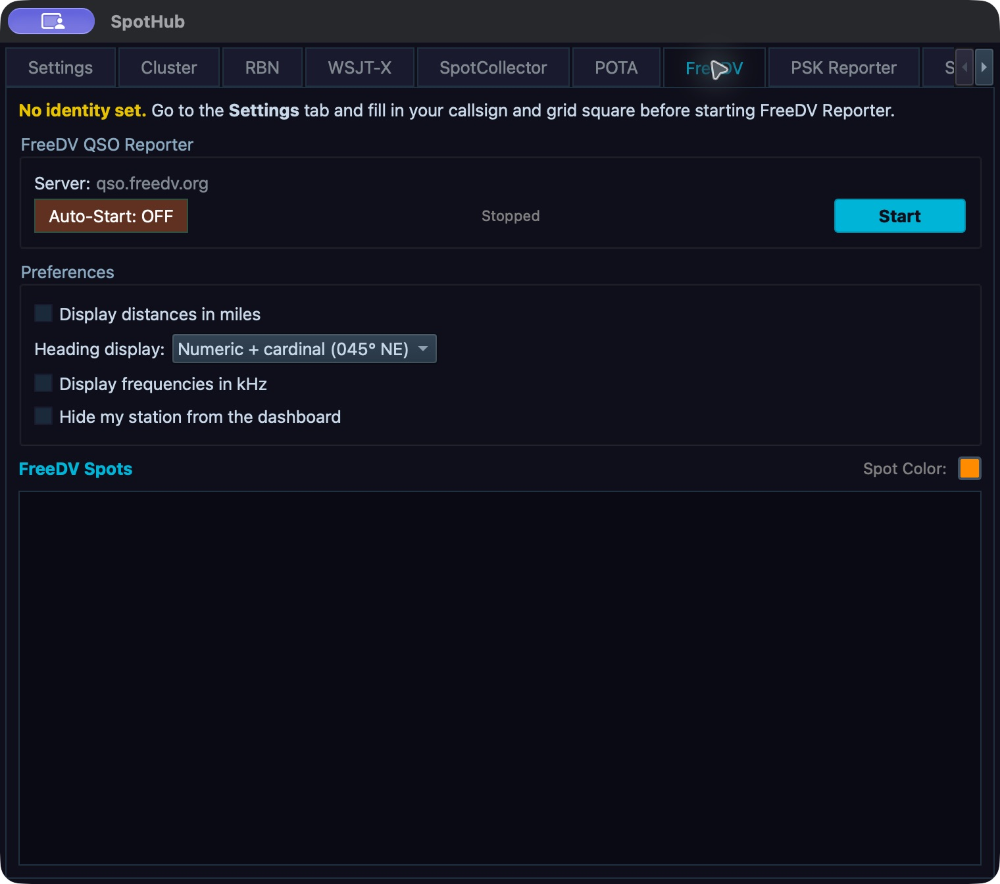

# RADE and FreeDV Reporter

RADE receive and transmit controls use a RADE-U or RADE-L slice. FreeDV Reporter is a separate station-presence and messaging tool. It lists stations and can tune to a selected frequency, but it is not a FreeDV voice decoder. FreeDV voice operation is not exposed as a separate mode in the mode menu. For VAX or TCI routing to an external digital application, see [chapter 9](09-tools.md).

RADE processing runs at the Core. Its availability depends on the Core build, installed codec/model assets, receiver resources and current modem readiness. A phone can show Core RADE status and offer Core controls; the phone does not run the codec locally. If RADE-U or RADE-L is missing or disabled, read the capability/readiness reason rather than trying to enable a hidden mode.

## Receive with RADE

RADE receive, modem synchronization and FreeDV Reporter service status are separate. A Reporter connection supplies station presence/messaging; it does not make a RADE slice synchronize or decode. You do not need the Reporter service connected to receive RADE audio.

For a receive session:

1. Before entering RADE, select the intended slice in ordinary **USB** or **LSB** and verify its receive route with a known audible signal. Then choose **RADE-U** for an upper-sideband signal or **RADE-L** for a lower-sideband signal, tune to the RADE signal and check that the passband contains it. Silence while the RADE decoder warms up or has no decoded speech is expected; it is not by itself an audio-route fault.
2. Show the desktop **RADE** applet from the applet/container controls, or inspect the RADE row for that slice on iPhone/iPad. Keep the selected slice active while reading its status.
3. Watch **Sync** and **SNR** together. Grey means not synchronized; yellow means synchronized below 5 dB SNR or a missing numeric estimate; green means synchronized at 5 dB SNR or higher. SNR by itself is not a lock indication. If Sync stays grey, recheck the sideband, tuning, passband and visible signal, then read any Core/build readiness reason. Do not require audible decoded speech before synchronization.
4. When synchronization holds, listen for decoded RADE speech. Read **Offset** as the modem's signed frequency-offset estimate, not as a command to retune the VFO. If you need to tune the signal, use the receiver's frequency control and watch whether Sync improves.
5. Read **Last RX** only as a successfully decoded RADE text item. In this build the RADE text path carries the callsign in the end-of-over (EOO) field; it does not provide a grid square or a general text-message channel. A new callsign in **Last RX** confirms that text decode, not that the FreeDV Reporter service connected or that the received voice was intelligible.

The **RADE** applet also has a **Profile** selector for transmit setup and **Reset vocoder**. The profile changes the shared active microphone profile and may be unavailable while transmit settings are refused. Reset affects the active slice's transmit vocoder; it does not retune, repair a missing codec/model, or reset the receive filter. Use either only for its named purpose.

## Prepare and transmit RADE

Use the built-in RADE mode and its normal NereusSDR transmit path; an external FreeDV Reporter connection does not key the radio. Prepare one short call in this order:

1. Select the slice you are authorized to transmit from and choose **RADE-U** or **RADE-L** for the intended sideband. Confirm that the mode is accepted and that the Core reports no modem/model readiness refusal.
2. Before going on air, open **Setup > Audio > TX Input** and select the microphone source that will supply speech: **PC Mic**, **Radio Mic** when the radio supports it, or **VAX TX (virtual device)** on a supported host. Confirm that the selected source and its available input indication match the source you intend to speak into. See [chapter 5](05-transmit.md) for source-specific checks and [chapter 9](09-tools.md) for the VAX TX route.
3. In the RADE applet's **Profile** selector, select the intended microphone profile while transmit settings are permitted. This uses the shared Mic Profile Manager, not a separate RADE profile store. If the station has a **RADE** profile, inspect that profile's leveler state: the RADE transmit path applies its own pre-codec mic gain/leveler and 80 Hz high-pass, then sends encoded modem audio through the WDSP TX modulator. The source specifically requires the RADE profile to disable the ordinary WDSP TXA Leveler so it does not act on the modem waveform. Do not use the ordinary SSB leveler/EQ recipe as a RADE tuning recipe; use [chapter 14](14-voice-profiles.md) to inspect and restore the shared profile.
4. Confirm transmit ownership, selected slice, band, interlocks and power in [chapter 5](05-transmit.md). For this manual-key route, use NereusSDR's **MOX** control to key; do not depend on a Reporter connection or an undocumented external keying command. Speak a short call into the selected source and monitor the normal transmit state.
5. Turn **MOX** off at the end of the call. Confirm the TX indication clears and the selected slice returns to receive. During the other station's next over, listen for decoded RADE speech and watch for its callsign in **Last RX** when its EOO is decoded. That callsign is the peer's EOO readback; it is not an acknowledgement that the peer copied your transmission.
6. If you changed the shared profile or TX source for the session, restore the previous active profile and source after the transmission, then verify their readbacks. If the Core refuses the profile or key request, follow the displayed refusal and do not repeat the request blindly.

The mode's receive **Sync**, signed **Offset**, decoded speech and **Last RX** answer different questions. Reporter **Connected** status only reports the separate station-presence service. For that service and its station list, continue with [Open FreeDV Reporter](#open-freedv-reporter).

## Open FreeDV Reporter

On desktop, open **Spot Hub** and select its **FreeDV** tab. FreeDV Reporter connects to `qso.freedv.org`; **Tools > FreeDV Reporter...** opens the station-list window, it does not start the reporter. Open Spot Hub **Settings** first and save a callsign and four- or six-character Maidenhead grid. Return to **FreeDV**, review **Auto-Start: ON/OFF**, then press **Start** and wait for **Connected**. The tab shows the reporter status and console. In a remote desktop session these Start/Stop controls operate the Core service. Do not enable or describe **Report decodes to PSK Reporter**: that option is hidden/unbuilt in this version.

On iPhone/iPad, **Tools > FreeDV Reporter** is a Core-hosted station list. Its stopped banner points to **Spot Hub > FreeDV** for connection; if the Core lacks reporter capability the page gives a reason. To start/stop from the phone, open **Spot Hub > FreeDV** and use **Connect/Disconnect**. **Auto-start** and **Hide my station from the dashboard** are Core settings; **Distances in miles** and **Frequencies in kHz** are this-phone display preferences. The Core must have a valid saved identity to connect.

The table can show Callsign, Locator, Distance, Heading, Version, Frequency, TX Mode, Status, User Message, Last TX Date, Last RX Callsign, Last RX Mode, SNR and Last Update. New rows, updates and removals come from the live reporter service. Use the column headers to sort; numeric columns such as frequency, distance and SNR sort numerically. Sorting and filters affect the view only.

*FreeDV source before connecting: Auto-start is off and the service is Stopped. Start/Stop manages the reporter service, independently of RADE modem synchronization. The desktop development capture has no saved reporting identity and no live reporter data.*

## Filter the station list

On desktop, use **Band** at the bottom for All or a listed amateur band, then **Track Frequency** to choose Band, Exact freq or off as offered by this build. On phone, choose **All** or a band across the top and use the two **Follow the radio** segments, **Band** and **Frequency**. Tap the selected segment again to turn following off. If the Core cannot identify each station's band, Band follow is disabled with a reason. Frequency follow matches the active slice frequency exactly in whole hertz; it is not a tolerance window. These follow choices are phone-local preferences.

Use the **Show** menu to show or hide individual table columns. To filter a particular column, right-click its header or use **Filter > [column]**. Choose a comparison operator, enter a value in the column's displayed units, and inspect the reduced result list. Operators include greater/equal, greater, equal, not equal, less and less/equal. Reopen that column's filter menu and choose **Clear filter** to remove its condition. Several column filters can be active together. Use **Idle longer than** to hide stations older than 30 minutes, 1 hour or 2 hours, or choose **Never**. A hidden row is filtered from the list; it is not evidence that the station disconnected.

On desktop, double-click a row or use its context menu to inspect/tune/copy as offered. Select a row, enter **Frequency (MHz)** and press **Send QSY** to send a request to that station; the local radio also tunes to the entered frequency. On phone, tap a station row to tune the active slice to its reported frequency; tap its **(i)** button for the details sheet, where the displayed metrics and tune/copy/lookup actions are available. Choose **Ask to QSY** to select your slice's current frequency, the station's reported frequency, or **Type one** in MHz, then press **Send QSY**. The Core passes the request to the other station's software and tunes your radio too. It cannot make the other operator move. Check the radio's displayed frequency afterward. Sending a request does not force the other operator to move or establish a contact. Use **Open Website** to open the reporter website and **OK** to close the window.

## Send or save a status message

On desktop, use **Msg** and **Status message**, then **Send**, **Save** or **Clear**. On phone, tap the status bar below the station list to open the message editor. Choose one of the saved messages or type text, then use **Send**, **Save** or **Clear**. Send publishes the text; Save stores a nonempty message in the recent list; Clear publishes an empty status. These are operator actions. Messages are operator actions; they are not sent automatically merely because a station appears in the table.

Check the service status after sending. If the message does not appear in station data, verify the reporter connection and wait for an update. Saving locally does not prove the server accepted or displayed it. Reporter status, station messaging and QSY are separate from RADE audio/text decoding.

## If the list or RADE status is empty

For an empty Reporter list, verify that the FreeDV Reporter tool/service is available and connected, then check the current band/exact-frequency and column filters, hidden columns, and idle timeout. Clear filters and choose **All** to restore the broadest view. For RADE, verify the slice is actually in RADE-U or RADE-L, the correct sideband is selected, and the Core reports the necessary codec/model readiness. The phone receive row is shown only for RADE-U/L: it reads the callsign or “RADE”, lock dot, SNR and signed offset when the Core sends sync status; an older Core shows a specific missing-status reason. On desktop, Profile and Reset vocoder are transmit-permission gated; the phone is a read-only receive row and does not expose those transmit controls. The FreeDV Reporter list is not a substitute for RADE Sync or Last RX, and Spot Hub's FreeDV source is a distinct view described in [chapter 16](16-spots-reporters.md).
