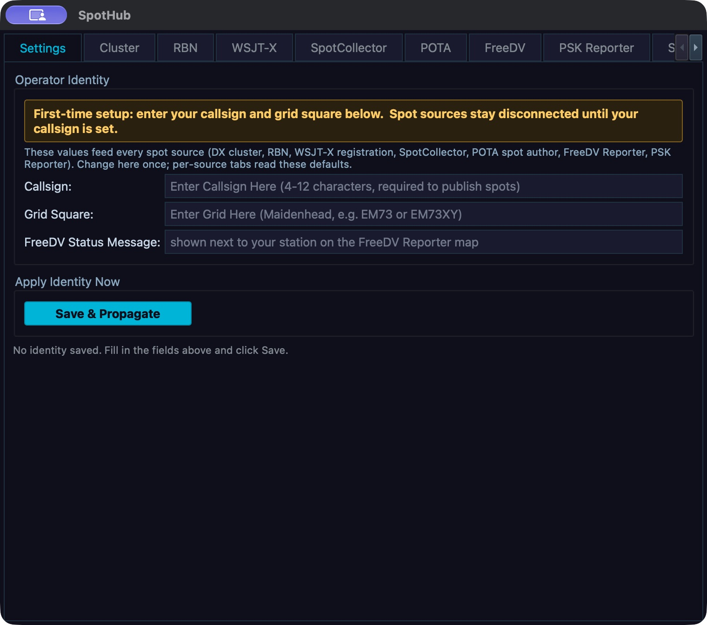
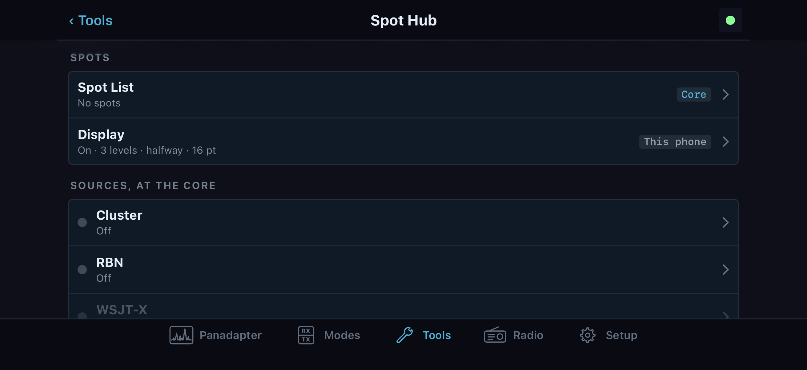

# 16. Spots and reporters

Spot Hub joins cluster spots, digital decodes and reporter activity into the panadapter and a shared spot list. A callsign/grid identity is used by the services that sign in or publish reception reports. Spot source connections and the stored spot list belong to the Core; the way labels look on a particular band display is local to that computer or phone.

On desktop, open **Tools > Spot Hub** or press **Ctrl+Shift+S**. The modeless window has **Settings**, one tab for each source, **Spot List**, and **Display**. On iPhone or iPad, open **Tools > Spot Hub**. Its page links to the Core's Spot List, Core source pages, Core identity, and a phone-local Display page. A phone can control a supported Core source while away from the Core computer; **WSJT-X** and **SpotCollector** are different because their UDP listeners run on each computer.

## Set the identity before connecting

On desktop select **Settings**. Enter **Callsign** and **Grid Square**, then select **Save & Propagate**. Callsigns and grids are trimmed and uppercased. The callsign must contain 3 to 12 characters; the Maidenhead grid must be 4 or 6 characters. A grid of another length is rejected, and the red status text explains the rejection. The optional **FreeDV Status Message** is limited to 200 characters and appears with your FreeDV Reporter station. Select **Save & Propagate** again after any edit. The summary below the button shows the saved identity and time, and **Saved** flashes briefly.

The button stores the identity in the Core's settings, updates the open Cluster, RBN and PSK Reporter fields, and updates connected reporter clients without requiring a reconnect. The identity is station-wide. Before changing it on a shared Core, coordinate with other operators because sources they are using will also publish or sign in with the new values.

On the phone, **Tools > Spot Hub > Settings** edits the Core's **Callsign** and **Grid square**. The phone sends each value when it is committed; the current value is read from Core settings. The page says when the Core is disconnected or refuses a write. Source pages can override the callsign for that source, and PSK Reporter also has its own grid field. Those overrides do not replace the shared identity.

Use a licensed station callsign and the operating position's actual Maidenhead locator. A callsign alone is not enough for PSK Reporter. FreeDV Reporter also needs the locator for distance and heading calculations. For its live station list, status message, and operator-directed QSY requests, see [Chapter 15](15-rade-freedv.md).

*Spot Hub identity is configured before starting a feed. Callsign and grid are blank in this desktop development capture; Save and Propagate has not been used. Do not treat an open Settings window as a connected source.*

## Connect the source that supplies the spot

Each source owns its own connection state. A green **Connected** or **Listening** status means the client/listener has started; it does not guarantee that incoming spots match the current band or list filters. The desktop's **Auto-Connect** and **Auto-Start** switches persist and apply on later Core starts. They do not start a source immediately. Use the adjacent **Connect** or **Start** button for the current session. To stop, use **Disconnect** or **Stop**. Read the status label and the source console after each action. On the phone, source pages show a state dot, Core status text, **Connect** or **Disconnect**, editable Core settings, and a rolling console where that source has one.

| Spot Hub tab | What to configure and start | What a good readback looks like |
|---|---|---|
| **Cluster** | **Server** defaults to `dxc.nc7j.com`; **Port** defaults to `7300`; **Callsign** defaults from the saved identity. Enter the cluster hostname/port supplied by its operator and the callsign you want to log in with. Select **Connect**. Use **Disconnect** to end the session. | **Connected**, the cluster's welcome/feed lines in **Cluster Console**, and new rows labelled **Cluster** in Spot List. A missing server or callsign leaves the client disconnected and reports that both are required. |
| **RBN** | **Server** defaults to `telnet.reversebeacon.net`; **Port** defaults to `7000`; **Callsign** comes from the saved identity. Select **Connect**. **Rate Limit** appears in the old UI/settings, but it is explicitly unbuilt in this release and has no effect. | **Connected**, RBN text in **RBN Console**, and new **RBN** rows. The cluster command field and **Send** are available only after connection. Do not type a command unless you know the server's own command syntax. |
| **WSJT-X** | Set **Address** and **Port**, then select **Start**. Defaults are multicast address `224.0.0.1` and UDP port `2237`; `0.0.0.0` is also shown as an any-address example. In WSJT-X, set the outgoing UDP destination to the matching computer/address and port. To stop the local listener, select **Stop**. | Status reads **Listening on address:port**. When WSJT-X sends decodes, they appear in **WSJT-X Decodes** and as **WSJT-X** rows. **CQ**, **CQ POTA**, and **Calling Me** checkboxes classify/filter input but are unbuilt in this release and must not be used as available controls. The source's color swatches and **Spot Life** slider are implemented. |
| **SpotCollector** | Set **UDP Port** (default `9999`), then select **Start**. Configure DXLab SpotCollector to send its UDP broadcasts to this computer and port. Select **Stop** to close the listener. | **Listening on port 9999** (or your selected port), raw `DX de ...` lines in **SpotCollector Spots**, and new rows. Rows normally show source **SpotCollector**; SpotCollector lines marked with an RBN skimmer suffix/prefix can be labelled **RBN**. |
| **POTA** | **Server** is `api.pota.app` and is read-only. Set **Poll Interval** from 15 to 300 seconds; default is 30 seconds. Select **Start** to poll or **Stop** to stop. The **Auto-Start** switch restores polling when the Core starts. | Status reads **Polling api.pota.app**. New activations appear in **POTA Activations** and as **POTA** rows. If the status says polling but the list does not change, first check the **POT** source pill and the Display source visibility setting. |
| **FreeDV** | The Core connects to `qso.freedv.org` over WebSocket. First save callsign and grid in **Settings**, then select **Start**. **Auto-Start** restores the connection on a later Core start. | Status changes to **Connected** and the console receives service events. FreeDV reception reports and stations are also shown in **Tools > FreeDV Reporter**; see [Chapter 15](15-rade-freedv.md). The Spot Hub feed is not a FreeDV modem or decoder. |
| **PSK Reporter** | Enter **Callsign** and **Grid**, then select **Start**. Defaults are the saved PSK identity, falling back to the shared identity. The client sends IPFIX reports to `report.pskreporter.info:4739` over UDP. **Auto-Start** restores the five-minute reporting timer on a later Core start. Select **Stop** to disarm the timer. | Status reads **Auto-send every 5 minutes**; **PSK Reporter Activity** records send activity. Eligible receiver-decode records supplied to the Core may be queued while reporting is active. The public PSK Reporter service does not send a live spots feed back to the client; this tab reports outgoing activity, not received spots. |

On the phone, the Core can connect **Cluster**, **RBN**, **POTA**, and **PSK Reporter**. These source pages use the same saved endpoints and identity values. Cluster and RBN have a **Command** field and **Send** button; a command is sent to that service and echoed into the Core console. POTA exposes **Poll every** in seconds. PSK Reporter exposes callsign/grid and the auto-start setting. The **WSJT-X** and **SpotCollector** rows explain that those listeners do not run from the Core for this app; use the computer that owns their UDP listener. FreeDV has its own implemented Core reporter page. Open **Spot Hub > FreeDV** and choose **Connect**. Check the header for the connected state and the console for the service response. **Disconnect** stops that Core reporter connection. Under **At the Core**, **Hide my station from the dashboard** changes the station's reporter visibility and **Auto-start** controls starting when the Core starts. Under **On this phone**, **Distances in miles** and **Frequencies in kHz** change only this handset's displayed units. Read a disabled reason or refusal beside the request; a phone-local unit change cannot repair a refused Core connection. The separate **Tools > FreeDV Reporter** is the station-list/QSY view described in [chapter 15](15-rade-freedv.md).

### Troubleshoot a source that will not start or has no rows

1. Check **Settings** first. If the callsign/grid are missing, save them there and reopen or refresh the source page. PSK Reporter requires both.
2. Check the source's own status. **Disconnected**, **Stopped**, **Error**, and **Listening** refer to different states. An error includes the client or socket's explanation.
3. For Cluster or RBN, confirm the host, port and callsign with the service operator. A successful TCP connection should show **Connected** and server text in the console. A connection error means no incoming spot has been proven.
4. For WSJT-X, verify the external application's destination address and port match Spot Hub, that it sends on the same network interface, and that the listener is showing **Listening**. For SpotCollector, verify that the PC is broadcasting to the configured port. These are local UDP receive paths; a phone cannot substitute for the desktop listener.
5. For POTA or FreeDV, check the polling/connection status and inspect the console for errors. A running service with no new rows can simply have no recent activity.
6. Open **Spot List** and enable the expected source pill and band. Open **Display** and check the source's **Show spots from source** setting. These are separate filters; a source can be active while its rows are hidden.

## Read, filter and tune from Spot List

The desktop **Spot List** merges all seven sources. Columns are **Time** (UTC, `HH:mm`), **Freq (kHz)**, **DX Call**, **Mode**, **Comment**, **Spotter**, **Band**, and **Source**. **DX Call** identifies the station/activity being spotted; **Spotter** identifies who reported it. **Freq** and **Band** locate the activity, and **Time** is the UTC spot time. Rows represent source observations, not confirmed contacts. New arrivals appear at the top. Click a column header to sort; frequency sorts numerically. The stored table is bounded to its most recent 500 entries. Spot ages and display-overlay expiry are controlled separately under **Display**.

Use the **Bands** pills for 160m, 80m, 60m, 40m, 30m, 20m, 17m, 15m, 12m, 10m, 6m and 2m. A lit pill includes that band; a dim pill excludes it. Use the **Sources** pills **DX**, **RBN**, **JT**, **COL**, **POT**, **FDR** and **PSK** the same way. The band and source choices persist on this desktop. A source checkbox in **Display** is the broader visibility gate; disabling a source there hides its spots from both the panadapter and the Spot List, even if its list pill remains lit.

On the phone, **Spot List** is the Core's list, shared with desktop and other phones. Tap **This band** to show the active slice's band, or **All bands** to remove that band restriction. The seven source pills use the same labels as desktop. A dimmed source pill includes no rows because the Core does not provide them to this app. Each row shows callsign, frequency, mode, source, UTC time, spotter and comment. Tap a row to tune the active slice. If the slice is locked or there is no slice to tune, the page reports the reason and disables tuning. The phone requests up to 500 recent Core records and shows “No spots match these pills and this band” when filters exclude all available rows.

On desktop, double-click a row to tune the active slice to its frequency. Hovering a row highlights the corresponding label on the panadapter when one is present. A click is not a tune gesture on the desktop table. Tuning still depends on an editable active slice; if the frequency is outside the current receiver window, the radio may retune or the view may move according to the receiver layout. For the phone's separate **Auto mode** action when tuning a spot, see [Control the panadapter spot labels](16-spots-reporters.md#control-the-panadapter-spot-labels).

The desktop **Clear** button at the bottom of Spot List clears that table's rows. **Display > Clear All Spots** clears the Core's shared spot map and the table, so the panadapter overlay and every connected phone lose those spots too. It does not disconnect the sources. The source can repopulate the list as soon as another event arrives. Use the broader button only when you intend a station-wide clear.

*Spot Hub in landscape keeps the source routes and list together. This native SwiftUI simulator screen has simulated Core state and no spots; it demonstrates navigation, not a working feed.*

## Control the panadapter spot labels

Desktop **Display** combines the overlay controls with a statistics panel. **Spots: Enabled/Disabled** shows or hides overlay labels; **Memories** concerns radio memory channels and is an explicitly unbuilt feature here. **Auto mode** requests a slice mode change when clicking a spot whose mode resolves; it does not retune the spot frequency itself. **Levels** controls how many label rows may stack vertically (1–10); **Position** moves the first label row as a percentage of panadapter height (0–100); **Font Size** changes label text size (8–32). **Spot Lifetime** controls overlay expiry and ranges from 10 seconds to 24 hours in stepped values. It does not change how long the Cluster/RBN/POTA clients stay connected.

For color, **Override Colors** replaces source/DXCC spot colors with the selected **Spot Color**. With it off, an available DXCC color or the source's spot color is retained. **Override Background** controls the label background; **Auto** selects a background automatically, while the swatch chooses a fixed background when Auto is off. **Background Opacity** runs from 0 to 100. Under **Show spots from source**, check or clear DX Cluster, RBN, WSJT-X, SpotCollector, POTA, FreeDV and PSK Reporter. This is the panadapter-and-list source gate, not a connection switch.

The statistics show table totals, unique callsigns, active sources, cty.dat entries, ADIF QSOs, DXCC entities and new DXCC/band counts in the current feed. They describe loaded/local data and current feed state; they do not verify a contact or award. Source/display changes save as you make them.

On iPhone/iPad, **Display** has an **On the band** group tagged **This phone** and a **Show on the band** row of source pills. **Spots** turns labels on/off. **Auto mode** asks the Core to set the active slice's mode to the mode resolved for a tapped spot; it is unavailable when the Core does not provide a resolved mode. **Levels** ranges from 1–10; **Position** from 0–100%; **Font size** from 8–32; and **Opacity** from 0–100%. **Override colours**, **Spot colour**, **Override background**, and **Background colour** change this phone's presentation. The phone never places labels behind a flag. Its source pills hide those source labels on this phone's band, but do not stop the Core's feed or remove rows from the shared Spot List. A separate **At the Core** section controls shared **Lifetime** and **Clear all spots**. Lifetime starts at 30 minutes and offers 10–55 seconds in 5-second steps, 5–55 minutes in 5-minute steps, and 1–24 hours in 1-hour steps. **Clear all spots** opens a confirmation and clears every device's Core spot set.

When several labels overlap at one frequency on desktop, a `+N` badge represents collapsed labels. Click a label to tune and notify the source UI of that spot; click the badge to choose from its hidden spots. Hovering a label shows callsign, frequency, source, spotter and age. Right-click a label for its wired actions: **Tune to [callsign]** tunes the active slice, **Lookup on QRZ** opens the callsign lookup page, and **Remove Spot** removes that spot from the overlay. Right-clicking the panadapter away from a label opens the panadapter context menu instead. On the phone, tap a label to open its details, then select **Tune** or **Close**. A `+N` badge opens a sheet of the hidden labels; tap one to tune. The phone's separate **Show on the band** source pills control local visibility.

## Source-specific actions and scope

| Action | Desktop | iPhone/iPad | Scope and result |
|---|---|---|---|
| Connect, disconnect, or start/stop an input | Source tab button | Source page **Connect/Disconnect** for supported Core sources | Starts/stops the Core client, polling task or listener. It does not tune a slice or guarantee new spot traffic. |
| Edit source callsign / address / port / poll period | Source tab fields; saves when connecting or starting | Core source page field; writes to station settings | The source uses the next submitted value. For remote phone writes, read the returned status or refusal before assuming it changed. |
| Send cluster/RBN command | Type in **Command** and press Return or select **Send** while connected | Type in **Command** and select **Send** while the source accepts commands | Sent to the connected service. There is no command-history feature; server syntax and effects are not defined by Spot Hub. |
| Filter source/band in Spot List | **Bands** and **Sources** pills | **This band/All bands** and source pills | Desktop table filters are local to that UI. Phone list filters apply to that phone's view of the Core list. |
| Show/hide a source everywhere | **Display > Show spots from source** checkboxes | Source visibility is provided by the list/display model; a source row's connection button is not a visibility switch | Desktop checkbox gates both panadapter overlay and Spot List. Phone **Display** is local; source running state remains at Core. |
| Tune to a spot | Double-click a table row; click a panadapter label; or use its right-click **Tune to ...** | Tap a Spot List row or a spot-label **Tune** action | Retunes the active slice. A locked slice or missing slice blocks the phone action with a reason. |
| Remove/clear spots | Right-click one overlay label and **Remove Spot**; **Clear** empties just the table; **Display > Clear All Spots** clears the shared set | **Show on the band** source pills or **Spots** hide local labels; **Clear all** is station-wide | Phone visibility controls do not remove spots from the Core list. Shared clear affects every connected device and does not stop the feed. |

For FreeDV station status, filtering, messages and QSY, use [Chapter 15](15-rade-freedv.md). A reporter's incoming station list is distinct from the spot marker overlay described here.
