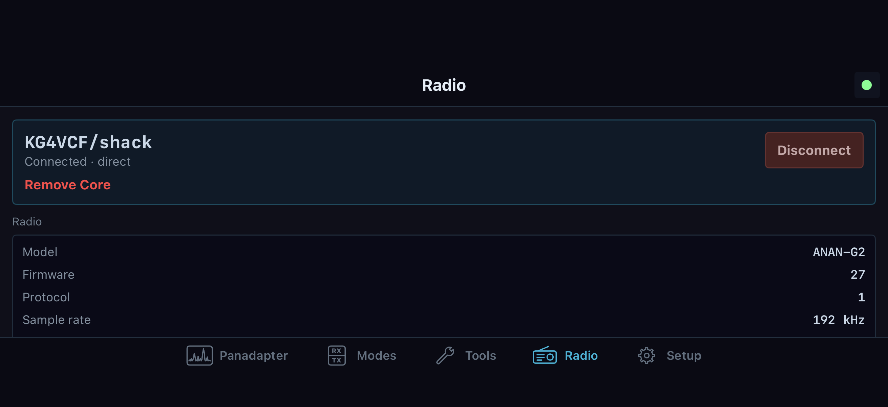

# Radio hardware, antennas, and calibration

Hardware setup writes station or radio state. Start with the intended radio connected and off the air. Open **File > Settings… > Hardware** for radio hardware pages and **File > Settings… > PA** for supported PA pages. A remote desktop edits the Core's radio when the Core exposes that control. These pages are capability, board, radio-version, permission, and on-air gated; use the control's disabled reason and readback as the authority for the connected radio. A visible Setup category does not mean every sub-control applies to every HPSDR model.

For receive-only operation of the front end, see [Tune and receive](03-receive.md). For drive, keying, and SWR protection, see [Set up and transmit](05-transmit.md). PureSignal and diversity procedures are in [PureSignal and diversity](18-puresignal-diversity.md), and external amplifiers and tuners are in [Amplifiers and tuners](19-amplifiers-tuners.md).

## Identify the connected radio and its limits

Open **File > Settings… > Hardware > Hardware Config > Radio Info**. Read the model, board, protocol, firmware, MAC/IP, ADC count, and **Max RX** fields before choosing a hardware procedure. Those values describe the connected radio/Core, not the local desktop. Use **Max RX** as the radio's reported receiver ceiling, then account for receivers already active and any shared Core clients. NereusSDR assigns DDC streams automatically; this page does not expose manual DDC routing.

The **Sample rate (RX1)** selection offers rates supported by this board. Selecting a new value requests a rate change; it does not prove that the wire stream has switched. If the active radio rate differs, the page shows a pending/active banner and says **Reconnect to apply new sample rate**. Reconnect, then return to Radio Info and confirm the pending banner clears and the active rate matches. The per-slice context menu described in [Slices](04-slices.md) may instead change a DDC stream's rate; on Protocol 1 the same choice is radio-wide. Do not confuse that stream-rate action with a change that the Radio Info page says needs reconnecting.

If a remote Core omits a field or says the connected Core does not offer it, stop at that gate. Do not infer a capability from the radio's family name or use a hidden/disabled action. A missing or unexpected model can also make the wrong filter bank appear; verify the identity here before adjusting antenna or calibration values.

*Radio in landscape keeps station identity and radio status beside the navigation. The ANAN-G2 identity and telemetry in this native SwiftUI simulator screen are test data. Check your own connected radio before using the hardware-specific controls below.*

## Choose antennas and ALEX routing

### Set the receive and transmit antenna for a band

The quick path is the **RX** applet's antenna controls or a slice flag's **Antenna** context submenu. The **Hardware Config > Antenna / ALEX > Antenna Control** page exposes the per-band table and readbacks. **Radio > Antenna Setup…** opens the same hardware setup area. Select the band row, then choose its **TX Antenna**, **RX1 Antenna**, and, when a second ADC/receiver is supported, **RX2 Antenna**. The table can also expose receive-only antenna selection and relay/bypass controls according to the board. The current row and active indicators are the readback; the saved band table is shared radio hardware state, not a private pan display preference.

Use the TX antenna for receive option when one physical path should serve both TX and RX. If the TX antenna is also selected for RX, the displayed receive route should agree with the selected TX route. **Block TX on RX-only antennas** prevents transmitting when an RX-only input is selected where that board supports the rule. Do not rely on the old **Transmit > Power** page for that setting; the active control lives under **Antenna Control**. Switch bands and inspect the new row rather than assuming a selection carries across all bands.

When an antenna field is disabled, the likely constraints are the connected board's relay count, lack of ALEX relays, second ADC availability, TX ownership/settings permission, or the radio being on air. Read its reason. If the radio's displayed antenna does not match the intended physical feedline, unkey, correct the row, and confirm its readback before proceeding. Antenna conflict policy is explicitly unbuilt; do not expect a global conflict-resolution checkbox.

On iPhone/iPad, open **Radio > More > Antenna Setup**. This opens the connected Core's described **Hardware > Antenna / ALEX** page; it is omitted when the radio does not have antenna control and is greyed with a reason when the Core cannot provide the page. First compare the table's band row and column labels with the actual station wiring. The Core supplies the rows and available ports; a filled circle marks the currently selected port. Tap one port cell in the intended band row to request that path for the radio. Receive, receive-only and transmit column groups appear only when the Core describes them. A blocked transmit port or an on-air radio disables that cell. Wait for the selected circle to move before assuming the shared radio route changed. A Core refusal appears under the table; correct its stated condition, check the band and physical feedline again, and only then retry. These selections change the radio's shared per-band routing for all devices, not a phone-local antenna preference. For what TX, RX1/RX2, receive-only, and RX-from-TX mean, follow the procedures above before changing a live station.

### Review Alex-1 and Alex-2 filter banks

The **Alex-1 Filters** and **Alex-2 Filters** subtabs configure hardware filter selection behavior by frequency range. Their band rows show start/end edges and, where offered, a bypass checkbox. The active LED/readout indicates which high-pass and low-pass the radio selected for the current receive frequency. Adjust an edge only to match known filter-board crossover points; neighboring ranges must remain ordered and non-overlapping. The edge editor maintains that boundary as values are changed. Per-row bypass selects the bypass path for that range. Alex-2 also has a master **ByPass/55 MHz BPF** control; its HPF and LPF selection indicators update from the current frequency.

These subtabs are only shown for compatible ALEX hardware. Alex-1 may present the high-pass controls as the board's BPF1 preselector rows on supported Orion/Saturn/Hermes C10 boards. Alex-2 is hidden unless the board reports that capability. Some receive high-pass controls have separate hardware-version gates; low-pass controls may have another gate. A disabled row is not evidence that a manual value was accepted. After an edit, confirm that the row remains enabled and the active filter indicator changes at the expected frequency. If you do not know the board's filter edges, keep the existing settings and use the automatic band selection.

## Set ADC attenuation and preamp

Select the slice, then use **RX > ATT/S-ATT** and the preamp control for the ADC feeding that slice. Attenuation and preamp apply to the physical ADC/front end, so another slice on the same ADC shares their effect. Dual-ADC radios can expose separate RX1 and RX2 attenuation/preamp state; the applet indicates when a selected slice uses the other ADC. Choose the available board-specific preamp mode from the menu and verify its selected label. Use the step attenuator only when its control is enabled, and check the overload badges while adjusting.

The purpose is to keep the ADC in a usable range for current band conditions. If the overload indicator lights or the receive trace/audio distorts, reduce front-end gain by selecting a lower-gain preamp or adding attenuation; then check the signal and overload state again. If a weaker signal becomes too small, reverse the adjustment cautiously. The supported range and increments depend on board. ADC controls are radio-level front-end changes, and a remote Core may hold them during transmit or another shared change. A greyed second-ADC control on a single-ADC board is not a missing local preference.

## Configure OC outputs by band

Open **Hardware Config > OC Outputs** and select **HF**, **SWL**, or **User Dig Out**. The **HF** matrix maps supported open-collector pins to RX and TX bands/states; use its row and column labels to assign the external relay or band-decoder action, then check the live pin strip for the resulting state. **SWL** provides its own supported input/band mapping. **User Dig Out** exposes the radio's supported user-digital-output bits where a Penny lane is present. These are Core/radio output settings; external wiring and the attached relay logic still determine the physical result.

Only assign outputs after identifying the pin and the external device's active polarity. Change one mapping at a time, observe the pin strip and connected hardware, and restore the prior mapping if the output is inverted or the relay does not follow the expected RX/TX state. Some TX pin actions require transmit-settings permission and stay locked while on air. The **VHF** subtab is hidden because transverter support is unbuilt. OC hot switching, USB BCD, and external PA extras are also explicitly unbuilt; no VHF, band-stack, or external-PA procedure should be inferred from the HF matrix.

## Configure Hermes Lite 2 options and I/O

On a Hermes Lite 2 with its supported I/O board, open **Hardware Config > HL2 Options**. In **Hermes Lite Options**, set **TX buffer latency** and **PTT hang** only to suit a known system timing requirement. The controls are in milliseconds and write the Core's HL2 values. **Enable CL2** and **CL2 frequency** set the clock output; commit the frequency field by pressing Enter or leaving the field. **External 10 MHz reference** enables the CL1 reference input. Check the external reference and cabling before enabling it. **Reset on Ethernet disconnect** controls the configured radio reset behavior when that link drops. **Disable power supply sync** affects the radio power-supply clock synchronization; “PS” here means power supply, not PureSignal. **Band Volts (PWM out 0 to 3.3 V)** configures the band-voltage output. **Swap audio channels** is disabled with a reason because NereusSDR does not send the radio's own audio over Protocol 1, so this option has no active audio stream to swap.

The same page's **I2C Control** section addresses bus **1 (HL2 daughterboard)**. To inspect a documented register, check **Enable I2C R/W tool**, enter its documented 7-bit **Address** and **Reg/Ctrl** byte, then press **Read**. The response boxes show four returned bytes in order from **Reg/Ctrl** through **Reg/Ctrl + 3**; use the status text if the request fails. The default address is `0x1D` for HL2 general registers; the page tooltip identifies `0x41` as the hardware-version register. Do not probe addresses or registers without a board-specific register map.

Writing needs two independent checks: **Enable I2C R/W tool** and **Write enable**. Only after verifying the device's documented address, register, and intended **Write data** byte should you press **Write**. The action is unavailable on air and can be withheld by a remote Core. Read the same register back afterward and compare the response. A write error appears in the I2C status line; stop and resolve it rather than repeating the write. Bus **0** is hidden/unavailable; NereusSDR supports bus 1 only.

In **I/O Board Pin States**, **Input pins (Rx/i1..i5)** is a read-only six-bit strip. **Output pins (o0..o7)** is the last-read output register. With the radio off air, enable **Pin Control (click to toggle output)**, then click one known wired output LED. The bit changes only when the Core's output-register readback arrives. Confirm the LED and physical relay/device state, then disable Pin Control when finished. I2C writes and Pin Control are gated while the radio is on air or the Core does not offer the I/O operation. These controls address the attached HL2 board; external wiring still determines what each output operates.

**Hardware Config > HL2 I/O** is a status and control page for the Hermes Lite 2 family. Its top status identifies whether the mi0bot custom I/O board at `0x41` was detected. **Probe board** queues three identification reads (hardware version, firmware major, firmware minor); confirm **Active** and a fresh **Last probe** time. **Reset I/O board** resets this page's detected flag, displayed register state, state-machine marker, and I2C log. It does not reset the physical radio or daughterboard. Use **Enable N2ADR Filter board** only when that board is installed; it applies the N2ADR receive filter preset to the OC matrix, and its status table shows decoded `REG_OP_MODE`, `REG_ANTENNA`, `REG_RF_INPUTS`, and tuner state. With a remote Core that has not granted the whole transmit preset, this checkbox changes receive filter assignments only; the tooltip says so. The OC status strip reports current band, output byte, RX/TX state, and pin LEDs. The read-only register table refreshes every 40 ms, the state-machine strip highlights the current update step, and the I2C transaction log records queued activity. Use these readbacks to diagnose board communication; the page is not an arbitrary register editor.

The page's **Bandwidth monitor** shows **EP6 ingress (RX I/Q)** and **EP2 egress (audio + C&C)** rates, **LAN PHY throttle**, and **Dropped frames**. These are live transport diagnostics. If the status reports throttling or dropped frames, check the radio's Ethernet path and current stream load before changing an unrelated I/O setting. **Probe board** and **Reset I/O board** are local UI actions; neither resolves a failed Ethernet path. The page auto-hides on other radio families. Timing controls are in **HL2 Options** and remain subject to the gates described there.

## Run the supported receive level calibration

Use level calibration only with a known signal source connected and its frequency and level measured. Open **Hardware Config > Calibration > Level Cal**. Enter the source **Frequency** and its known **Level (dBm)**. The **Rx1 6m LNA** value is the receive calibration adjustment for the six-meter LNA; **Rx2 6m LNA** is disabled because this build uses one shared receive calibration. Confirm the calibration source and settings, then press **Start** and accept the confirmation. Follow the progress bar and status text until completion. The Core performs the routine; do not disconnect or change the source while it is running. If the status reports a refusal or failure, read it, correct the stated radio/readiness condition, and retry only when the source is stable.

Use **Reset** only when you intend to return receive level calibration and display offsets to that radio's defaults. Confirm the reset prompt, then check the status and resulting meter/display behavior. **Cancel** stops a running calibration. The **Freq Cal** group may show a frequency and accuracy note, but its **Start** control is explicitly unbuilt and hidden. Do not treat **HPSDR Freq Cal Diagnostic** values as an automatic frequency calibration sequence.

The HPSDR diagnostic includes **Correction factor**, **Using external 10 MHz ref**, and a separate **10 MHz factor** with their own **Reset** controls. These fields affect frequency correction; use only a correction factor established for this radio/reference. The 10 MHz field becomes available when the external-reference option is selected. **TX Display Cal > Offset** adjusts the TX display calibration in dB, not RF output power. **Volts/Amps Calibration** contains hardware-specific **Sensitivity**, **Offset**, **Default**, and **Log Volts/Amps to VALog.txt** controls. These affect PA voltage/current calculation or logging; restore **Default** only when you intend to return board defaults. Do not use these diagnostic values as a substitute for RF power measurement.

## Configure PA drive interpretation and read telemetry

Open **File > Settings… > PA > PA Gain** when a supported internal PA profile is available. The profile selector identifies the active profile. **New** creates an empty profile seeded from the connected radio's factory gain row; **Copy** duplicates the selected profile under a new name; **Delete** removes the selected profile but is disabled for the last remaining profile; **Reset Defaults** asks for confirmation and reseeds the active profile from factory values, clearing its drive-step adjustments and max-power columns. A warning appears when the active table differs from factory defaults. These profile lifecycle controls are disabled while the radio is transmitting.

In **PA Gain by Band (dB)**, each band row has **Gain (dB)**, nine drive-step adjustment columns from **10%** through **90%**, **Max W**, and **Use Max**. **Gain (dB)** is the base PA compensation for that band. The nine adjustment values fine-tune each drive step; changing them affects the selected profile immediately. **Max W** holds a per-band watt ceiling; enable **Use Max** on that row to apply the ceiling. The changes write to the active profile as you commit each value. Confirm the active profile name, band row, and edited value before leaving the page. When on air, only the transmitting band's permitted values may remain editable, and remote edits may require this window to hold TX. Radios without an internal PA profile show an unavailable notice; the table is not calibration for an external Ganymede amplifier.

Some eligible boards show **Auto-Calibrate (sweep)** with an **Auto-Cal Sweep** panel containing **Status**, **Progress**, **Target watts**, and **Cancel**. The source describes this as a passive sweep that expects the operator to have already keyed TUNE into a dummy load; it does not directly key the radio or manage a complete operator-controlled drive sequence. Each accepted forward-power sample writes a per-band/drive-step adjustment to the active profile, and Cancel keeps adjustments already written while skipping later steps. Because the available controls do not give a reliable operator sequence to set and verify each drive step, this manual does not recommend starting this sweep as a calibration procedure. Use a known reference setup and the per-band table only with a controlled, separately verified calibration method. If the sweep is shown, its exact supported measurement progression remains a source/runtime gap; do not treat its checkbox or progress bar as proof that it has safely calibrated the profile.

Open **File > Settings… > PA > Watt Meter** for a compatible board. **PA Forward Power Calibration** presents up to ten labeled power points for that board; each numeric field is the calibrated forward-power value in watts associated with its adjacent point label. The connected board determines which points and ranges appear. These values are saved to the radio's calibration profile as each field is committed; there is no separate Apply button. Compare forward-power telemetry against a calibrated external meter at the matching labeled points, then adjust only the corresponding point value and compare again. Keep a record of original values so you can restore them if the indicated power becomes less accurate. Do not run a high-power test to reach a label unless the antenna/load and station are rated for it. If the calibration group is hidden or unavailable, that board has no offered PA forward calibration path.

The same page's **Show PA Values page** checkbox controls whether **PA Values** appears in Setup navigation. **Reset PA Values** clears that page's peak/min trackers; it does not reset Watt Meter calibration. The **PA Values** page reports live and peak/min forward/reflected power, SWR, PA current/temperature, supply voltage, and available raw ADC/voltage telemetry. After a reset, the current value remains and new extrema accumulate as readings arrive. Missing rows reflect unavailable telemetry for that hardware. Use this page to read operating telemetry, not to infer output accuracy without a known reference.

Open **PA > PA Values** only when the connected hardware publishes these readings. It can display live and recorded maximum/minimum voltage, current, and power values. Use its reset action to clear the recorded extrema before a new observation period; confirm they return to current values as telemetry arrives. The page and telemetry are hardware-specific. A blank, disabled, or missing PA Values page means the Core did not provide that measurement path, not that the radio is fault-free.

## Set a hardware receive-filter policy

Right-click the intended desktop VFO flag and choose **Filter policy...**.
The dialog identifies **Chain [number] - Filter Policy**. This changes that
hardware receive chain's BPF routing; it is not the slice's audio passband.
Check which receiver paths share the chain before applying a change.

Read **Current state > Effective** and **Reason**, then choose **BPF mode**:

| Choice | Routing policy |
| --- | --- |
| Auto - Filter when single-band, bypass when multi-band | Allows the controller to use a band filter for a single-band chain and bypass for a multi-band requirement. |
| Force filter (TX-bound band) | Requests filtering for the transmit-bound band. Check the effective result for the chain's current receivers. |
| Force bypass - Always wideband | Requests wideband bypass; it can expose the ADC to signals normally excluded by a BPF. |

Choose **Apply** to submit the choice, or **Cancel** to leave it unchanged.
In a remote window, Apply sends the policy to the Core; a send refusal stays
in the dialog with its reason. Older/unavailable Core state can leave the mode
section absent or disabled and offer **Close**. Close does not apply a policy.
After an accepted request, reopen the dialog and check the current radio's
mode, **Effective: Filtered / BYPASS / BYPASS (wideband)** and **Reason**. The
requested mode and effective routing can differ because of current chain
requirements. Do not judge success from a closed dialog alone.

If the wideband result produces overload or worse reception, restore the
previous policy and inspect the effective reason and active receivers. The
broadcast-reject HPF checkbox is unbuilt/hidden in this build; the policy
dialog does not offer a working broadcast-reject control.

## Worked example: verify an antenna and receive front end before TX

With the radio connected and unkeyed, read its model, board, ADC count, and maximum RX in Radio Info. Open Antenna Control and select the current band row. Confirm TX antenna and RX1/RX2 assignments against the station cabling, then verify any RX-only block policy. Select the receiving slice and check which ADC it uses. Adjust attenuation/preamp while watching the ADC overload indicator and receive signal. If the radio has ALEX, verify the current-frequency HPF/LPF indicators before changing filter ranges. Only after the hardware readbacks agree should you open the TX applet and begin the mic/drive procedure in [Set up and transmit](05-transmit.md).

If a control is unavailable, do not work around it by editing unrelated values. Confirm the connected board and whether the radio is on air, then read the specific gate reason. Hardware availability can change with Core version, remote catalog support, board firmware, and transmit ownership. Preserve existing calibration and relay settings when the physical source, reference meter, or attached wiring cannot be verified.
