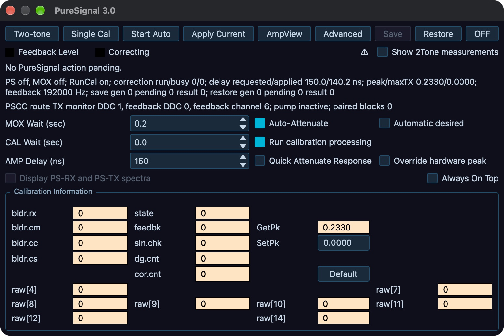

# PureSignal and diversity

This chapter covers two shared Core functions. PureSignal applies a correction to transmitted RF from a sampled feedback path. Diversity combines the synchronized receiver pair on Slice A. Both depend on the connected radio, its capabilities and available resources. A disabled control or displayed reason is the authority for the current session. Start unkeyed, verify the connected radio and TX owner, and use [Set up and transmit](05-transmit.md) for the station's keying and timeout procedure. Physical antenna, coupler, PA and load work belongs to [Radio hardware, antennas, and calibration](17-hardware-antennas-calibration.md) and [Amplifiers and tuners](19-amplifiers-tuners.md).

## Confirm the PureSignal path and station state

PureSignal requires a supported radio/Core feedback stream, a correctly wired and attenuated sample from the transmit path, transmit permission, and an appropriate TX slice. Identify the connected radio at **File > Settings… > Hardware > Hardware Config > Radio Info**. Before asking for calibration, confirm that the feedback coupler is connected in the correct direction, the sample level is suitable, the PA and load are known, and the station's protections remain active. Do not raise drive to make the feedback display move.

Open **DSP > PureSignal…**, **Tools > PureSignal…**, or the **PureSignal** applet when the connected Core offers it. A missing tool, unavailable applet, or refused action means the connected radio/Core, settings permission, TX ownership, feature catalogue or readiness gate does not currently allow that operation. Read the status and refusal text, restore a safe off-air state, then resolve the indicated condition. PureSignal work is performed by the Core/radio; desktop and phone are control and status clients.

The form shows **Feedback Level**, **Correcting**, and action/native status. Read these separately: **Feedback Level** describes the sample input; **Correcting** indicates whether a correction is applied. The labels are not wattmeters, SWR protection, or a certificate that the antenna/load is safe. A request can be pending, accepted, completed or refused; wait for the reported result rather than treating a click as success. During automatic calibration, the status reports calibration progress. Check that the radio returns to receive before changing cabling or station configuration.

*PureSignal before a test: MOX and PS are off, the pump is inactive, and no feedback calibration is demonstrated. Identify Single Cal, Two-tone and OFF separately before following the sequence. Captured from the desktop development build; the numeric zeros are idle readbacks.*

## Calibrate and apply a correction

With the transmitter unkeyed, open the detailed **PureSignal** form and expand **Advanced** only if you need to inspect the calibration configuration. The form's top row contains **Two-tone**, **Single Cal**, **Start Auto**, **Apply Current**, **AmpView**, **Advanced**, **Save**, **Restore**, and **OFF**. **Single Cal** requests one calibration operation; the controller may make up to five attempts. **Start Auto** requests automatic calibration. **Apply Current** applies the correction currently held by PureSignal. Use **OFF** to reset/turn off correction state and stop automatic activity. The **Two-tone** toggle is a separate transmit test generator, not a calibration click or speech test.

**Single Cal** arms calibration; it does not produce RF or complete from an unkeyed transmitter. A correction requires transmitted samples through the feedback path. Use this sequence after the station's test path and drive have been established:

1. While receiving, choose the intended TX slice and confirm this device holds TX. Configure the test signal and its drive source in **Setup > Test > Two-Tone IMD**, using the [two-tone procedure](05-transmit.md#configure-and-run-a-two-tone-test). Recheck the selected drive source rather than assuming Tune Pwr supplies the test.
2. Press **Single Cal** and inspect any accepted/pending or refused action status. If refused, remain in receive and resolve that reason.
3. Start the configured **Two-tone** test. This keys the transmitter and provides samples for calibration. Observe **Feedback Level**, calibration status and **Correcting** while the test is active. The configured **MOX Wait** delays collection after keying; an unkeyed pending action is not a completed calibration.
4. Stop **Two-tone** promptly after a successful result or any abnormal feedback/protection indication. Verify both the generator and MOX/transmit state are off and receive has returned. If correction never arrives, stop the test rather than waiting indefinitely on air. Inspect the displayed reason, feedback wiring/level and calibration-processing setting before another attempt.
5. Confirm the action result and correction readback. A later brief transmission on the same established path can verify that correction remains applied. Changing the path requires rechecking its compatibility and feedback behavior.

No keyed measurement was performed while writing this procedure; validate it on the documented station/build before publication.

Once a single calibration and its readbacks are stable, use **Start Auto** if continuous correction is wanted. This enables the automatic calibration state; it still needs keyed feedback samples to calculate a correction. During a controlled test or subsequent transmission, confirm the calibration and **Correcting** readbacks. Stop the test and return to receive if the feedback or protection indication is abnormal. **Apply Current** is for using a correction already held by the current Core session; it does not create or restore a calibration. To stop, select **OFF**, then check the status and **Correcting** readback before changing the path. Do not confuse an automatically requested state with a successful correction: the form's status is the confirmation.

The desktop form's **Advanced** panel exposes these controls:

- **MOX Wait (sec)**, 0.1–10.0 seconds, is settling time from MOX assertion to feedback collection.
- **Auto-Attenuate** permits automatic feedback attenuation adjustment. **Quick Attenuate Response** applies those changes at a faster interval.
- **Automatic desired** remembers whether automatic calibration should resume when the station becomes ready. It records intent; it does not override a capability, ownership or readiness gate.
- **CAL Wait (sec)**, 0–100 seconds, controls the wait between calculating correction solutions. Zero is the fastest response.
- **Run calibration processing** controls whether calibration processing runs.
- **AMP Delay (ns)**, 0–25,000,000 ns, compensates for analog PA-chain delay. Use a value established for this particular chain; do not copy a value from another station.
- **Override hardware peak** enables the hardware peak override.
- **Display PS-RX and PS-TX spectra** is visibly disabled in this build; use **AmpView** for available diagnostics.
- **Always On Top** changes the local form window behavior.

The **Calibration Information** group exposes board/status information and the live **SetPk**/**GetPk** readbacks. Treat these as radio-specific calibration information, not general tuning controls. Record existing values before changing an offered field and use only a value established for the connected board. A displayed warning or unavailable field calls for the connected radio's procedure, not a guessed default. Changing advanced values can alter correction behavior; change one at a time, request a fresh calibration and inspect the same readbacks. Leave all values as shown when there is no documented reason to adjust them.

## Save, restore and inspect correction assets

**Save** is available only when the current correction is being applied and the operation is permitted. Press it and enter a **Correction label:**. The Core's correction asset manager stores the named correction; this is not a desktop file-save dialog. **Restore** opens **PureSignal Correction Files**, an asset catalogue with **Label**, **Format**, **Encoding**, **Size**, **Identity**, and **Compatibility** information. Select a compatible entry and follow the reported operation status. The correction catalogue has explicit import/export support through the asset manager; it is separate from whole-radio configuration and TX profiles.

A correction is meaningful only for compatible radio identity and transmit/feedback path. Read the asset's compatibility details before restoring it, and verify status on the same station configuration. In the catalogue, **Import…** and **Export…** transfer a correction asset between the local computer and the Core catalogue; **Refresh files** requests an updated list; **Restore selected** applies the selected compatible correction. If no compatible item is listed, the action is disabled, or the Core refuses the request, use a fresh calibration rather than trying arbitrary files. After restoring, confirm the action result and **Correcting** status. Never rely on a saved correction after changing the radio, PA, coupler, attenuation, antenna path or other material part of the feedback chain without confirming compatibility and behavior.

## Use AmpView and the two-tone test

Press **AmpView** to open the local **AmpView 1.0** chart. Its display options are **Show Gain**, **Phase Zoom**, **Low Res**, and **On Top**. Use them to read the chart more clearly; they do not alter calibration. The curves require current feedback samples. A blank chart calls for checking the feedback stream and active measurement state, not an assumption that the PA response is flat.

Use **Two-tone** only for a controlled measurement into the station's established test load/coupler and within PA duty limits. The form's **Show 2Tone measurements** checkbox requests the two-tone measurement readouts. Confirm the station's test configuration, TX ownership, feedback path and permitted drive before enabling the toggle. Observe the result, then turn the generator off and return to receive immediately after the measurement. It produces a test signal and can key/transmit; it is not a safe substitute for a microphone check. [Voice processing and profiles](14-voice-profiles.md) describes the separate TX audio monitor and AM modulation monitor.

## Operate PureSignal from the phone or iPad

Open **Tools > PureSignal**. When the connected Core reports PureSignal capability, the page offers **Automatic calibration** with **Off** and **On**, plus status lamps **Calibrating**, **Correcting**, and **Feedback**, a numeric feedback level, correction state and calibration count. The phone selector requests the Core's automatic-calibration state. Read the shown Core state and any refusal text after changing it. No status means the Core is disconnected or has not supplied the status record; it does not confirm that correction is active. Single calibration, advanced settings, AmpView, SetPk/GetPk and correction Save/Restore are desktop-form workflows in this build. The phone provides shared status and automatic on/off control, not a local correction engine.

## Enable diversity on Slice A

Diversity uses the synchronized **DDC0 + DDC1 sync pair** on **Slice A**. It requires compatible two-ADC hardware and receiver resources. It does not merge arbitrary slices. Identify ADC count and radio capabilities in **Radio Info** first. Open **DSP > Diversity…** or **Tools > Diversity…** on desktop. The desktop dialog has **Enable diversity on Slice A (DDC0 + DDC1 sync pair)**, **Phase (degrees)**, **Gain (dB)**, **Sensitivity pattern**, eight memories **M1** through **M8**, and a status line. Enable the checkbox only when Slice A is the intended receiver. The confirmation changes to **Status: engaged (DDC0+DDC1 sync; BPF auto-bypass)**; when disengaged it reads **Status: idle**. During a PureSignal calibration hold, the dialog overlays **PS HOLD** and **PureSignal calibrating** on separate lines.

With a stable received signal, adjust **Phase (degrees)** from 0.0 to 360.0 in 0.1-degree increments. The radar is the **Sensitivity pattern**; dragging its lobe changes phase. Adjust **Gain (dB)** from −20.0 to +20.0 in 0.1 dB increments to balance the receiver paths. Listen to the wanted signal and noise while making one change at a time, then check the numeric phase/gain readbacks and the radar. These values change shared Slice A receive behavior. If reception gets worse or status becomes idle, disable diversity or restore the previous values, then check the receiver/resource gate before trying again. Diversity engages an automatic BPF bypass noted in the status; it does not mean the normal filter route remains active.

The desktop caption explains memory behavior: **Memory (left-click recall, right-click store)**. Right-click a slot to store the current phase and gain; left-click it to recall. The eight slots are per band. Change band and the dialog loads that band's memory bank. Store only after a useful, stable adjustment, then verify recall on the same band. A slot contains phase and gain values, not antenna selection or a full receiver setup.

On phone/iPad, open **Tools > Diversity**. Its **Diversity** switch controls Slice A, and **Phase** and **Gain** sliders expose the same ranges and values. **Sensitivity pattern** is the Core-provided response display. The mobile page has a **Store** switch: turn it on to make the next memory tap store the current phase/gain; with Store off, a tap recalls. It offers **M1** through **M8**. Phone memories are saved on that phone per band; desktop memories persist on that computer per band. Check the switch and displayed values before tapping a slot. If the Core pauses diversity or refuses a change, read its reason and confirm the desktop/Core status before continuing. The phone does not create a separate diversity receiver or calculate an independent radar response.

## Troubleshoot without bypassing a gate

If PureSignal is missing, check the connected radio identity and Core catalogue. If an action is held, read its explicit reason, confirm the TX owner and off-air/readiness conditions, and use [Set up and transmit](05-transmit.md) to restore a safe state. If feedback is poor, unkey and inspect the station's feedback wiring, sample level and compatible hardware procedure. If correction does not appear, read the action status and calibrate only after the physical path is known. If the asset manager rejects a correction, verify identity and compatibility; do not bypass the catalogue.

If diversity is unavailable or idle, check for two synchronized ADC receiver paths, Slice A selection and receiver-resource availability. If PureSignal calibration shows the **PS HOLD** overlay and **PureSignal calibrating** status, wait for it to finish and verify the overlay clears. If memory recall appears wrong, select the intended band and confirm the correct memory bank. DDC Routing is not a recovery path; it is not an operator control in this build. For TX monitor audio and transmit profile setup, return to [Voice processing and profiles](14-voice-profiles.md); for hardware calibration and safe drive setup, use [Radio hardware, antennas, and calibration](17-hardware-antennas-calibration.md).
