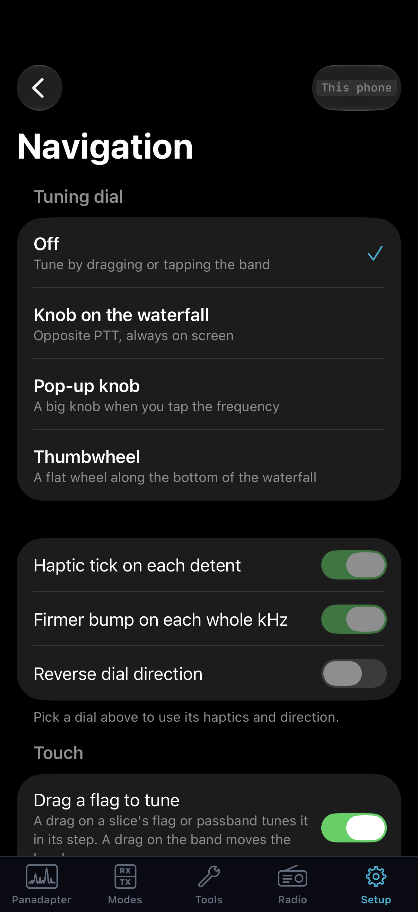
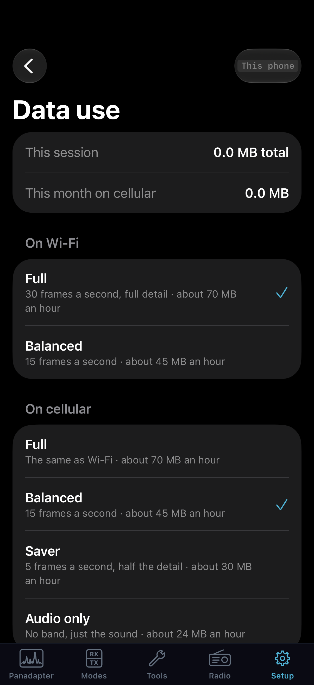

# Phone preferences and session care

The phone procedures in this chapter describe the reviewed native development
app, whose availability and delivery are separate from the desktop/Core release.
Use the connected Core's capability/refusal messages; see [build and verification
scope](verification.md) before treating these instructions as release acceptance.

Use this chapter to adapt the app to the way you listen: a phone in your hand,
headphones away from the desk, an iPad on a stand, or a longer cellular session.
The **This phone** or **This iPad** badge identifies a preference kept on that
device. A **Core** badge identifies a station setting. These can appear on the
same page, so check the badge of the particular group before changing it.

The [phone operating chapter](07-iphone-operate.md) covers an ordinary receive
and transmit session. [Sharing a Core](08-shared-core.md) covers device and
receiver ownership. The settings below refine those workflows.

## Configure the phone's band display

The toolbar **Display** sheet is a quick control surface for its named pan.
It says **Pan N · this phone** and changes that pan's local waterfall and
spectrum presentation. **Palette**, waterfall level mode, **Colour gain** and
**Black level** affect waterfall contrast. **Fill**, **Line**, and **Spectrum
height** affect the trace. **Top** and **Range** move the visible dBm scale.
Read the scale labels and trace after each change. **CTUN** changes the
relationship between tuned frequency and pan center; read the sheet's note and
verify the flag after toggling it. **LIVE** returns from a historical view. A
disabled extra names the missing Core capability.

Tap **More display options in Setup** for **Setup > Display > On this phone**.
The page contains station and local controls together, so follow its scope
badge on each group:

| Group | What it changes and how to check |
| --- | --- |
| **Band plan** | Choose from plans advertised by the Core. This changes the Core's plan for desktop and all devices. **Size** changes the plan's visual size on this phone. Check the selected plan and strip at the bottom of the band. |
| **Core display groups** | The Core describes its analyzer groups and owns offered FFT, window, Hz/bin target, and frame-rate settings. These are shared. Check the badge and bin-width readout; an older Core shows them greyed with an explanation. |
| **Waterfall** | Choose palette and, when available, **Clarity**, **Auto**, **Noise floor**, or **Manual** levels. **High level** and **Low level** are manual endpoints; Core levels can arrive later. **Colour gain** and **Black level** refine contrast. |
| **Waterfall: more** | Set detector/averaging when those are not in Core groups, update period, opacity, stop-on-transmit, timestamps/time zone, look-back depth, filter and zero-line overlays, or a custom gradient. Copy buttons transfer the visible scale endpoints to levels or back. The footer reports retained history for the current period. |
| **Spectrum / Spectrum: more** | Set fill, gradient, line width, spectrum height, trace/passband color and strength, classic peak hold, and zero line. Older-Core pages can expose detector, averaging, and decimation locally when supported. Calibration is disabled because the Core has already applied radio calibration. |
| **Grid & Scales / Grid & Scales: more** | Set grid visibility/step and dBm top/bottom; show the dBm scale and choose frequency-label alignment. If the Core supplies a noise-floor estimate, the bottom can follow it and optionally preserve the range. |
| **Noise floor / Peaks** | The noise-floor line and shift, active peak hold, and peak blobs require Core display extras. Classic peak hold is separate. Follow the disabled reason if extras are unavailable. |
| **On the band / Colours / View** | Toggle cursor frequency, bin width, frame rate, and strongest-signal readout; choose its corner and update rate. Set local grid, marker, line, and label colors. Extended view is available only when described by the Core; CTUN is a pan view setting. |
| **Transmit display** | Local transmit scale top/range, waterfall levels/palette, and DUP. **The Core's transmit display** contains station analyzer settings and affects devices viewing it. Check its badge and returned values. |

For a weak-signal view, select the correct pan, set waterfall **Levels** to
**Manual**, and adjust High/Low around the current noise and signal. Use a copy
button if you want those endpoints to match the dBm scale; otherwise tune them
separately. Set the scale/grid so peaks remain visible, then adjust trace and
palette. Return to the band and inspect the noise floor and a strong nearby
signal. A disabled control's footer tells whether the Core lacks the catalog
or does not support that choice. Most groups belong to this phone; **Core** or
**Both** badges identify settings with broader effect. Desktop controls with
similar names may have another owner; see [desktop display procedures](10-customize.md).

## Choose a tuning dial and touch behavior

Open **Setup > General > Navigation**. The choices apply immediately on this
phone; they do not rearrange another device's controls.

| Tuning dial | Where it appears and how to choose it |
| --- | --- |
| **Off** | Tune with the enabled band gestures. Dial haptics and direction settings are disabled until a dial is selected. |
| **Knob on the waterfall** | Keep a knob opposite PTT on the main display. Useful when small corrections need to stay within reach. |
| **Pop-up knob** | Tap the frequency to use a larger knob in its panel. |
| **Thumbwheel** | Use the flat wheel along the bottom of the waterfall. |

Select one, return to Main and tune a slice you control. Check the step on the
dial itself before turning it. The slice keeps its own step on each band.
**Haptic tick on each detent** marks individual increments; **Firmer bump on
each whole kHz** marks kHz boundaries. **Reverse dial direction** changes the
direction that raises frequency. Compare the displayed frequency before and
after a small movement to confirm the direction you expect.

The **Touch** group controls separate gestures:

| Preference | Effect |
| --- | --- |
| **Drag a flag to tune** | Dragging a flag or passband tunes that slice in its step. Dragging the band still moves the view. |
| **Tap to tune on the band** | A tap tunes the active slice at the tapped position. |
| **Pinch to zoom the band** | Enables pinch zoom. The waterfall's minus/plus buttons remain available. |
| **Double-tap action** | Choose **Tune**, **Center** or **None**. Center is a view action; Tune requests a frequency change. |
| **Snap tap-to-tune to step** | Round tap tuning to the slice's nearest step. Available when single-tap tuning or double-tap Tune is enabled. |

For a crowded display, one useful arrangement is to turn off single-tap tuning,
keep flag dragging, and assign double-tap to Tune. Try the gestures in receive,
then check the final VFO frequency and passband. These choices control how a
request starts; ownership, lock and Core refusals still apply.

*Navigation sets touch behavior on this device. Choose the gesture you will use, then test it while receiving. This native SwiftUI simulator screen shows controlled preference values, not prescribed settings.*

## Select playback and microphone routes

Open **Setup > Audio > On this phone**, or use Main's **Sound** panel for the
playback route. The checkmark follows the current route in both places.

1. In **Play the band through**, choose the device you want to hear. The list
   includes the iPhone/iPad speaker, the iPhone earpiece where available, and
   connected headphones or AirPods by their current name.
2. Confirm received audio comes from that device. Adjust its volume and the
   slice's audio level separately.
3. Under **Microphone**, choose **iPhone microphone** or **AirPods microphone**
   as appropriate. Check the TX microphone meter before keying.
4. Check **Mute the band while you talk**. The monitor rule shown underneath
   is separate: **MON** plays in headphones only.

Using the iPhone microphone lets AirPods retain full-quality receive playback.
Choosing the AirPods microphone makes iOS use its phone-call audio profile in
both directions. If playback quality changes when you select that microphone,
compare with the iPhone microphone before changing the Core's DSP or network
settings. Changing the phone microphone does not select a radio's front-panel
mic input; the transmitter's input choice is covered in
[transmit setup](05-transmit.md).

**iPhone voice processing** is shown as Off. The Core's PROC, equalizer and
leveler shape the transmitted voice. Use [voice processing and
profiles](14-voice-profiles.md) for those controls rather than searching for an
iOS voice-effect switch.

The implemented **Standard** audio quality is Opus at 24 kbit/s with audio up
to 8 kHz. **High** remains greyed with the reason that the Core does not offer
it. The presence of that row is not an additional usable quality setting.

## Recover from headphone removal or an audio interruption

When a connected headset disappears, playback pauses and the app presents a
notice. Choose the offered speaker-resume action when you are ready to play
through the phone. This prevents a private headphone session from suddenly
playing aloud. Once playback is running, reconnect/select headphones in
**Sound** and confirm their route and audible output. Reconnecting headphones
or selecting a route alone does not clear this paused state.

A call, Siri or another audio interruption pauses playback and ends a phone
transmission. When the interruption ends, the receive audio can resume;
transmit does not resume automatically. Before starting another transmission,
check the route, microphone, TX badge and PTT state. Treat an interrupted
transmission as ended, even if you were speaking when the interruption began.

If receive audio does not return, distinguish the paused-headphone notice from
a Core reconnect message. Use the matching recovery action first. Re-pairing a
Core is not a playback-route repair. See [troubleshooting](11-troubleshooting.md)
when the route is selected but the audio remains absent.

## Set screen, background and sleep behavior

Open **Setup > General > Battery and sessions**. These are phone preferences.

| Group | Choices and outcome |
| --- | --- |
| **Locked or in another app: Sound only** | While away from the app, stop requesting band images and retain sound. On return the band subscribes again. |
| **Keep the screen on** | **Never**, **While charging**, or **Always**. Never still keeps it on while keyed; Always keeps it on while the band is showing. |
| **Sleep timer** | **Off**, **30 minutes**, **1 hour** or **2 hours**. A running timer shows **Disconnects at** followed by the end time. |
| **In Low Power Mode, drop to Saver** | Limit the requested band to Saver quality when iOS Low Power Mode is on. |
| **Slow the band when the phone is hot** | Reduce display work while iOS reports heat, returning as it cools. |

For a listening session away from the screen, enable Sound only and select a
sleep duration. Check the displayed disconnect time after connecting. When
returning to Main, expect a new live band view; the waterfall can mark the
period when the phone was locked or in another app. Historical rows are not
evidence of continuous visual updates while the app was away.

The sleep timer ends the session by disconnecting. It is different from a
transmit time-out, which ends keying, and different from a Core service's
lifetime. The station Core may continue running after this phone disconnects.
Set the sleep timer to Off when you intend to listen until you explicitly
leave. Recheck its end time if you change the timer during a session.

Locking the phone ends a transmission. Keeping the screen awake and permitting
background audio do not provide locked-phone transmit control. Return to the
foreground, read the ownership state and key deliberately for the next over.

## Manage Wi-Fi and cellular data use

Open **Setup > CAT & Network > Data use**. **This session** counts the session
across its network use; **This month on cellular** tracks cellular use. The
choices for Wi-Fi and cellular are stored separately.

| Mode | Requested band | Estimate displayed by the app |
| --- | --- | --- |
| **Full** | 30 frames/s, full detail. | About 60 MB/hour. |
| **Balanced** | 15 frames/s. | About 35 MB/hour. |
| **Saver** | 5 frames/s, half the detail. | About 20 MB/hour. |
| **Audio only** | Sound without a band view. | About 13 MB/hour. |

Wi-Fi offers Full and Balanced. Cellular also offers Saver and Audio only.
These rates are requests, and the displayed data amounts are estimates, not
measurements or a billing guarantee. The page also estimates an additional
13 MB for each hour of talking. Use its counters and your cellular account's
usage information when planning an actual allowance.

1. Choose the Wi-Fi mode for normal station or home use.
2. Choose the cellular mode for the amount of visual activity you need away
   from Wi-Fi. Audio only suits listening when you do not need to inspect the
   spectrum; it does not represent a failed band display.
3. Enable **Warn me past 5 GB a month on cellular** if you want the app's
   threshold notice. The warning is a notice, not an automatic usage cap.
4. Return to Main and read the data-mode chip. After a network change, check
   which mode is in use before interpreting a change in waterfall speed.

Power and heat policies can reduce the requested rate further. Serious heat
halves the current request; critical heat or Low Power Mode can cap it at
Saver when their switches are enabled. The Core's own display settings also
limit what arrives. Choosing Full does not force a busy Core to deliver Full.

*Data use distinguishes Wi-Fi from cellular choices. Read the selected mode and session totals before changing quality to diagnose a route. This native SwiftUI simulator screen uses test-start zero totals; it is not a measured data-rate example. Its acceptance-build estimate text differs from the source-baseline table above. Use your installed build's counters and estimates.*

## Understand the Sharing indicator

Main can show **Sharing · n fps** when the Core grants fewer display frames
than this phone requests. Tap it to see whether the Core is busy or its
connection is full. The note can identify the device holding transmit, which
keeps its full band and sound while other devices share the remaining budget.

Check the reason before increasing quality or repeatedly reconnecting. If
only the band is slower and audio remains clear, the allocation may be doing
its intended job. If audio breaks up too, use **Tools > Connection and
performance** and compare audio delivery with display activity. A Sharing
chip alone does not diagnose Wi-Fi signal strength or microphone failure.

## Set a transmit time-out and recognize disabled PTT choices

Open **Setup > Transmit > PTT buttons**. In **Stop transmitting after**, select
an offered duration or Off, then read the returned selection and any error.
This group is marked **Core**. The Core time-out applies to phone/iPad
transmissions; the station desktop also has its own time-out setting. A Core
watchdog remains part of transmit supervision. A time-out reason means the
over ended, so return to receive and check the state before keying again.

The Headset button, Bluetooth PTT Pair, Action button and **Buttons key a
locked phone** controls are disabled in the covered app. Only on-screen PTT
keys from this phone. Do not configure an accessory around those labels or
assume that pairing a Bluetooth audio device gives it a working PTT button.
In a debug build, a **PTT button test** may appear; it logs button behavior
and never keys the radio.

## Inspect app information and collect evidence

Use **Setup > About this app** for the phone build, device and license/link
information. When reporting a session problem, record the app and Core builds,
the network type, playback/microphone route, selected data mode, whether the
phone was hot or in Low Power Mode, and the time the symptom began. Include
whether the phone was in front, locked or returning from another app.

**Setup > Diagnostics > Logs** and **Tools > Support Bundle** provide the log
and collection workflows described in [troubleshooting](11-troubleshooting.md).
Sharing a bundle is an explicit action through the phone's share sheet.

## Worked example: a long headphone listening session

Start with a saved Core and connected headphones. This is a receive session;
leave PTT unkeyed throughout the setup.

1. Connect to the saved Core and select the intended slice on **Panadapter**.
   Verify its frequency/mode and live link. Open **Sound** and choose the
   connected headphones. Check local mute and level, then listen to a known
   signal. If silent, correct this phone's route before changing the Core's
   SPEAKERS/PHONES buttons.
2. Open **Setup > Audio > On this phone**. Choose **iPhone microphone** if you
   want AirPods playback to remain at full quality. Choosing **AirPods
   microphone** uses phone-call quality in both directions. This choice does
   not key, but it changes the audio-session behavior a later over will use.
3. Open **Setup > General > Battery and sessions**. Enable **Sound only** for
   locked/background listening. Choose **Off**, **30 minutes**, **1 hour** or
   **2 hours** under **Sleep timer**. For a timed session, read **Disconnects
   at** and check that it is the intended end time.
4. Open **Setup > CAT & Network > Data use**. Review **On Wi-Fi** and **On
   cellular** separately, select the intended policy, and read **This
   session** plus **This month on cellular**. A connected session can slow
   the display for data, heat or battery management; check the chosen policy
   before treating a slower waterfall as link loss.
5. Return to **Panadapter**, confirm audio, then lock the phone or switch
   apps. Sound only requests audio without the band while in that state.
   Before returning, do not infer tuning or TX ownership from continued
   headphone audio alone.
6. After an interruption or headphone removal, bring the app to the front.
   For a headphone-removal pause, tap the band’s audio notice when ready to
   resume on the phone speaker. Once playback is running, reconnect/select
   headphones in **Sound**, then verify their route and audible output.
   Reconnecting headphones alone leaves playback paused. After a call or
   other interruption ends, receive audio can resume without that action;
   transmit remains ended. Check the slice and receive audio again. If the
   Core is reconnecting, inspect the link chip/**Connection and performance**
   before changing DSP.
7. If the sleep timer ended the session and the app is disconnected, select
   the saved Core and reconnect. Pair again only when the app/Core actually
   requires it. If merely the band paused for background listening, return
   to the live display and inspect the current data mode instead.
8. Before a later voice over, follow [phone transmit preparation](07-iphone-operate.md#prepare-and-transmit-voice-from-the-phone)
   from its stated holder condition. Recheck microphone, frequency, TX slice
   and permission. Successful listening has not granted transmit.
9. To finish, confirm receive and choose **Radio > Disconnect**. The saved
   Core remains for the next session; use Remove Core only when you intend
   to forget it.
